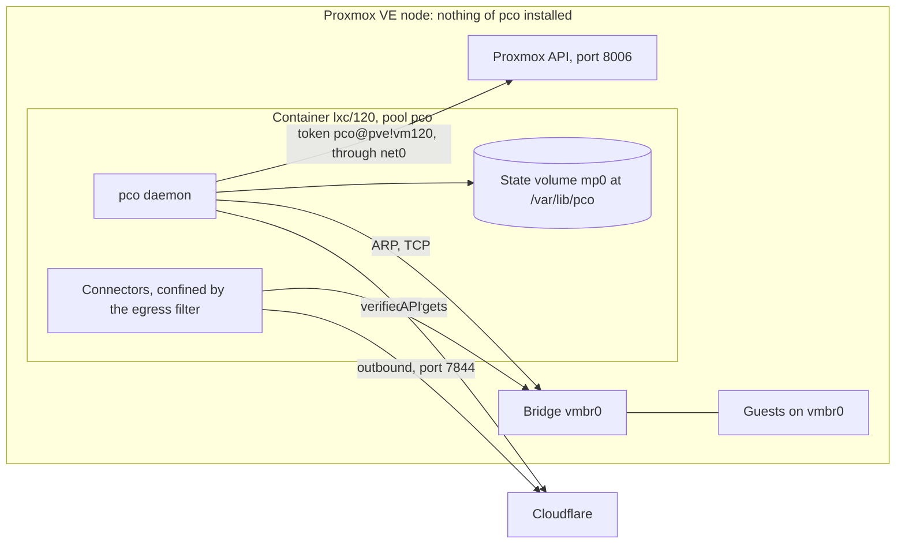
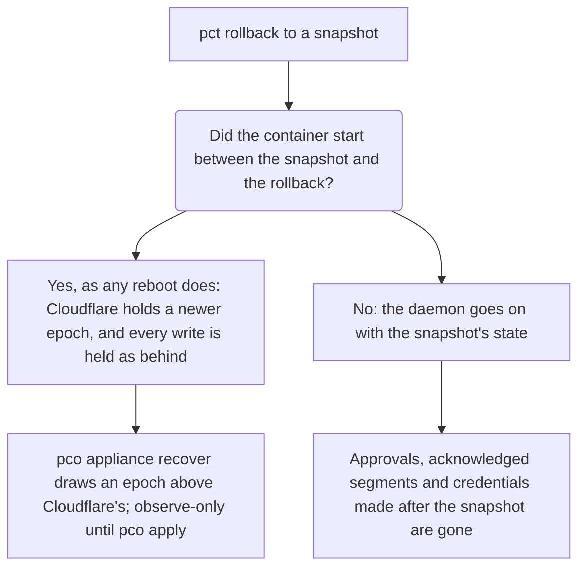

# Appliance

The appliance is pco in a container of its own: the daemon and its connectors run in an
unprivileged container on a Proxmox VE node, and nothing is installed on the node itself.
This page says what it is, how to install it, what it creates, the rules it keeps to, and how
to upgrade it, back it up and bring it back. Commands that run on the node say so; the others
run in the appliance, with `pct exec <vmid> --` in front from the node.

## What it is

The appliance is an unprivileged Debian 13 container with pco and `cloudflared` in it, made
from a template that every release carries. It reads Proxmox through the API with a token of
its own, reaches the guests through its network card, and keeps its state on a volume of its
own. The node gets the container and a few objects in Proxmox, which [the table
below](#what-the-install-creates) lists, and nothing else: no package, no unit, no file under
`/etc` or `/usr`, no nftables table.

How the appliance sits on the node, and what it reaches through which card:

Choose the host profile instead when you can have pco on the node and want the stronger proof.
A daemon on the node reads the forwarding table of the bridge and proves the address of a guest
of that node at the level `port`; a container cannot read it, so the appliance proves
`observed` at best, under the rules that [Identity](identity.md#the-appliance-and-observed)
describes. The host profile is what the installer does by default. [Profiles](profiles.md) sets
the two side by side.

## Install

On the node, as root, give the installer `--appliance`:

    curl -fsSL https://raw.githubusercontent.com/anaryk/proxmox-cloudflared-operator/main/scripts/install.sh | bash -s -- --appliance --storage local-zfs

Without `--appliance` the script installs the host profile, or asks on a terminal, where Enter
keeps the host profile. `PCO_PROFILE=appliance` answers the same beforehand. The script checks
the signature of the release's `checksums.txt` and the checksum of the package as it does for a
host, then unpacks the package into a temporary directory instead of installing it, runs
`pco appliance install` from there with the rest of the arguments, and removes the directory
when that returns.
[SECURITY.md](https://github.com/anaryk/proxmox-cloudflared-operator/blob/main/SECURITY.md#verifying-a-release)
says how to check the release key the script carries before it runs.

`pco appliance install` looks at the node, decides everything, and only then makes anything. A
run on a node of its own, with the defaults and a yes to the one question:

    preflight: Proxmox VE 9.2.21 on amd64, node pve1
    preflight: pve1 is a node of its own, in no cluster
    preflight: the container goes on storage local-zfs, the template on local
    preflight: the appliance will be lxc/120
    preflight: the datacenter firewall is off; the appliance reaches the API on port 8006 of the node
    preflight: the API at 192.0.2.10:8006 verifies as pve1 against the cluster CA
    preflight: no principal but the admins can reach into lxc/120
    template: downloaded local:vztmpl/pco-appliance_1.2.3_amd64.tar.zst, checksum verified
    pool pco: created
    container lxc/120: created on local-zfs, name=eth0,bridge=vmbr0,ip=dhcp
    role PCO: created with VM.Audit, Sys.Audit, VM.GuestAgent.Audit, SDN.Audit, Pool.Audit
    user pco@pve: created, granted role PCO on /
    token pco@pve!vm120: created, privilege-separated, with role PCO on /
    Register the gate tags cf-tunnel, cf-tunnel-managed, so that only admins can set them on a guest? [Y/n]
    registered tags: added cf-tunnel, cf-tunnel-managed
    note: clones and restores of a guest keep its tags, so the clone of a published guest asks to be published too
    container lxc/120: running pco 1.2.3
    web interface: listens on 192.0.2.150:8643, net0's address
      lxc/120: identity: /var/lib/pco is a volume of lxc/120 (rpool/data/subvol-120-disk-1)
      lxc/120: settings: identity minimum observed, gate tag cf-tunnel; the install only observes until pco apply
      lxc/120: store: created install 7f3a9c0d41b2, writer generation 1
      lxc/120: install: 7f3a9c0d41b2, lxc/120 on pve1
      lxc/120: proxmox token: pco@pve!vm120 stored
      lxc/120: proxmox: the token reads the API at 192.0.2.10:8006, verified as pve1
      lxc/120: credentials: the bootstrap holds no Cloudflare token; add one with pco credential add
      lxc/120: pco.service: restarted
    web interface: started, certificate SHA-256 AB:CD:EF:01:23:45:67:89:AB:CD:EF:01:23:45:67:89:AB:CD:EF:01:23:45:67:89:AB:CD:EF:01:23:45:67:89
    container lxc/120: protected
    pco appliance lxc/120 is installed on pve1, in pool pco
      token: pco@pve!vm120
      Proxmox API: 192.0.2.10:8006, verified as pve1 against the cluster CA
      web interface: https://192.0.2.150:8643/, its certificate's SHA-256 fingerprint, which the browser shows at the first visit:
        AB:CD:EF:01:23:45:67:89:AB:CD:EF:01:23:45:67:89:AB:CD:EF:01:23:45:67:89:AB:CD:EF:01:23:45:67:89
    next:
      pct exec 120 -- pco status
      pct exec 120 -- pco credential add --label <label>      (unless a Cloudflare token was given)
      tag a guest with cf-tunnel and write its routes into its notes
    warning: snapshots, clones and storage replication of lxc/120 carry its secrets, the API token and the Cloudflare credentials: whoever can read them can read those

The lines that begin with `lxc/120:` are what `pco appliance init` printed inside the
container, where it made the store from what the installer pushed in. The Proxmox token and the
Cloudflare token reach the container in one file, `/var/lib/pco/bootstrap.json`, pushed with
`pct push` and removed by `init` as soon as it has read it: never through the configuration of
the container or its environment, which anyone with `VM.Audit` can read.

### Questions and flags

The installer asks a question only where the answer is the admin's to give: whether to register
the gate tags (yes by default), whether to go on beside another install of pco (no by default),
and whether to add `NoAccess` lines for principals that could reach into the appliance (no by
default; see [who may reach the appliance](#who-may-reach-the-appliance)). Without a terminal it
needs `--yes`, which takes the default of every question and never adds a `NoAccess` line.
Everything else has a flag, and a default where one is safe:

| Flag | Default | What it sets |
|---|---|---|
| `--storage` | the one storage of the node that holds containers | Where the root filesystem and the state volume go. With several, the installer refuses and lists them. |
| `--template-storage` | `--storage` when it holds templates, else the one storage that does | Where the template is downloaded to. |
| `--bridge` | `vmbr0` | The bridge of the container's card, `net0`. |
| `--vlan` | none | The VLAN of `net0`. A VLAN-aware bridge needs one: its PVID, 1 unless `bridge-pvid` says otherwise, for the untagged VLAN the node's own address is in. |
| `--ip` | `dhcp` | `dhcp`, or the address with its prefix and an optional gateway, as `192.0.2.120/24,gw=192.0.2.1`. |
| `--api-host` | the node's address on the bridge (or its VLAN) | The address the appliance reaches the Proxmox API at, on port 8006. |
| `--api-ca` | none | A CA file for an API certificate that neither the cluster CA nor the system roots verify. |
| `--vmid` | the next free VMID | The VMID of the container. A VMID that is taken is refused. |
| `--cores`, `--memory` | 1, 768 | Cores, and memory in MB (at least 256). |
| `--rootfs-size`, `--state-size` | 4, 1 | The root filesystem and the state volume, in GiB. |
| `--template` | downloaded through Proxmox | The template as a file, by its absolute path, for a node without internet. |
| `--checksums` | given by `install.sh` | The `checksums.txt` of the release, which the template is checked against. |
| `--keep-template` | `true` | Whether a template this run downloaded stays when the run is taken back. |
| `--deny-access` | off | Add the `NoAccess` lines shown, instead of refusing. |
| `--cf-token-file` | none | A file with the first Cloudflare token; it can be added inside later. |
| `--gate-tag`, `--no-registered-tags` | `cf-tunnel`, registered | As for [`pco setup`](security.md#the-gate-tag-and-what-it-proves). |
| `--resume` | none | Finish the run of a journal, or take it back (below). |

[`pco appliance install`](cli/pco-appliance-install.md) has the full help. The script keeps
`--appliance`, `--profile` and `--uninstall` for itself, wherever they stand, and passes every
other argument on, so a run without questions looks like this:

    curl -fsSL https://raw.githubusercontent.com/anaryk/proxmox-cloudflared-operator/main/scripts/install.sh | bash -s -- --appliance --storage local-zfs --bridge vmbr0 --ip 192.0.2.120/24,gw=192.0.2.1 --vmid 120 --cf-token-file /root/cf-token --yes

With DHCP, the web interface follows the address `net0` gets (see
[the web interface](#the-web-interface)), and a static address or a reservation at the DHCP
server keeps it where you expect it.

### What the preflight refuses

Each refusal ends the run before anything is made, with `nothing was changed` at the end of the
line.

| The installer says | What to do |
|---|---|
| `choose the storage of the appliance with --storage: <storages>` | Several storages hold containers: name one. Snapshot-capable storage (ZFS, LVM-thin, Ceph) is what lets a backup run in snapshot mode; see [backups](#snapshots-backups-and-their-limits). |
| `bridge <bridge> is VLAN-aware: name the VLAN of the appliance with --vlan (--vlan <pvid> for the bridge's untagged VLAN), as a card without a tag is a member of every VLAN` | Give `--vlan`. Untagged on a VLAN-aware bridge, the card would be on every VLAN of it. |
| `bridge <bridge> is not VLAN-aware, so --vlan <n> cannot be given to the appliance's card` | Leave `--vlan` out, or choose a VLAN-aware bridge. A tagged card on such a bridge fails to start and leaves a virtual interface on the node that only root can remove, so the installer refuses it first. |
| `the node has no address on <device>, which the appliance would reach the API at: name one with --api-host` | The appliance reaches the API through its card, and by default at the node's address on the same bridge and VLAN. Give `--api-host` with an address of the node the appliance can reach, through a router if need be. |
| `the API at <address>:8006: the certificate verifies neither under the node name <node> against the cluster CA nor under a DNS name it carries (<names>) against the system roots: pass --api-ca with the CA that signed it, or --api-host with an address whose certificate verifies` | See [the API and its certificate](#the-api-endpoint-and-its-certificate). |
| `principals other than the admins can reach into lxc/<vmid>: run the lines above, or let the installer add them with --deny-access (--yes never does)` | See [who may reach the appliance](#who-may-reach-the-appliance). |
| `VMID <vmid> is taken: choose another with --vmid, or leave it out for the next free one` | As it says. |
| `cluster <name> has no quorum, so nothing can be written to /etc/pve: install once it has` | Restore the quorum first. |
| `version <version> of Proxmox VE is not supported: pco needs 8.4 or later, or 9` | Upgrade Proxmox VE. |

A run that names principals looks like this, answered with the default:

    warning: ops@pve holds VM.Backup, VM.Config.CDROM, VM.Config.Cloudinit, VM.Console, VM.PowerMgmt on lxc/120, with which it can read the appliance's secrets
    warning:   pveum acl modify /vms/120 --users ops@pve --roles NoAccess
    warning:   NoAccess on /vms/120 takes from ops@pve what it holds on lxc/120 alone
    Add the NoAccess line above? [y/N]
    pco: install step preflight: principals other than the admins can reach into lxc/120: run the lines above, or let the installer add them with --deny-access (--yes never does); nothing was changed

The installer also warns, and asks whether to go on, when pco is set up on this node as the host
profile or another appliance exists: both would claim every guest with the gate tag.

### Offline

A node without internet installs from files you bring: the package, `checksums.txt` and its
signature, and the template, `pco-appliance_<version>_<arch>.tar.zst`, all from the release.
`install.sh` checks the signature and the checksums of both as always, and passes the template on
as `--template`:

    PCO_DEB=./pco_1.2.3_amd64.deb PCO_CHECKSUMS=./checksums.txt PCO_SIGNATURE=./checksums.txt.sig \
      PCO_TEMPLATE=/root/pco-appliance_1.2.3_amd64.tar.zst bash install.sh --appliance --storage local-zfs

Use the `install.sh` of the release's tag, which carries the key that signed it. The appliance
still needs to reach the Proxmox API, Cloudflare's API on port 443 and the edge on port 7844 once
it runs. The template must hold the same version of pco as the installer, which refuses another.

### A run that was cut short

The installer notes each object in a journal, `/root/.pco-appliance-install/<run>.json`, before
it makes it. A step that fails, and SIGINT, SIGTERM or SIGHUP, take back what the run made; the
journal goes when the run succeeded or was taken back in full. A run that was killed, or one
whose taking back failed, leaves its journal, and `install.sh` names it:

    install.sh: the installer did not finish, and left its journal in /root/.pco-appliance-install
    install.sh: to finish the run or take it back, run: PCO_PROFILE=appliance PCO_VERSION=1.2.3 PCO_RESUME=/root/.pco-appliance-install/20261006T101500-3f2a.json install.sh
    install.sh: install.sh stands for the script as you ran it; when curl piped it into bash, put the variables before that bash

The variables name the profile, the release and the journal of the run. Run the script again
with them, after the `curl` as the last line says:

    curl -fsSL https://raw.githubusercontent.com/anaryk/proxmox-cloudflared-operator/main/scripts/install.sh | PCO_PROFILE=appliance PCO_VERSION=1.2.3 PCO_RESUME=/root/.pco-appliance-install/20261006T101500-3f2a.json bash

It finishes the run, or takes it back when it cannot; `pco appliance install --resume <journal>`
does the same with a binary at hand. The journal holds no secret, so a run that was given a
Cloudflare token needs `--cf-token-file` again, and the Proxmox token is made anew. A second
installer on the same node does not wait: it refuses while another holds the lock in the
journal directory.

## What the install creates

Every object the installer makes carries a mark, by which `pco appliance uninstall` finds it and
tells it from what an admin made:

| Object | What it is | Mark |
|---|---|---|
| Container `lxc/<vmid>` | Unprivileged, Debian 13, features `nesting=1` and nothing else, started at boot (`onboot=1`, `startup: order=1,up=20`), protected against removal (`protection=1`), in pool `pco`, tags `pco-appliance;pco-combined`, host name `pco`, console mode `tty`, no swap. `net0` named `eth0` on the bridge, with `tag=` on a VLAN-aware one. `mp0` at `/var/lib/pco` with `backup=0`. | Its description: `pco appliance vm<vmid>, installed <date> by pco appliance install`, and a line `NoAccess for <principal> on <path>` for each `NoAccess` line the installer added. |
| Role `PCO` | `VM.Audit`, `Sys.Audit`, `SDN.Audit`, `VM.GuestAgent.Audit` (`VM.Monitor` on Proxmox VE 8.4) and `Pool.Audit`: read-only, the role of the host profile too. | Its name and exactly these privileges. |
| User `pco@pve` | The user the token belongs to. | Its comment, `pco operator`. |
| Token `pco@pve!vm<vmid>` | Privilege-separated. | Its comment, `pco appliance vm<vmid>`. |
| ACL lines | Role `PCO` on `/` for the user and for the token: a privilege-separated token holds only what its user holds too. | The role. |
| Pool `pco` | Holds the appliance. | Its comment, `pco appliances`. |
| Registered tags | `cf-tunnel` and `cf-tunnel-managed`, and the gate tag when it is another, so that only an admin can set them. | Listed in the appliance's manifest. |
| Template volume | `<storage>:vztmpl/pco-appliance_<version>_<arch>.tar.zst`. It stays after the install: it is data, and what an appliance is made again from. | Listed in the manifest. |
| `NoAccess` lines | Only those you confirmed, at the question or with `--deny-access`. | Recorded in the description of the container, which the appliance's token cannot change, and in the manifest. |

Later, and only through `pco appliance grant-network`, the roles `PCOManaged`
(`VM.Config.Network`) and `PCOSDN` (`SDN.Use`) with their lines; see
[network grants](#network-grants).

Nothing else is created on the node, at install or later. The appliance keeps the list of what
was made for it in `/var/lib/pco/manifest.json`; the uninstaller pulls it back and takes it as
untrusted input, cross-checking every object against Proxmox and its mark before it removes
anything, and does without it when it is gone.

## Commands on the node

Nothing of pco is installed on the node, so the commands that run there come with the release
each time they are needed. Use the release the appliance runs, which
`pct exec 120 -- pco version` names. `install.sh` runs the uninstaller for you, from a temporary
directory it removes when it returns, after the same checks of the release as for an install:

    curl -fsSL https://raw.githubusercontent.com/anaryk/proxmox-cloudflared-operator/main/scripts/install.sh | PCO_VERSION=1.2.3 bash -s -- --appliance --uninstall --vmid 120

The others, `pco appliance repair`, `grant-network` and `revoke-network`, run from a package
you have the installer check and then unpack yourself. Download `pco_1.2.3_amd64.deb`,
`checksums.txt` and `checksums.txt.sig` from the release, and `scripts/install.sh` of the tag
`v1.2.3`, which carries the key that signed it (check that key as
[SECURITY.md](https://github.com/anaryk/proxmox-cloudflared-operator/blob/main/SECURITY.md#by-hand)
says):

    PCO_DEB=./pco_1.2.3_amd64.deb PCO_CHECKSUMS=./checksums.txt PCO_SIGNATURE=./checksums.txt.sig \
      PCO_SKIP_SETUP=1 bash install.sh --appliance

It checks the signature and the checksum, says `verified by: signature by key` with the
fingerprint, and stops before it runs anything. Then unpack the package where only root can
read, run the command, and remove the directory:

    mkdir -m 700 /root/pco-1.2.3
    dpkg-deb -x pco_1.2.3_amd64.deb /root/pco-1.2.3
    /root/pco-1.2.3/usr/bin/pco appliance repair --vmid 120
    rm -rf /root/pco-1.2.3

`dpkg-deb -x` only unpacks: dpkg does not take the package for installed. Never run a `pco`
taken out of the appliance on the node: root on the node would run what the container holds.

## The API endpoint and its certificate

The appliance dials the Proxmox API at `<api-host>:8006` and verifies the certificate under a
server name the installer chose, against the CA it pushed into the container
(`/var/lib/pco/pve-ca.pem`) and the system roots. It never dials a loopback address.

The certificate `pveproxy` serves by default, `pve-ssl.pem`, is signed by the cluster CA and
carries the node's names and its primary address, and no address on another bridge. So the
server name is the node name, whatever address the appliance dials: an address on the
appliance's bridge verifies as well as the node's primary one. An ACME certificate, or a custom
one in `pveproxy-ssl.pem`, carries a DNS name and chains to a public CA or a private one: the
installer then verifies it under a DNS name it carries, against the system roots, or against
`--api-ca` for a private CA. A certificate that verifies neither way is refused.

When the certificate changes later, as when the cluster CA is made anew, ACME is turned on or a
custom certificate is put in, the appliance holds every write with the line

    the certificate of 192.0.2.10:8006 no longer verifies under pve1 (the cluster CA or the pveproxy certificate changed?): run pco appliance repair --vmid 120 on the node

and `pco appliance repair --vmid 120` on the node probes the certificate again and pushes the new
CA and server name (`--api-ca` for a private CA).

## First steps

A fresh appliance only observes, and its `identityMinimum` is `observed`, the level it proves
addresses at. Four things make it publish.

1. **A Cloudflare token**, unless the install was given one. From the node:

       pct exec 120 -- pco credential add --label main

   The token is asked for without being shown. [Cloudflare token](cloudflare-token.md) says what
   it needs. `pct enter 120` opens a shell in the appliance for longer work.

2. **A guest to publish.** Tag it with the gate tag and write its routes into its Notes, as
   [Quickstart](quickstart.md#tag-a-guest-and-write-its-routes) shows. The guest must be on the
   bridge and VLAN of the appliance's card: the appliance reaches guests on its own segments.

3. **The segment.** A route proven at `observed` is served only on a segment an admin
   acknowledged. `pco status` says when one waits, and `pco routes` names it:

       HOSTNAME          STATE        LEVEL     SERVICE  OWNER     ZONE         NOTE
       app.example.com   unreachable  observed  -        lxc/131   example.com  segment vmbr0 is not acknowledged; pco segment acknowledge vmbr0
       wiki.example.com  unreachable  observed  -        qemu/132  example.com  segment vmbr0 is not acknowledged; pco segment acknowledge vmbr0

   Acknowledge it once you know that you would trust any device on it with what its MAC can
   claim:

       pct exec 120 -- pco segment acknowledge vmbr0

       2 routes at observed wait for segment vmbr0:
         app.example.com   lxc/131
         wiki.example.com  qemu/132
       Acknowledging it serves the routes at observed proven on it, unless they wait for an approval of their guest.
       Acknowledge segment vmbr0? [y/N] y
       Acknowledged segment vmbr0; its routes at observed are served from the next cycle.

4. **Approvals**, where a route waits for one. At `observed` a guest waits for an admin when
   anyone but the admins may change its network cards, when its MAC changed since it was
   pinned, or when its address is the gateway or a resolver of a node or of the appliance.
   `pco guest list` lists them, and `pco guest approve <owner>` says why the guest waits and
   what the approval records, and records it; look at `pco guest list` first:

       pct exec 120 -- pco guest approve qemu/132

       qemu/132 (wiki) waits for approval in identity uuid:5b0f4c1e-1d2b-4c7a-9a64-3f1e2d0c9b8a; approved, it publishes wiki.example.com.
       It waits because:
         delegated: alice@pve holds VM.Config.Network
       Approving it records MAC bc:24:11:00:01:32.

   [Identity](identity.md#the-appliance-and-observed) explains each of these rules.

Then look at what pco would do, `pct exec 120 -- pco plan`, and publish:

    pct exec 120 -- pco apply

The appliance's `pco status` has two lines a host does not: the profile, and what the last
self-identification found.

    Mode:        enforce
    Profile:     appliance
    Identity:    ok (lxc/120 on pve1)

## The web interface

The appliance serves the web interface on its own, `pco-web.service` on port 8643 of `net0`'s
IPv4 address, which `/etc/pco/net0` holds: the installer writes it, and the daemon writes the
card's new address when it changes, as a new lease of DHCP does, restarts `pco-web` and says so
in the event `net0's address changed from <old> to <new>: pco-web listens on <new>:8643 now`.
It listens there and nowhere else, and refuses to start on any other address: cards added later
lead into the networks of guests, who would reach the sign-in page through them.
`PCO_WEB_LISTEN` in `/etc/default/pco-web` may name another port of that address, and nothing
else. `pco doctor` checks it in `web listen`.

Its certificate is the appliance's own: a key made in the appliance and a self-signed
certificate of 397 days, which the daemon makes at its first start and again 30 days before it
ends. A new address of `net0` keeps it, and the fingerprint with it. A browser does not know
it, so check the fingerprint at the first visit against the one the installer printed, or the
one `pct exec 120 -- pco web cert` prints. `pco web cert import` puts a certificate of your own
in its place, which the daemon leaves alone, and `pco web cert renew` makes a new self-signed
one, in place of one of your own only with `--force`.

You sign in with a user of Proxmox VE and its password, at the node's API as the appliance
reaches it, with a TOTP or recovery code where the user has a second factor (a security key
works only on Proxmox VE's own page), or with an API token. `Sys.Audit` on `/` lets you look,
`Sys.Modify` on `/` lets you change. `root@pam` may not sign in with a password, so that the
most powerful account of the cluster is not one more password this page accepts; sign in as a
user of its own, or with a token. `PCO_WEB_ALLOW_ROOT=1` in `/etc/default/pco-web` of the
appliance allows it, if you mean it.

## Upgrades

pco and `cloudflared` in the appliance are held: apt and `unattended-upgrades` leave them alone,
and `pco upgrade` changes them, inside the appliance. Take a snapshot of the appliance on the
node first, named as `pco upgrade` asks, because pco's token has no right to take one itself:

    pct snapshot 120 pco-pre-upgrade-20261006

`pco doctor` accepts a snapshot of that name for 7 days, and warns about it after. Then:

    pct exec 120 -- pco upgrade --check

    release v1.2.4: checksums.txt is signed by key 0123456789ABCDEF0123456789ABCDEF01234567
    pco: installed 1.2.3, available 1.2.4
    cloudflared: installed 2026.9.3, available 2026.10.1, from the manifest of release v1.2.4 of 2026-10-05
    cloudflared denied: 2026.9.0 (cloudflare/cloudflared#1737)

`--check` exits 1 when an upgrade is available, which suits a script. `pco upgrade` upgrades pco
and then `cloudflared`, `pco upgrade pco` or `pco upgrade cloudflared` one of them, and
`--version` names a version:

- **pco** comes from its GitHub release. The signature of the release's `checksums.txt` is
  checked with the release key the package ships, `/usr/share/pco/release-key.gpg`, and the
  package with its line there. After the install, `pco upgrade` waits up to 60 seconds for the
  daemon to answer with the new version.
- **cloudflared** comes from the manifest of vetted versions, `cloudflared-versions.json`, that
  the release lists in the same signed `checksums.txt`: the newest version it allows, never one
  it denies, downloaded from Cloudflare's release and checked against the sha256 of the
  manifest. Cloudflare's apt repository offers only the newest version, which is why pco carries
  its own list. The connectors restart on the new binary one after the other, and each has 60
  seconds to be ready again.

The package each upgrade replaced is kept in `/var/lib/pco/upgrades/previous`, one per package,
and `pco upgrade --rollback` (or `pco upgrade cloudflared --rollback`) installs it again. A
rollback of pco is refused while the store holds an object the kept pco cannot read, and one of
`cloudflared` to a version the manifest denies. [The upgrade guide](guides/appliance-upgrade.md)
goes through it step by step.

A new `cloudflared` reaches the appliance in a release of pco. A workflow of the repository looks
for a new release of `cloudflared` every week and opens a pull request with its entry for the
manifest, the packages of both architectures and their sha256. Merging it after review is the
vetting; the next release of pco carries the new list, and `pco upgrade cloudflared` takes it
from there. A version found to be bad goes into the list's `deny`, with a reason a reader can
check, and `pco doctor` fails while the installed one is denied. `pco doctor` warns when the list
the appliance has is more than 90 days old.

Debian's security updates install themselves: `unattended-upgrades` runs every day, restricted
to Debian's security origin, and `pco-first-boot.service` runs it once at the first start that
has a network, for what was published since the template was built. Templates are rebuilt every
month for the same reason, with the security updates of that month; they are for new installs,
and a running appliance does not need them.

## Who may reach the appliance

Whoever can reach into the appliance can read its secrets: the Proxmox token, the Cloudflare
tokens and the run tokens of the tunnels. These privileges count, held on `/vms/<vmid>` of the
appliance, or on a path above it:

- `VM.Console`; any `VM.Config.*`, which can set the console mode to a root shell that the next
  start turns on; `VM.PowerMgmt`, which makes that start;
- `VM.Clone`, `VM.Snapshot*`, `VM.Backup`, `VM.Migrate` and `VM.Allocate`, with which the
  container and its volumes are copied, moved or replaced;
- `Pool.Allocate` on `/pool/pco`, the pool the appliance is in;
- `Permissions.Modify`, with which a principal grants itself any of the above.

The admins, who hold `Sys.Modify` on `/`, and pco's own user and tokens do not count. The
installer refuses while another principal holds any of these, unless you confirm the `NoAccess`
line it shows for each, at its question or with `--deny-access`. The running appliance makes the
same computation every minute, and while such a principal exists it serves nothing: it removes
the flag its connectors start behind, empties its egress filter, stops the connectors and holds
every write, with a line for each principal in `pco status`:

    ops@pve holds VM.Console, VM.PowerMgmt on the appliance lxc/120; pco serves nothing while it does: pveum acl modify /vms/120 --users ops@pve --roles NoAccess

The connectors start again at the first read that finds none. Access control that cannot be read
holds writes, and does not stop the connectors: only a principal that is known fails the
appliance closed.

How to take a privilege away, as Proxmox computes it:

- A `NoAccess` line on `/vms/<vmid>` takes away what a principal holds on the appliance. A
  narrower role there does not: the appliance is a member of pool `pco`, and a grant that
  reaches `/pool/pco` from `/` comes back to the appliance as a role of its pool, past a
  narrower role on its own path. Only `NoAccess` on `/vms/<vmid>` keeps it out.
- A token without privilege separation holds the roles of its user, and a `NoAccess` line for
  the token changes nothing: the line names its user, with `--users`.
- A line on `/` or `/vms` takes from the principal every privilege in the cluster, or on every
  guest, that no line further down grants it. The installer says so before it asks. Taking back
  the grant itself is often the better way.

pco changes no ACL by itself. The daemon never does; the installer only on your yes or with
`--deny-access`, and never with `--yes`. The lines it added are recorded in the description of
the container and in its manifest, and `pco appliance uninstall` takes them back while they are
as it made them, once the container is gone.

### Network grants

A later release attaches cards of the appliance to the networks of guests. That needs
`VM.Config.Network` on the appliance and `SDN.Use` on the network, and pco's token never holds
`Permissions.Modify`, so a command run as root on the node grants them (see
[commands on the node](#commands-on-the-node)):

    pco appliance grant-network --vmid 120 --bridge vmbr1

    pco appliance grant-network grants pco@pve and pco@pve!vm120:
      role PCOManaged (VM.Config.Network) on /vms/120
      role PCOSDN (SDN.Use) on /sdn/zones/localnetwork/vmbr1
      pveum acl modify /vms/120 --users pco@pve --tokens 'pco@pve!vm120' --roles PCOManaged
      pveum acl modify /sdn/zones/localnetwork/vmbr1 --users pco@pve --tokens 'pco@pve!vm120' --roles PCOSDN
    Grant these? [y/N] y
    granted: PCOManaged on /vms/120 and PCOSDN on /sdn/zones/localnetwork/vmbr1

The grant is on the most specific path of the network: `/sdn/zones/<zone>/<vnet>`, with
`/<vlan>` for a VLAN, and the zone `localnetwork` for a plain Linux bridge. A whole zone is never
granted. `--vlan` names a VLAN. `pco appliance revoke-network` takes a grant back, and the
uninstall does too. `pco doctor` warns in its `network grants` check about a grant on a whole
zone or on a bridge that carries an address of a node. Nothing in this release attaches a card.

### Beside a host install

A host install of pco and an appliance on one cluster both claim every guest with the gate tag,
and each takes the other's records for someone else's. The installer warns when it finds a host
install on the node, or another appliance in the cluster. Run one of them, or give the appliance
a gate tag of its own with `--gate-tag`.

## Snapshots, backups and their limits

The secrets are on the state volume, `mp0`, which backups leave out (`backup=0`). Snapshots,
clones and storage replication do not: each carries a copy of the volume with every secret on
it, and whoever can read the copy can read those. `pco doctor` warns about every snapshot but
the one taken before an upgrade, and about a replication job, in its `snapshots` check.

A snapshot also takes the state back to its time when it is rolled back, and the appliance then
knows less than Cloudflare does. What happens depends on whether the container started between
the snapshot and the rollback; each box begins with the answer that leads to it:

- **A start since the snapshot**, which is the usual case, as any reboot is one. Every start of
  the container draws a new writer epoch, and the one Cloudflare holds is newer than the
  snapshot's. The appliance holds every write, says
  `the state of this appliance is older than its last write at Cloudflare (rollback or restore); run pco appliance recover`,
  and its `Writer:` line says `behind`. Run, from the node:

      pct exec 120 -- pco appliance recover

      writer: install 7f3a9c0d41b2, generation 8, drawn for this start of the container; it only observes until pco apply
      pco.service: started

  It reads the tunnels at Cloudflare with the stored credentials, draws an epoch above the
  highest generation they carry and above the stored one, writes it to disk before anything
  uses it, and leaves the install observe-only. Look at `pco plan`, then `pco apply`. It needs a
  stored credential that sees the tunnels: one added after the snapshot is gone with the
  rollback, and `pco credential add` comes first.
- **No start since the snapshot.** The epoch the rollback's start draws is above the snapshot's,
  which is still the one at Cloudflare, so the daemon goes on with the snapshot's state.
  Approvals, acknowledged segments and credentials made after the snapshot are gone. Nothing
  holds, so nothing else tells you: the event `epoch drawn after a container start; the state is
  the volume's`, which every start of the container brings, and the `epoch` note of `pco doctor`
  are the reminder. Look at what you decided since the snapshot and decide it again.

A backup leaves the state volume out, so a restored backup has no state and needs a
[repair](#restore-and-repair). Run backups of the appliance in snapshot mode, on a storage that
can snapshot. What a connector noticed of a backup in each mode, in two runs:

| Mode | Backup took | Longest gap in the connector's heartbeat |
|---|---|---|
| snapshot | 41.8 s, 21.3 s | 0.38 s, and none over 0.35 s |
| suspend | 50.8 s, 30.4 s | 3.07 s, 2.90 s: requests stall while the container is frozen, though it still answers pings |
| stop | 29.5 s, 28.6 s | 29.24 s, 28.68 s: a full outage |

## Restore and repair

`pco appliance repair --vmid <vmid>` puts the appliance right, run on the node that has it as
[commands on the node](#commands-on-the-node) are. It starts the container if it is stopped and
stops it again at the end, takes nothing back when it fails, and finishes when it is run again.
What it does depends on the state volume:

- **With state:** it makes the Proxmox token anew, checks the gate tags and the certificate of
  the API again, and has `pco appliance init` repair the store with the token, the MACs, the
  endpoint and the node's addresses as they are now.
- **Without state, with `--recover`:** it gives the container a state volume if it has none,
  marks it, and has `init` adopt the install the Cloudflare token sees (`--install-id` when it
  sees several), with the manifest rebuilt from the marks in Proxmox.

The cases, and the command for each:

- **A restore from a backup to a new VMID**, once the appliance is lost with its node or its
  disk. The restore comes with a new, empty state volume. Then, on the node that has it:

      pco appliance repair --vmid 121 --recover --cf-token-file /root/cf-token

  The container is marked as itself, and the install is adopted from Cloudflare, observe-only.
  While the appliance it was made from is still in the cluster, the repair refuses: the
  restored container would write that one's install with its credentials. It is a copy then;
  remove it, and repair the original instead.
- **A restore over the appliance** (`pct restore --force` to its own VMID; Proxmox refuses to
  restore over a protected container, so `pct set 120 --protection 0` comes first). The restore
  destroys the state volume and mounts an empty one, saying nothing. The same repair brings it
  back: `pco appliance repair --vmid 120 --recover --cf-token-file /root/cf-token`. Protect the
  container again afterwards, `pct set 120 --protection 1`; `pco doctor` fails its `protection`
  check until then.
- **A token or an ACL line that was lost**, or a Proxmox VE upgrade that changed privileges:
  `pco appliance repair --vmid 120`.
- **A node whose addresses changed.** The appliance never publishes an address of a node. It
  learns them from the API, which lists the addresses a node is configured with, and from the
  installer, which saved every global IPv4 address the node had, as one it got from DHCP. Give
  the nodes static addresses, or run `pco appliance repair --vmid 120` after one changed.
- **The certificate of the API changed**: `pco appliance repair --vmid 120`, with `--api-ca` for
  a private CA. See [the API and its certificate](#the-api-endpoint-and-its-certificate).
- **A volume without the marker.** The daemon refuses to start when `/var/lib/pco` is not a mount
  of its own or lacks the marker `.volume`, before it opens anything, so that it never writes
  secrets onto the root filesystem. It exits with status 78 and stays failed, instead of
  starting again every 5 seconds, and `pco status` says why:

      pct exec 120 -- pco status
      pco: /var/lib/pco has no pco volume marker (restore, or a volume that is not pco's?): run pco appliance repair --vmid 120 on the node

  With the marker and no state, the daemon runs, writes nothing, and says
  `pco has no state on its volume (restore?): run pco appliance repair --vmid 120 on the node`.

A restore over the appliance that brought its state with it, from a backup made while someone
had set `backup=1` on `mp0`, is a rollback by another name: it holds every write as `behind`
when Cloudflare is ahead of it, and `pco appliance recover` follows. [The restore
guide](guides/appliance-restore.md) goes through a restore step by step.

## Copies

A clone of the appliance and a restore to another VMID while the original is there are copies,
also when an admin sets their MAC back to the appliance's by hand. A clone carries the state
volume with every secret and an enabled connector for each tunnel. A copy that wrote at
Cloudflare would draw a newer epoch and take over from the real appliance, which would then
stop.

So the appliance proves at every start, and in every cycle, that it is the container it was
installed as, from facts a copy cannot share: the volume mounted at `/var/lib/pco` must be a
volume of its VMID, and its links must carry the MACs of its configuration. Until that passed,
it draws no epoch and starts no connector: the connectors start only once the daemon has written
`/run/pco-appliance/identity-ok` in this boot. A copy finds itself out and serves nothing:

    Identity:    copy: connectors stopped (not lxc/120 on pve1: the volume at /var/lib/pco is rpool/data/subvol-125-disk-1, a volume of VMID 125 and not of lxc/120: this container is a copy)

It removes the flag, empties its egress filter, stops and disables its connectors, draws no
epoch and writes nothing at Cloudflare. The appliance itself, when another running guest carries
one of its MACs:

- in pool `pco`, takes it for a copy of itself, names it, holds its writes and keeps serving:
  `lxc/125 in pool pco carries a MAC of lxc/120: a copy of the appliance runs; writes are held until it is gone`;
- outside the pool, takes it for a tenant's doing: an event, the routes of that guest are
  rejected with the issue `configured with the MAC <mac> of the appliance lxc/120`, and the
  appliance carries on. Its writes may, its traffic may not: a guest with its MAC on its segment
  takes away the requests to the appliance and the data Cloudflare pushes over the connectors'
  connections. See [Security](security.md#the-appliance).

To clean up, remove the copy from the node, with the release the appliance runs:

    curl -fsSL https://raw.githubusercontent.com/anaryk/proxmox-cloudflared-operator/main/scripts/install.sh | PCO_VERSION=1.2.3 bash -s -- --appliance --uninstall --vmid 125 --keep-cloudflare

The uninstaller sees from the description that the container was made from `lxc/120`, which is
still there, leaves Cloudflare and the objects the original uses alone, and refuses
`--purge-cloudflare`, which would delete the original's records. An appliance of its own is
installed anew, not made from a copy.

## Limits of this release

- One appliance for a cluster. It can run on a member of a cluster and reach the guests of every
  node that are on its segments; when its node is down, so are the hostnames it serves. pco does
  not make it a Proxmox HA resource, and moving it to another node when that node fails comes in
  a later release. See [Operations](operations.md#the-appliance-on-a-cluster).
- No Attach and no managed network: the appliance reaches the guests on the segments of its
  cards, and `filtered`, the level of the managed network, proves nothing yet. An
  `identityMinimum` of `filtered` therefore holds every route back.
- No `pco export` or `pco import`: a lost state volume comes back through
  `pco appliance repair --recover`, which adopts the install from Cloudflare, and the settings,
  approvals, acknowledged segments and manual routes are made again by hand.
