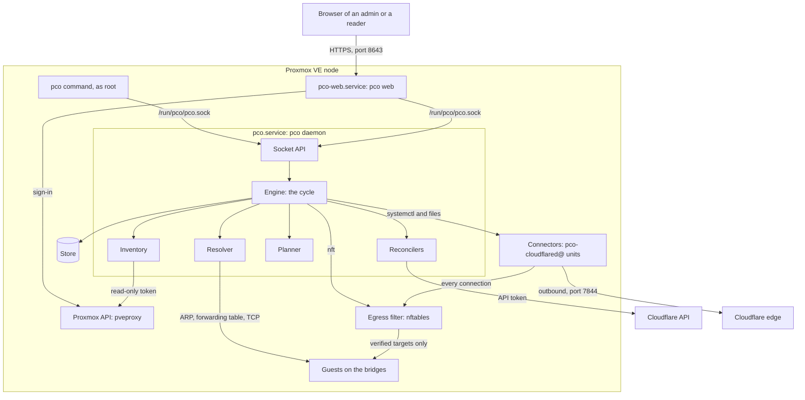
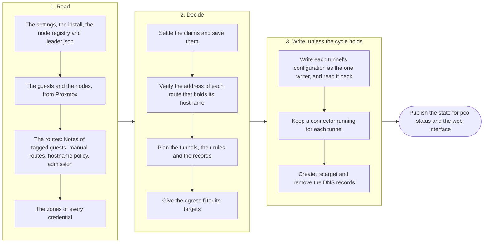
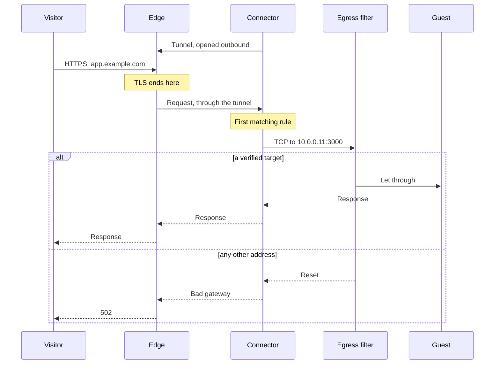
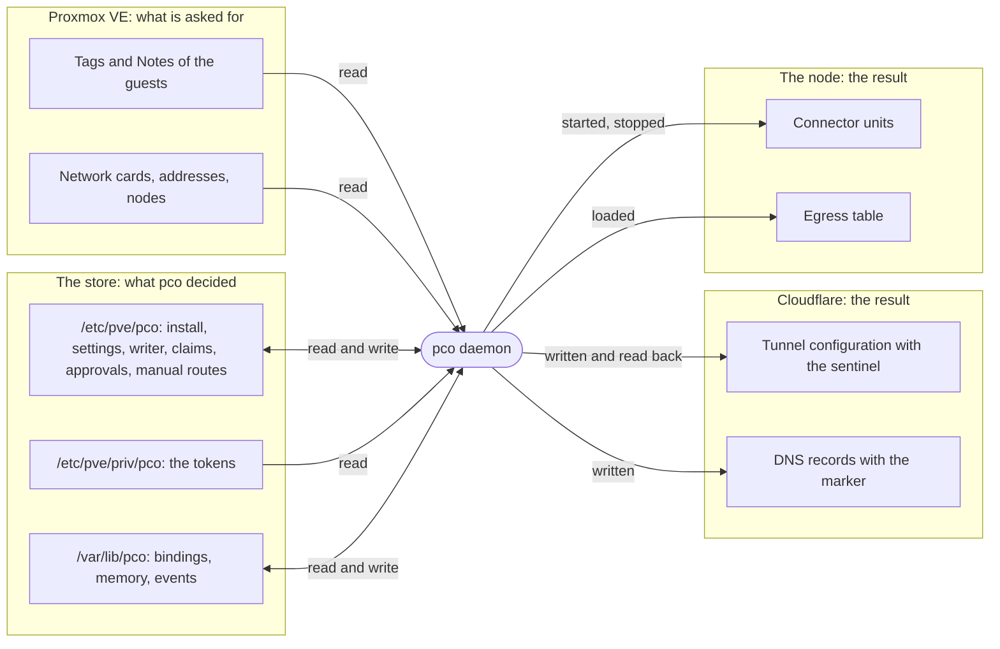

# Architecture

This page says how pco is built: its parts and where they run, what one cycle of the daemon
does, the path of a request, how pco makes sure that one process alone writes to Cloudflare,
where its state lives, and what it never touches. It describes the host profile, the one in
this release; [Profiles](profiles.md) sets it beside the appliance.

## The parts

pco is one binary, `/usr/bin/pco`, which runs as three kinds of process on the node: the
daemon, which does the work; the web process, which serves the web interface; and the
command line, which asks the daemon. The connectors are `cloudflared`, run as systemd units
that the daemon starts and stops.

The parts of the host profile, and who asks or writes to whom; an arrow points from the part
that asks or writes to the part it asks or writes to:

| Part | What it does | Code |
|---|---|---|
| Daemon | Runs as root, holds the lock of the node, runs the engine and serves the socket. | `internal/daemon` |
| Engine | Runs the cycle and keeps what the last one found, which every client reads. | `internal/engine` |
| Store | The state in small JSON files under three roots. | `internal/store` |
| Inventory | Reads the guests and the nodes from the Proxmox API. | `internal/inventory`, `internal/pve` |
| Planner | Turns the Notes into routes, settles the claims and plans the tunnels and records, without reading or writing anything itself. | `internal/planner`, `internal/annotation` |
| Resolver | Proves that an address belongs to a guest. | `internal/resolve` |
| Reconcilers | Bring the tunnels and the DNS records at Cloudflare in line with the plan. | `internal/reconcile`, `internal/cfapi` |
| Connectors | One `cloudflared` unit for each tunnel. | `internal/connector` |
| Egress filter | Confines the connectors to the targets pco verified. | `internal/egress` |
| Socket API | JSON over `/run/pco/pco.sock`, for the command line and the web process. | `internal/api` |
| Web process | Serves the web interface and passes its calls on to the socket. | `internal/web` |

### The daemon and its cycle

`pco.service` runs `pco daemon` as root. It takes an exclusive lock on
`/var/lib/pco/daemon.lock`, so that a second daemon on the node refuses to start, reads the
Proxmox token from the store, waiting up to two minutes for the cluster filesystem, and
starts its engine once its socket listens.

The engine runs one cycle at a time: every `pollInterval`, 10 seconds by default, and at once
after `pco sync` and after an admin action that changes what a cycle would do, such as
`pco apply`, an approval or a new credential. Such an action waits for the cycle that runs,
and the next cycle waits for it. [The reconcile cycle](#the-reconcile-cycle) below says what
a cycle does.

Beside the cycle the daemon runs a watch of the neighbour table and of the forwarding tables
of the bridges, which takes an address out of the egress filter as soon as its MAC moves; a
keeper of the egress table, which checks it every 30 seconds and whenever nftables reports a
change, and loads it again when it is gone or changed; and a sampler that reads the counters
of the connectors and of the egress filter every five seconds, for the traffic the web
interface shows. While the web interface is set up, the daemon also keeps its certificate up to
date, and restarts `pco-web.service` when what it loaded is no longer what the files hold.
[Operations](operations.md#the-daemon-and-its-units) has the units.

### The store

The store is a set of small JSON files, one for each object, under three roots:
`/etc/pve/pco` for what is not secret, `/etc/pve/priv/pco` for the tokens, and `/var/lib/pco`
for what belongs to this node alone. [Operations](operations.md#where-the-state-lives) lists
the files.

The first two roots are on pmxcfs, the cluster filesystem of Proxmox VE, so that every node
of a cluster sees the same files: the install, the settings, the writer identity, the claims,
and the node registry that names the node pco runs on. That is how `pco setup` on a second
node knows that pco runs elsewhere. Proxmox keeps `/etc/pve/priv` readable by root alone.

pmxcfs also sets the terms the store keeps to. It fixes the mode of a file by its path, has no
links, refuses a file over 1 MiB, copies every write to every node, and is read-only on a node
whose cluster has lost quorum. So the store never changes the mode of a file, replaces a file
by a rename within its directory, writes an object only when it changed, and reports a write
that fails as an error of that write while reads go on. The daemon never creates the two shared
roots, only `pco setup` does, and it never takes them for empty when the cluster filesystem is
not mounted.

### The inventory

The inventory is pco's view of Proxmox: the guests with their tags, Notes, network cards and
addresses, and the nodes with their addresses and interfaces. It reads them through the
Proxmox API on `https://127.0.0.1:8006` with the token `pco@pve!pco`, whose role can only
read. A cycle lists the guests and reads the configuration of every guest with the gate tag;
the others are read again every five minutes, and the addresses a guest reports are kept for a
minute.

What the inventory reads is complete or it is not. A list of guests, a configuration or a node
that could not be read makes it incomplete, and the cycle then holds: a guest missing from an
incomplete inventory proves nothing, so it never leads to a removal.

### The planner

The planner decides what the tunnels serve. It reads nothing and writes nothing, so the same
input always gives the same plan. It collects the routes from the Notes of every guest that
has the gate tag and is not a template, by the [annotation grammar](annotations.md#the-grammar),
adds the manual routes, and applies the hostname policy. It settles the claims, which guest
holds each hostname. From the winners and their verified addresses it builds the plan: for
each account with a zone that has routes, one tunnel with its ingress rules, exact names before
wildcards, a rule that answers 503 for each hostname that is claimed and not served, the
sentinel rule and a last rule that answers 404; and a proxied `CNAME` record for each hostname.

### The resolver

The resolver decides which address of a guest a route may point at, and proves that the
address is the guest's. It asks the kernel of the node: the route to the address, ARP on the
guest's bridge, the forwarding table of the bridge, and a TCP connection to the port.
[Identity](identity.md) is the whole of it.

### The reconcilers

The tunnel reconciler makes the tunnel `pco-<install id>` in each account that needs one,
writes its configuration where it differs from the plan, and reads it back: a tunnel whose
configuration at Cloudflare equals the plan is verified. The DNS reconciler creates, retargets
and deletes the proxied `CNAME` records, touches only the records that carry the marker of this
install, and points a record only at a tunnel that the same cycle verified. A record is deleted
only once its hostname has been unwanted for the whole grace period, and the mass delete guard
holds many deletes until an admin confirms them; see
[Operations](operations.md#grace-periods-and-the-mass-delete-guard). Each credential has its own
budget of requests to Cloudflare. Both reconcilers write only as [the one writer](#one-writer).

### The connectors

A connector is `cloudflared`, run for one tunnel by the unit
`pco-cloudflared@<tunnel id>.service` as the user `pco-connector`, with no capabilities. The
daemon writes its files in `/var/lib/pco/tunnels/`: the run token, a configuration file of pco's
own and an environment file that names the metrics address and the install. It starts the unit,
restarts it when its files change, and stops it when its tunnel is gone. The tunnel is remotely
managed: the connector gets its ingress rules from Cloudflare, not from the node.

The connectors keep running when the daemon stops, restarts or is upgraded, and the hostnames
they serve keep answering. What stops is every decision: new routes, withdrawals and removals.

### The egress filter

The egress filter is the nftables table `inet pco_egress`. It applies to the packets of the
user `pco-connector` alone, and lets a connector reach Cloudflare's edge, the resolvers of the
node and the targets the daemon verified, and nothing else. The daemon gives it the targets in
every cycle, before it writes anything at Cloudflare, and `pco-egress.service` loads it at boot.
[Security](security.md#the-connector-egress-filter) has its rules.

### The socket API

The daemon answers a JSON API on the unix socket `/run/pco/pco.sock` and has no network
listener. It answers root and, while the web interface is installed, the user `pco-web`, and it
tells them apart by the user id the kernel gives for the other end of each connection. The
commands that show or change the state ask the daemon through it; those that set up or take
down the node, such as `pco setup`, `pco uninstall` and `pco egress`, work on the node directly.
The API never answers with a token. [Security](security.md#the-socket-api-and-who-may-call-it)
says who may call it.

### The web process

`pco-web.service` runs `pco web` as the user `pco-web`, in a systemd sandbox of the same kind
as the connectors'. It serves the web interface over HTTPS on the address `pco setup` gives it,
by default the node's own address on port 8643. A user signs in with what Proxmox VE already
knows of them: the ticket of the Proxmox web interface, or an API token pasted in. `pco web`
checks it with pveproxy on the node; `Sys.Audit` on `/` makes a reader, `Sys.Modify` on `/` an
admin. Sessions live in the memory of the process only. Every call of the page goes through a
table of the calls it may make, each with the role it needs, to the socket of the daemon, and
nothing outside the table is passed on.

## The reconcile cycle

A cycle, every `pollInterval` or at once after an admin action, reads, decides and then writes,
in this order; a step that cannot be sure ends the cycle there or keeps it from writing, and the
state the cycle publishes says why:

The rule behind it is that missing information is never taken for an empty answer. A cycle
that holds changes nothing at Cloudflare and nothing on the connectors; the reasons are in
[Operations](operations.md#holding-back). In observe-only mode, until `pco apply`, the tunnel and
DNS steps only read, and every change they would make is shown as held by `observe mode`. A
cycle that holds still lists, when that is due, the connectors Cloudflare shows on each tunnel,
so that a hold does not hide [a connector that is not pco's](security.md#a-connector-that-is-not-pcos).

## The path of a request

A visitor's request for `app.example.com`, served by a guest at `10.0.0.11:3000`, goes from
Cloudflare's edge through the tunnel to the connector on the node, which the egress filter lets
through to the guest only at a verified target; the daemon is not on the path:

The other answers a visitor can get come from the tunnel itself. A hostname that is claimed and
not served has a rule that answers 503, and a name the tunnel has no rule for meets the last
rule, which answers 404; neither reaches a guest. With no connector connected, the edge answers
with its error 1033. [Troubleshooting](troubleshooting.md#what-a-visitor-sees) starts from these.

The connector opened the tunnel itself, with outbound connections to Cloudflare on port 7844.
From the connector to the guest the request is plain HTTP, unless the route says `https`. The
connectors run on when the daemon does not, so a published hostname keeps answering while the
daemon is stopped or upgraded.

## One writer

Only one process may write the configuration of the tunnels and the DNS records of an install.
Two that did would undo each other's work, and one that runs on an old copy of the store would
put back what the other took away. pco keeps to that with a writer identity in the store and a
mark of it at Cloudflare.

The writer identity is `/etc/pve/pco/meta/leader.json`: the install id, a generation, which is a
number, and a nonce, a random string. `pco setup` writes generation 1 for a new install, and
`pco setup --recover` takes a generation above every one it finds at Cloudflare and in the store.
Every cycle reads the file once at its start; that identity is the one the cycle writes as.

Every configuration a writer puts at Cloudflare carries its identity in the sentinel rule, the
last rule but one: `g<generation>.<nonce>.pco-<install id>.invalid`, which answers 404 and, being
in `.invalid`, never resolves. Before it writes the configuration of a tunnel, a cycle reads the
one at Cloudflare and judges the sentinel it finds there:

| Sentinel in the configuration | Verdict |
|---|---|
| None, or one of another install id, or of an older generation | The writer writes. |
| Its own generation and nonce | The writer writes. |
| Its own generation with another nonce | `foreign`: the writer stops. |
| A newer generation, which `leader.json` now names or has gone past | `stale`: the writer stops. |
| A newer generation, which `leader.json` does not know | `foreign`: the writer stops. |

Before it writes, a run checks that `leader.json` still names the identity the cycle started
with, and the DNS run asks again before every single write. If `leader.json` changed meanwhile,
the run is `stale` and stops. If it cannot be read, nothing is written.

A writer that stops changes nothing at Cloudflare for the rest of the cycle, and the `Writer:`
line of `pco status` says `stale` or `foreign`; the daemon goes on watching the connectors.
[Troubleshooting](troubleshooting.md#the-writer-is-stale-foreign-or-unknown) says what to do about
each verdict.

A restored copy of the store carries the `leader.json` of the time it was saved. If a recovery
has taken a newer generation since, the copy finds a sentinel newer than anything it knows, which
is `foreign`, and writes nothing: the problem names the generation it found and says
`pco setup --recover`. If the copy carries the generation still in use, it is the same writer as
far as the sentinel can tell, which is right when it replaces a node that is gone. Never run it
beside the original: the sentinel cannot tell two such daemons apart, and each reports the
other's connector as [a connector that is not pco's](security.md#a-connector-that-is-not-pcos).

Without quorum, pmxcfs is read-only, and so are the two shared roots of the store. The store goes
on reading, and every write to them fails. A cycle that has a changed claim to save holds and
changes nothing at Cloudflare until the claims can be saved, a DNS record whose grace cannot be
recorded is not deleted, and an admin action that writes to the store, such as an approval, fails.
A cycle with nothing to save goes on as before.

In the appliance profile the writer identity is also bound to the start of its container. Once
the appliance has proven that it is the container it was installed as, from facts a copy cannot
share, it draws a new epoch at each start of the container: the generation one up and a new
nonce. A copy of the container, such as a clone, serves nothing: it stops its connectors, empties
its egress filter and changes nothing at Cloudflare.

## pco on a cluster

pco runs on one node of a cluster. `pco setup` on a second node refuses with
`pco is already set up on node <name>; cluster support arrives in a later release`, and a daemon
holds when the node registry names any node but its own. The guests of the other nodes are listed
and their routes are read, but this node cannot see the forwarding tables of their bridges, so
they are proven at `observed` at best, and are served only once `identityMinimum` is lowered to
`observed` and their segment is acknowledged; see [Identity](identity.md#identityminimum).

The connectors run on the one node too. When that node is down, every published hostname is down
with it. Moving pco to another node when its node fails is planned for a later release; nothing
does it today.

## Where the state lives

Each kind of state has one place that is its source of truth, and the daemon brings the others in
line with it:

- **Proxmox** holds what is asked for: the gate tag and the Notes of each guest, which people
  write, and the network configuration of the guests and the nodes. pco only reads it.
- **The store** holds what pco decided and must not forget: the install and its writer, the
  settings, who holds each hostname, the approvals, the acknowledged segments, the manual routes,
  and the tokens. On the node it keeps the verified address of each hostname, what the daemon
  must still know after a restart, and the event log.
- **Cloudflare** holds the result: the tunnel of each account with its configuration, and a
  record for each hostname. pco reads it to compare and to verify, and takes nothing there as a
  wish: a change made to its tunnel in the dashboard is overwritten in the next cycle. What
  Cloudflare does decide is which accounts and zones a token sees.
- **The node** holds the rest of the result: the connector units with their files, and the
  egress table.

## What pco never touches

- A guest. The daemon never changes a guest, its tags or its Notes. Only `pco setup` and
  `pco uninstall` change Proxmox, and only what their manifest lists: the role `PCO`, the user
  `pco@pve` with its token and its grant, and the registered tags.
- A DNS record that does not carry the marker of this install. It stays, and the route waits,
  until an admin runs `pco adopt` for the name.
- A tunnel of another install, or one that is not pco's. pco deletes only tunnels of its own
  install: its tunnel when `pco uninstall` purges Cloudflare, and the probe tunnels a deep
  credential check left behind.
- Anything else at Cloudflare: the settings of a zone, certificates, Access, other records.
- A connector of another install, or one that names no install. It is reported, and never
  stopped or removed.
- Other nftables tables and the Proxmox firewall. The egress filter is a table of its own and
  looks at the packets of `pco-connector` only.
- The traffic. pco is never in the data path.
