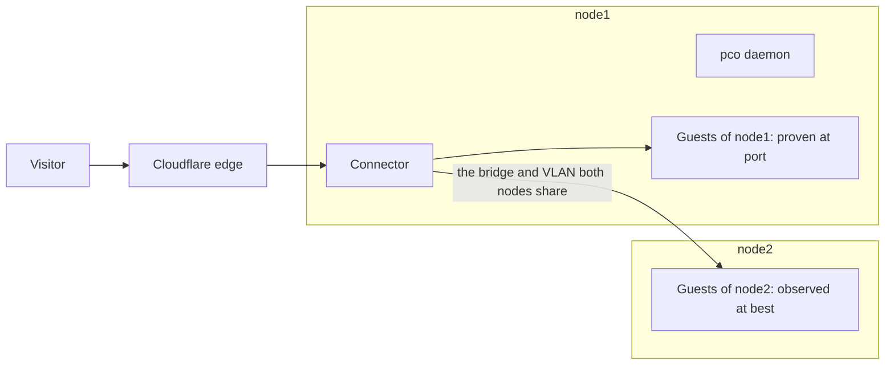

# Run pco on a cluster

This guide places pco in a Proxmox VE cluster: which node to install it on, how the guests of
the other nodes are served, and what stops when that node is down. The node that runs pco in
the examples is `node1`; `node2` is another node of the cluster.

## When you need it

Your Proxmox VE nodes form a cluster, and the guests you publish run on more than one of them,
or may move between them.

## pco runs on one node

In this release pco runs on one node of a cluster. Its state is on the cluster filesystem,
`/etc/pve/pco`, and the node registry in it names the node that runs pco. `pco setup` on a
second node refuses, with `pco is already set up on node node1; cluster support arrives in a
later release`, and a daemon whose registry names another node holds every cycle.

The connectors run on that node too, and every request to a published hostname passes through
one of them. The guests of the other nodes are reached from it, across the network the nodes
share:



Running pco on more than one node, and moving it to another node when its own fails, is
planned for a later release; nothing does it today.

## Which node to install on

- The node that runs most of the guests you publish. Only a guest on the node that runs pco
  can be proven at `port`, the highest identity level, because only there can pco read where
  the bridge delivers the guest's frames. A guest of another node reaches `observed` at best,
  and is not served unless you allow it (below).
- A node with an address of its own on every bridge and VLAN of those guests, as for a single
  node ([Identity](../identity.md#what-is-checked)).
- A node you seldom take down, since every published hostname goes down with it. If Proxmox
  VE's high availability moves the published guests, prefer that node for them, so that they
  come back to it.

## Before you start

- pco is set up on the node you chose, and publishes.
- The guests of the other nodes that you want to publish are on a bridge and VLAN that the
  node running pco shares at layer 2, with an address of its own there.

## Steps

1. Tag the guest of `node2` and write its routes, as on any node. With the default settings the
   route is proven at `observed` and held back:

   ```sh
   pco routes
   ```

   ```text
   HOSTNAME          STATE        LEVEL     SERVICE                OWNER     ZONE         NOTE
   app.example.com   active       port      http://10.0.0.12:3000  lxc/120   example.com  -
   wiki.example.com  unreachable  observed  -                      qemu/105  example.com  identity level observed is below the required port
   ```

   `pco status` counts such routes in a problem line, `1 route is held back: its identity level
   is observed, below the required port; ...`, and exits 1. The hostname answers 503 and has
   no record. Either move the guest to `node1`, which is the better answer for a few guests, or
   go on.

2. Lower the identity minimum to `observed`. Read [Identity](../identity.md#identityminimum)
   first: at `observed` pco proves an address by ARP alone, which whoever may set the MAC of a
   guest's card can satisfy, and the setting holds for every guest of the install:

   ```sh
   pco settings show --json > /root/pco-settings.json
   jq '.settings.identityMinimum = "observed"' /root/pco-settings.json > /root/pco-settings.new.json
   pco settings apply /root/pco-settings.new.json
   ```

3. A route proven at `observed` is served only on a segment, a bridge and VLAN, that an admin
   acknowledged. The route now says which:

   ```text
   HOSTNAME          STATE        LEVEL     SERVICE                OWNER     ZONE         NOTE
   app.example.com   active       port      http://10.0.0.12:3000  lxc/120   example.com  -
   wiki.example.com  unreachable  observed  -                      qemu/105  example.com  segment vmbr0 is not acknowledged; pco segment acknowledge vmbr0
   ```

   ```sh
   pco segment list
   ```

   ```text
   SEGMENT  ACKNOWLEDGED  ROUTES
   vmbr0    no            1
   ```

4. Acknowledge the segment, when every guest on it is one you would trust with the routes of
   the others. The command lists the routes it releases and asks:

   ```sh
   pco segment acknowledge vmbr0
   ```

   ```text
   1 route at observed waits for segment vmbr0:
     wiki.example.com  qemu/105 (wiki)
   Acknowledging it serves the routes at observed proven on it, unless they wait for an approval of their guest.
   Acknowledge segment vmbr0? [y/N] y
   Acknowledged segment vmbr0; its routes at observed are served from the next cycle.
   ```

   A segment of a VLAN is named with its tag, `vmbr0:20`.

5. Approve the guests that still wait. At `observed` a route also waits for an approval of its
   guest when anyone but the admins may change the guest's network, when its address answers
   from another MAC than the one first seen, or when the address is the gateway or a resolver
   of a node. `pco guest list` names them with the reason, and `pco guest approve` shows what
   it records before it asks ([Identity](../identity.md#routes-that-wait-for-an-admin)).

## When the node that runs pco is down

Nothing that pco publishes is served. The connectors run on that node, so every tunnel loses its
connections and visitors get Cloudflare's error 1033 for every hostname, those of guests on other
nodes included. The DNS records stay as they are, and nothing changes at Cloudflare until the node
is back. The guests of the other nodes run on, unpublished.

When it comes back, the connectors start before the daemon has verified anything, with an egress
filter that holds no target, and visitors get a 502 until the first cycle has given the filter
its targets ([Operations](../operations.md#the-daemon-and-its-units)). Plan a reboot of that
node as an outage of everything published.

A guest that moves from `node1` to another node, by migration or by high availability, is proven
at `observed` from then on: with the default minimum its routes are held back and answer 503
until it is back on `node1`.

Without quorum the cluster filesystem is read-only. The daemon goes on reading and serving what
is published; a cycle that has a changed claim to save holds, and an approval or another admin
action that writes to the store fails, until quorum is back.

To move pco to another node for good, follow
[Back up and recover](backup-and-recovery.md#move-pco-to-another-node).

## Check

```sh
pco status
pco segment list
pco diagnose wiki.example.com
```

`pco status` has no problem line about routes held back or held by the observed rules, and
`pco diagnose` passes its `identity` step at level `observed`.

## Undo

Take an acknowledgement back; the routes at `observed` on the segment are held from the next
cycle:

```sh
pco segment revoke vmbr0
```

Set `identityMinimum` back to `port` the way it was lowered. The routes of guests on other nodes
are then held back again and answer 503.

## Read on

- [Identity](../identity.md#the-levels): what `port` and `observed` prove.
- [Security](../security.md#identity-levels-against-five-attackers): what `observed` does not
  stop.
- [Architecture](../architecture.md#pco-on-a-cluster): pco on a cluster.
- Reference: [pco segment list](../cli/pco-segment-list.md),
  [pco segment acknowledge](../cli/pco-segment-acknowledge.md),
  [pco segment revoke](../cli/pco-segment-revoke.md).
