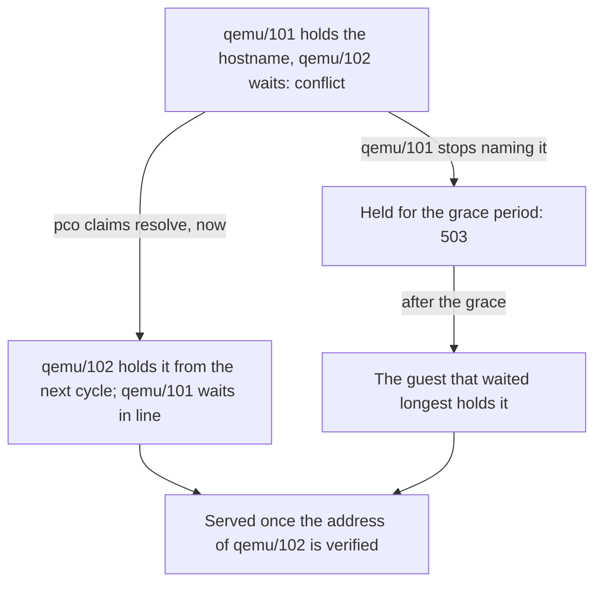

# Move a hostname to another guest

This guide hands a published hostname, `www.example.com`, from the guest that serves it,
`qemu/101` (`web-1`), to a new one, `qemu/102` (`web-2`), and says what a clone of a published
guest does.

## When you need it

- A service moves to a new guest: a rebuilt VM, a container in place of a VM, a new release
  beside the old one.
- A clone or a copy of a published guest appears, with the tag and the Notes of the original,
  and asks for the same hostnames.

## How a hostname belongs to a guest

A hostname belongs to one owner at a time, and pco keeps that as a claim. The first guest that
names it holds it for as long as it keeps asking. Any other guest that names it is in the state
`conflict`, serves nothing, and waits in line. The claim moves in two ways only: its holder
stops asking and the grace period passes, or an admin hands it over with `pco claims resolve`.
Nothing about the guests, their addresses or their identity moves it by itself.

The two ways a claim moves, and what the hostname answers on each:



## Before you start

- The new guest runs the service and is ready to be published as in
  [Publish a container](publish-a-container.md) or [Publish a virtual machine](publish-a-vm.md).
- In admission mode `approve`, the new guest needs an approval of its own;
  [Decide who may publish](who-may-publish.md) says how.

## Steps

1. Tag the new guest and give it the route for the hostname, in its Notes or, as here, on the
   command line. It waits behind the holder:

   ```sh
   qm set 102 --tags 'cf-tunnel'
   qm set 102 --description 'cf-tunnel: www.example.com -> :8080'
   pco sync
   pco routes
   ```

   ```text
   HOSTNAME         STATE     LEVEL  SERVICE                OWNER     ZONE         NOTE
   www.example.com  active    port   http://10.0.0.11:8080  qemu/101  example.com  -
   www.example.com  conflict  -      -                      qemu/102  -            hostname is held by qemu/101
   ```

   ```sh
   pco claims list
   ```

   ```text
   HOSTNAME         HOLDER            STATE     SINCE                      WAITING           NOTE
   www.example.com  qemu/101 (web-1)  conflict  2026-09-28T14:00:00+02:00  qemu/102 (web-2)  -
   ```

2. Hand the hostname over. The command says who holds it and what follows, and asks:

   ```sh
   pco claims resolve www.example.com qemu/102
   ```

   ```text
   www.example.com is held by qemu/101 (web-1) since 2026-09-28T14:00:00+02:00.
   Resolving hands it to qemu/102 (web-2); qemu/101 (web-1) waits for it from then on, in the place in line its claim gives it.
   From the next cycle qemu/102 holds it, and serves it once its address is verified: pco diagnose www.example.com shows how that goes.
   Move www.example.com to qemu/102? [y/N] y
   The claim on www.example.com is now held by qemu/102.
   ```

   Until the next cycle the old guest serves the hostname. From the cycle that verifies the
   address of the new guest, the tunnel sends it there; the DNS record does not change, as it
   points at the tunnel and not at a guest. If that address fails its check, the hostname
   answers 503 until it passes.

3. Take the hostname out of the Notes of the old guest, every mention of it. While the old
   guest still names it, it waits in line, and it gets the hostname back if the new guest
   ever stops asking for it.

The slow way needs no command: take the hostname out of the Notes of the old guest first. It is
`held` and answers 503 for the grace period, a minute by default, and then the guest that has
waited longest gets it. Use it when a minute of 503 does not matter.

## Clones and copies

A clone, and a guest restored from a backup to another VMID, carries the tag and the Notes of
the original, and so names its hostnames. It gets none of them: it is in `conflict` and serves
nothing, and `pco routes` shows it as the `qemu/102` row above. Edit its Notes to name
hostnames of its own, or take the tag off it. Do not resolve a claim to it unless the copy is
meant to take over.

Two things keep a copy from doing harm in other ways. A copy that runs with the MAC of a
running guest is refused, and its routes say `MAC <MAC> is also configured on qemu/<id>`. And in
admission mode `approve` a clone waits for an admin before it publishes anything, also names
nobody holds; [Decide who may publish](who-may-publish.md) says when that mode is worth it.

A guest that is restored, or made again, under the same VMID is the same owner to pco: it keeps
the claims of `qemu/101`, without anyone handing them over.

## Check

```sh
pco claims list
pco diagnose www.example.com
pco events --since 10m
```

`pco claims list` shows the new holder: `pending` until a cycle has settled the claim, then
`conflict` while the old guest still names the hostname, and `serving` once it publishes it
alone. `pco diagnose` names the new guest in its `route` step and its
address in `identity`. The events have the move, as an event of the kind `admin`: `the claim
on www.example.com was moved from qemu/101 to qemu/102 by the admin; qemu/101 waits for it from
now on`.

## Undo

While the old guest still names the hostname, hand it back the same way:

```sh
pco claims resolve www.example.com qemu/101
```

If its Notes no longer name it, write the route back into them first; the daemon refuses an
owner that does not claim the hostname: `qemu/101 no longer claims www.example.com: it has no
route for it and does not name it`.

## Read on

- [Annotations](../annotations.md#hostnames-belong-to-one-guest-at-a-time): claims as the
  Notes see them.
- [Security](../security.md#clones-and-restores): what a clone and a restore can and cannot
  take.
- Reference: [pco claims list](../cli/pco-claims-list.md),
  [pco claims resolve](../cli/pco-claims-resolve.md).
