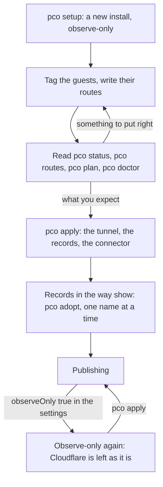

# Roll out in observe-only mode

This guide brings a node to the point where pco publishes, by way of observe-only mode: every
guest is tagged and every route written, what pco would do is read and put right, and only then
is it let loose on Cloudflare. It also says how to go back to observe-only.

## When you need it

- You set up pco where hostnames already matter, and want to see what it would publish before
  it changes a DNS record.
- You move many hostnames to pco at once, from a `cloudflared` of your own or from address
  records.
- You want pco to stop changing Cloudflare for a while, and keep what it published serving.

## What observe-only does

A new install, and one after `pco setup --recover`, starts in observe-only mode. The daemon runs
every cycle as it would: it reads the guests and their Notes, settles who holds each hostname,
proves the addresses, plans the tunnels and the records, and gives the egress filter its targets.
It reads Cloudflare, and writes nothing there: no tunnel, no configuration, no record, and no
connector on the node. `pco apply` ends the mode.

Claims are pco's own state and are kept in observe-only mode too, so the order in which guests
name a hostname counts from the first cycle, not from `pco apply`.

The way through the mode, from setup to publishing, and back:



## Before you start

- pco is installed and set up, with a token that serves your zones; [Quickstart](../quickstart.md)
  goes as far as that. `pco status` says `Mode: observe-only`.
- Decide now whether a guest needs an admin's approval before it publishes (admission mode
  `approve`, see [Decide who may publish](who-may-publish.md)), and which wildcards and apexes
  you admit ([Publish a wildcard](wildcards.md)). Both are settings that are easier to set
  before anything is published.

## Steps

1. Tag the guests and write their routes, as in [Publish a container](publish-a-container.md)
   and [Publish a virtual machine](publish-a-vm.md). Ask for a cycle when you are done:

   ```sh
   pco sync
   ```

2. Read the overview. `Issues` lists the mistakes in the Notes with their line and column,
   and `Problems` what the daemon found wrong; both should say `none`:

   ```sh
   pco status
   ```

   ```text
   Mode:        observe-only
   Profile:     host
   Inventory:   complete
   Writer:      ok
   Egress:      on
   Routes:      active 1
   Last cycle:  2026-10-01T14:00:00+02:00
   Tunnels:
     NAME              ID  VERIFIED  CONNECTOR
     pco-7f3a9c0d41b2  -   no        none
   Credentials:
     LABEL  STATE   NOTE
     main   usable  -
   Issues:      none
   Problems:    none

   Run pco apply to start publishing.
   ```

3. Read every route. In observe-only mode `active` means that pco would serve the route, with
   the address in `SERVICE`; any other state says in `NOTE` what keeps it:

   ```sh
   pco routes
   ```

   ```text
   HOSTNAME         STATE   LEVEL  SERVICE                OWNER    ZONE         NOTE
   app.example.com  active  port   http://10.0.0.12:3000  lxc/120  example.com  -
   ```

   Look for routes that are `unreachable` (no address proven, or the port does not answer),
   `rejected` (an apex or wildcard no pattern admits), `no-zone` (no credential serves the
   zone) and `conflict` (another guest named the hostname first).
   [Problems](../problems.md#route-states) has every state and reason.

4. Read the plan, what `pco apply` would set going:

   ```sh
   pco plan
   ```

   ```text
   ACTION         TARGET            DETAIL                                                                     HELD
   create-tunnel  pco-7f3a9c0d41b2  in account 0123456789abcdef0123456789abcdef                                observe mode
   put-config     pco-7f3a9c0d41b2  in account 0123456789abcdef0123456789abcdef: 3 rules, first configuration  observe mode
   create-record  app.example.com   in zone example.com: tunnel pco-7f3a9c0d41b2 has no known id               tunnel not created yet
   ```

   The rules of the tunnel are one for each hostname, one that answers 503 for each hostname
   that is claimed and not served, and two of pco's own at the end. The records wait for the
   tunnel, and the plan cannot yet say which of their names a record of someone else holds:
   that shows once the tunnel exists, after `pco apply`.

5. Run `pco doctor`. In observe-only mode its `mode` check warns, `observe-only: nothing is
   changed at Cloudflare`, as it should; any other warning or failure is worth reading first.

6. Put right what you found, in the Notes, the settings or the network, and read again from
   step 2 until the routes and the plan are what you expect.

7. Start publishing:

   ```sh
   pco apply
   ```

   ```text
   Applying: the daemon changes Cloudflare from the next cycle. Follow it with pco status.
   ```

   The next cycle creates the tunnel, writes and verifies its configuration, starts the
   connector and creates the records of the names that are free. With many routes the first
   cycles keep to Cloudflare's rate limit: of 1000 records about 990 go in the first cycle,
   and the rest about five minutes later
   ([Operations](../operations.md#what-cloudflares-rate-limit-costs)).

8. Look at the plan again. A name that a record of someone else holds is listed now, and keeps
   being served by that record until you adopt it, one name at a time:
   [Take over existing DNS records](adopt-existing-records.md).

## Check

`pco status` says `Mode: enforce`, its tunnel `VERIFIED yes` and its connector `active, ready`,
and `pco events` shows what was done:

```sh
pco status
pco events --since 10m
pco diagnose app.example.com
```

The events of the first cycle are an `admin` event, `observe-only mode ended; changes are
applied from now on`, and an `action` event for the tunnel, its configuration and each record.

## Undo

Going back to observe-only is a setting, `observeOnly`:

```sh
pco settings show --json > /root/pco-settings.json
jq '.settings.observeOnly = true' /root/pco-settings.json > /root/pco-settings.new.json
pco settings apply /root/pco-settings.new.json
```

From the next cycle the daemon changes nothing at Cloudflare. What it published stays as it is
and keeps serving: the records, the tunnel with its last configuration, and the connector,
which keeps running. New routes are not published and routes that go are not taken off.
The egress filter still follows the proofs, so an address that loses its proof is out of the
connector's reach at once, whatever the tunnel still says. `pco tunnel rotate` is refused in
the mode. `pco apply` ends it again.

To take everything off Cloudflare instead, see [Uninstall](../uninstall.md).

## Read on

- [Operations](../operations.md#observe-only-until-pco-apply): the mode, and the holds of the
  daemon.
- [Architecture](../architecture.md#the-reconcile-cycle): what a cycle does.
- Reference: [pco status](../cli/pco-status.md), [pco plan](../cli/pco-plan.md),
  [pco apply](../cli/pco-apply.md), [pco settings apply](../cli/pco-settings-apply.md).
