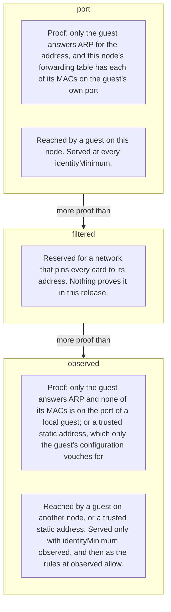
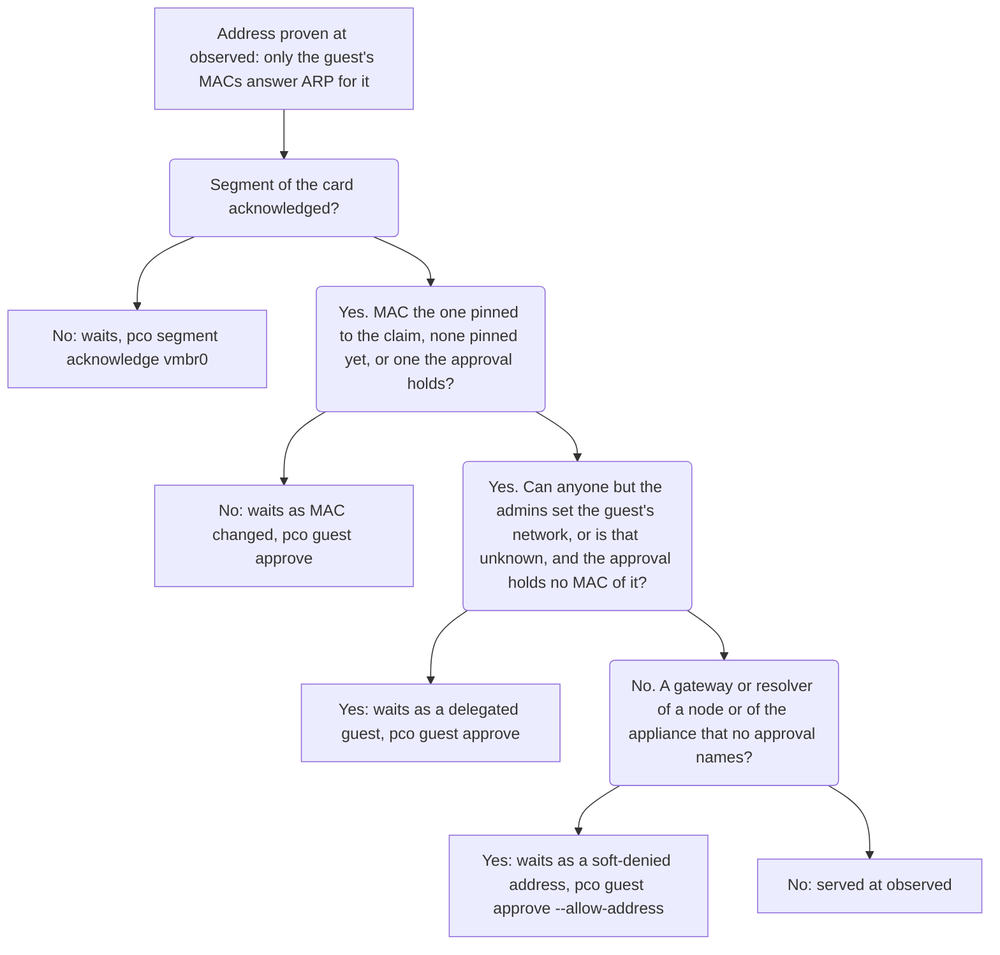
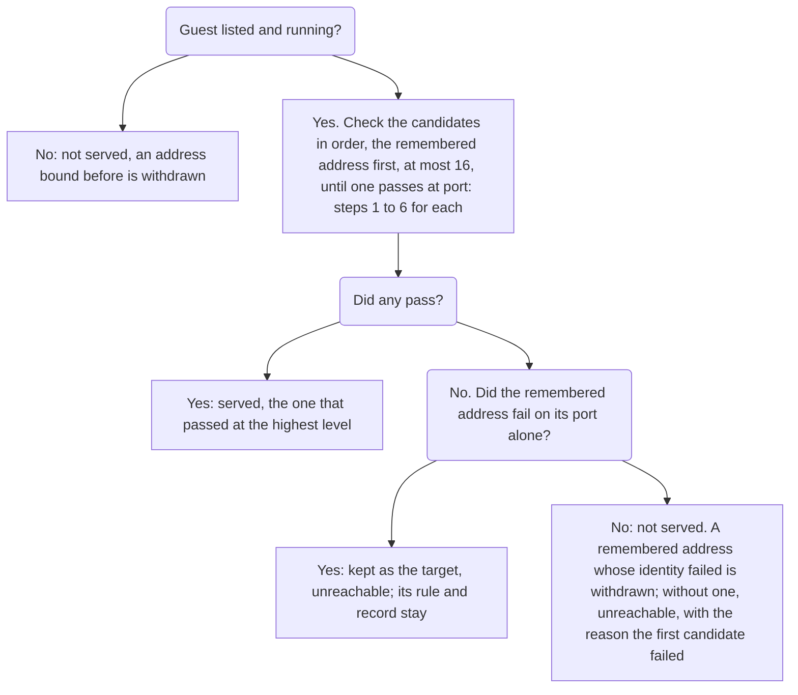

# Identity

pco publishes an address only after it has shown that the address belongs to the
guest whose Notes asked for it. This page says what it checks, in which order, what the
result levels mean, and the one setting that changes how much proof is required.

## Why it checks

The Notes of a guest are written by people, and a guest controls what its guest agent
reports and what it answers on the wire. If pco published whatever the Notes or the
agent say, a guest could name the address of the Proxmox web interface, of the router,
or of another guest, and have it appear on the internet. So neither the Notes nor the
agent is proof. Proof comes from the network the node itself sits on.

## What is checked

For each route, pco makes a list of candidate addresses (see below) and verifies them
one at a time. A candidate is served only if all of the following hold.

1. **It is not forbidden.** It is an IPv4 address, not loopback, link-local, multicast,
   unspecified or broadcast, not an address of any node of the cluster or of this host,
   and not the gateway of an SDN subnet. No setting lifts this. See
   [the denylist](#the-denylist-and-the-node).
2. **The node reaches it directly.** The node has an address of its own in the guest's
   network, on the interface of the bridge (or of the VLAN) that the guest's network
   card is on, and the kernel sends traffic for the candidate out of that interface,
   to the address itself and not through a gateway. The route must not depend on the
   source address either. Otherwise a guest could prove an address on its own bridge
   while the node sends the real traffic somewhere else.
3. **No other running guest has the MAC.** A MAC address that is configured on another
   guest that runs, or may run because Proxmox has not said whether it does, is
   refused. A stopped guest does not count. One guest keeps a MAC that another has too:
   the guest whose address was bound on that MAC before, for as long as the bridge's
   forwarding table still has the MAC on its own port (step 5). A guest that starts with a
   copy of a published guest's MAC therefore does not take its route away, while the
   table places the MAC where it was; once the table moves it, the binding is withdrawn.
4. **Only this guest answers ARP for it.** pco sends its own ARP requests on that
   interface, three of them a tenth of a second apart, and collects for about 600 ms
   every MAC that claims the address: replies, but also requests and announcements that
   name it as their sender. Every MAC must be one of the guest's own network cards on
   that bridge and VLAN. No answer, a stranger's answer, or so many claimants that the
   list is cut short is a failure.
5. **The bridge delivers it to the guest's own port.** This is the forwarding-table
   check, and it needs the guest to run on this node. For each MAC that answered, the
   bridge's forwarding table (per VLAN on a VLAN-aware bridge) must have learned it on
   exactly one port, the port Proxmox made for that guest's card:
   `tap<vmid>i<n>` for a virtual machine, `veth<vmid>i<n>` for a container, or
   `fwpr<vmid>p<n>` when the card has the firewall on. A MAC that the table has on the
   uplink, on another guest's port, or on several ports fails.
6. **The port answers.** pco makes a TCP connection to the address and port of the route,
   and gives it two seconds.

The result of steps 1 to 5 is the identity level. Step 6 is not about identity: a route
whose identity holds but whose port does not answer is kept and shown as `unreachable`.
A trusted static address behind a router is proven in another way, which replaces steps 2,
4 and 5; see [Static addresses behind a router](#static-addresses-behind-a-router).

## The levels

`pco routes` shows the level of each route in the `LEVEL` column.

The levels form a ladder, from the most proof at the top to the least, each with what proves it
and which routes can reach it; a route without a guest has the level `manual`, outside the
ladder:

| Level | What was proven |
|---|---|
| `port` | Steps 1 to 5: only the guest answers ARP for the address, and the forwarding table of this node places each of its MACs on the guest's own port. |
| `observed` | Less than `port`, in one of two ways. For a guest on another node of the cluster: only the guest answers ARP for the address, and none of its MACs is on the port of a guest of this node, which would be a local guest answering in its name; this node cannot see where the table sends the guest's own frames. For a trusted static address behind a router (see below): neither ARP nor the forwarding table is asked, and only the guest's Proxmox configuration vouches for the address, together with a kernel route to it through a gateway. |
| `filtered` | Reserved. It is the level of a network in which every guest card is pinned to its address by the Proxmox firewall, which belongs to the appliance profile; see [Profiles](profiles.md). Nothing proves it in this release. |

A route that names an address and no guest has the level `manual`. Root makes it with
`pco route manual add`, an admin in the web UI, and its address must lie in `manualCIDRs`;
it is kept as a file in `/etc/pve/pco/routes/`, and nothing proves it; see
[Security](security.md).

`port` is the highest level, and only a guest on the node that pco runs on can reach it.
When a route has several candidates, pco serves the one proven at the highest level, and
it stops trying once one reaches `port`; the order below only decides between equals. A
newly bound address is kept for two minutes before pco looks for a candidate that may be
proven higher, unless the address is proven below `identityMinimum`, so that a candidate
whose proof comes and goes does not move the route up and down.

## `identityMinimum`

The setting `identityMinimum` is the lowest level at which an address is served. Its
values are `port`, `filtered` and `observed`, and the default is `port`. It is a setting
of the whole install: there is no minimum per route.

With the default, two kinds of route are not served:

- routes of guests on other nodes of the cluster, and
- routes to a trusted static address.

Both can only reach `observed`. Such a route is held back: its hostname answers 503, no
DNS record is made for it, and `pco routes` shows it as `unreachable` with the note

    identity level observed is below the required port

`pco status` carries a problem line that says how many routes are held back at which
level and what to do:

    1 route is held back: its identity level is observed, below the required port; guests
    on other nodes and trusted static addresses are proven at observed only: lower
    identityMinimum in the settings to serve them

(The status then exits with 1, because a published route that answers 503 needs you.)

To serve them, set `identityMinimum` to `observed`. Understand what that means first.
At `observed`, ARP consistency is all that is proven, and that can be satisfied by
configuration and not only by forging. A Proxmox user who can set the MAC of a guest's
card and write its Notes can aim a route at any device on the segment whose MAC they
copy. The table in [Security](security.md) spells out which attacker each level stops.
Lowering the minimum does not switch off the forwarding-table check of the guests of this
node: they are still proven at `port` where they can be, and a local guest whose MAC is not
on its own port still fails. What changes is that routes proven at `observed` are served, as
far as [the rules at `observed`](#routes-that-wait-for-an-admin) allow, and the setting is
the same for every guest of the install: any guest that is on another
node, and any trusted static address, gets the lower proof. If the guests that need
`observed` are few, the better answer is often to run pco on the node where they live.

`filtered` is accepted as a value, because it is the name of a level the installation
may have in another profile. On the host it is treated as `port`; in the appliance it holds
every route back, as nothing proves it there yet (see
[the appliance](#the-appliance-and-observed)).

## Routes that wait for an admin

A proven address can still wait for an admin before it is served. Such a route is
`unreachable` and its hostname stays claimed and answers 503; `pco routes` says what it waits
for, `pco guest list` lists its guest among those that wait, and one problem line of
`pco status` counts the routes held this way.

At `observed`, which is served only while `identityMinimum` is `observed`:

- **The segment.** A route proven by ARP at `observed`, which is the route of a guest on another
  node, is served only on a segment an admin acknowledged: the bridge and VLAN of the guest's
  card, named `vmbr0`, or `vmbr0:20` for VLAN 20. `pco segment list` shows the segments that
  routes were proven on, and `pco segment acknowledge vmbr0:20` serves them from the next cycle.
  A trusted static address is on no segment and does not wait for one.
- **The MAC.** The first time an address of a route is verified at `observed`, the MAC it
  answered from is pinned to the hostname's claim. When the address later answers from another
  MAC, the route waits until an admin approves the guest, which records the new MAC.
- **Delegated guests.** When anyone but the admins (`Sys.Modify` on `/`) and pco's own user holds
  `VM.Config.Network` on the guest, the route waits for an approval of the guest. pco reads the
  access control of Proxmox every minute; while the last read that worked is more than five
  minutes old, or none has worked since the daemon started, every route at `observed` waits for
  such an approval.

At any level:

- **Gateways and resolvers.** The address of a guest that is the gateway of an interface of a
  node, or a resolver of a node, is served only once an approval of the guest names it. Such an
  address stays on the list for 30 days after pco last saw it in that role.

`pco guest approve <guest>` shows why the guest waits and what the approval records, the MACs
and the addresses, and records it. It releases these routes in either admission mode;
[Security](security.md#approval-mode) says what else an approval does.

## The appliance and `observed`

The [appliance](appliance.md) runs in a container, which has no forwarding table of the bridge
to read, so step 5 above is not there: an address it verifies through its own card is proven at
`observed` at best, whichever node the guest runs on. Its `identityMinimum` is `observed` from the
install, and every route it serves is served under the rules of the section above. Each of them
is there because, at `observed`, ARP is all that is proven, and whoever may set the MAC of a
guest's card may aim a route at another device on the segment.

The order in which a route proven at `observed` meets them, and what releases each; each box
begins with the answer that leads to it:

- **Segments and their acknowledgement.** The appliance maps each of its cards to the bridge and
  VLAN of its configuration in Proxmox. A segment is acknowledged once, by an admin, and a new
  one starts unacknowledged. Acknowledge a segment when you would trust every device on it with
  what its MAC can claim: a device that copies a guest's MAC passes ARP as the guest does.
  `pco segment list` shows the segments and their routes, `pco segment revoke` takes an
  acknowledgement back. A bridge whose name has a dot cannot be acknowledged, and its routes
  wait.
- **The MAC pin.** The first time an address of a route is verified, the MAC it answered from is
  pinned to the hostname's claim, and stays with the claim across a stop of the guest and a
  withdrawal. The claim goes, and the pin with it, only when the hostname is released after the
  grace period.
- **Renumbering under the pin.** A guest that gets another address, as from DHCP, is served at
  the new one in the next cycle without an admin, as long as the pinned MAC alone answers for
  it. A new MAC is what needs an admin: the route waits with
  `MAC changed from <old> to <new>; approve the guest to accept it`, and the approval records the
  new MAC.
- **Delegated guests.** pco reads the access control of Proxmox every minute and works out, as
  Proxmox does, who holds `VM.Config.Network` on each guest: the one privilege that chooses a
  card's MAC. When anyone but the admins and pco's own user and tokens holds it, through a user,
  a group, a token or a pool, the guest's routes at `observed` wait for an approval, which
  records the MACs it answered from. A clone and a restore are guests of their own and fall
  under the same rule.
- **Access control that cannot be read.** Until the first read after a start, and while the last
  read that worked is more than five minutes old, every guest counts as delegated.
- **Soft deny and `--allow-address`.** The gateways and the resolvers of the nodes and of the
  appliance itself are soft-denied: a guest that is the router or the resolver of a network is a
  common thing to publish, and also the address a route aimed elsewhere would reach for. A route
  to one waits at any level until an approval of its guest names the address:
  `pco guest approve lxc/120 --allow-address 192.0.2.1`. The addresses of nodes and of the
  appliance stay denied without exception. A soft-denied address not seen in that role for 30
  days leaves the list.

`pco routes` shows the reason of each route that waits, `pco guest list` the guests that wait
with why, and a problem line of `pco status` counts the routes held by these rules:

    2 routes are held by the observed rules: segment not acknowledged 2; pco routes says why each is held

**Why `filtered` holds every route.** `filtered` is the level of a managed network, in which pco
attaches a card of its own to each guest and pins it to its address with the Proxmox firewall.
That network comes in a later release, and nothing proves `filtered` before it. An appliance
whose `identityMinimum` is `filtered` therefore serves no guest: each route shows
`identity level observed is below the required filtered` in `pco routes`, and the problem line
counts them and names `observed`. Leave it at `observed`.

**The appliance's own addresses.** The denylist of the appliance holds, besides the addresses of
every node, the addresses of the appliance itself and the gateways of SDN subnets. The addresses
of a node come from the API, which lists those a node is configured with; an address a node
holds only at run time, as one from DHCP, is known only when the installer or a repair saw it
on the node it ran on. Give the nodes static addresses, or run a repair after one changed; see
[Appliance](appliance.md#restore-and-repair).

## Candidates and their order

A route's target says which addresses are candidates.

- An address in the target (`-> http://10.0.0.50:5000`) or `via=<ipv4>`: that address
  and no other. It is placed on the card of the guest that lists it as a static address
  or that the guest agent reports it on, and when neither does, tried on every card that
  has a bridge, in the order of the cards. The checks above decide.
- `via=net<N>`: the addresses of that card, the static ones from the Proxmox
  configuration first and then the ones the guest reports.
- Neither: the static addresses of every card, in the order of the cards, then the
  reported addresses of every card in the same order. Static means `ipconfig<N>` of a
  virtual machine (cloud-init) or `ip=` of a container. Reported means what the guest
  agent says for a virtual machine and what Proxmox reads from a running container. A
  reported address counts only for the card whose MAC the agent gives it with.

IPv6 addresses are not candidates, and neither are addresses that are unspecified or
multicast. At most 16 candidates are tried for one route in a call.

pco remembers the address it verified for each hostname, with the MAC of the card, the
level, the time and, for a proof at `port`, the bridge and the port the forwarding table
placed the MAC on (the files in `/var/lib/pco/bindings`). That address is verified
first in the next cycle, even when nothing reports it any more, so that a guest agent
that stops answering for a while does not unpublish a route. If the address fails
because its port does not answer, it stays the target for two minutes before other
candidates are tried. If the check could not be made at all, because the host could
not be asked, the old proof stands for five minutes at most, and after that the route
is withdrawn.

`via=` is the way to say which address you mean when a guest has several. Without it,
the remembered address is tried first, and then the first candidate that passes at the
highest level is used.

The way pco finds the address of a route is drawn below. The port is part of the check of
each candidate, so a candidate whose port does not answer is passed over like one whose
identity fails. Each box begins with the answer that leads to it. The drawing leaves out the
two minutes for which a newly bound address, or a bound one whose port fails, is kept without
trying the others, and a check the host could not make:

## When a check fails

A route that was verified and then fails its identity check is withdrawn: its rule
becomes a 503 block, its DNS record stays, and `pco routes` shows the state `withdrawn`
and the reason. The same happens when the guest stops (`guest is not running`) or is
no longer listed. It is served again when the identity check passes again, whatever
the port does. A route that was never verified is `unreachable` and has no DNS record
yet.

A route does not have to wait for the next cycle to be checked again. When the kernel
reports that the MAC of a served address moved, the address leaves the egress filter at
once and the route is verified again, and only a verification that fails withdraws it at
Cloudflare. [Security](security.md) says what is watched and what that does not cover.

The reasons say what failed. `pco diagnose <hostname>` lists every candidate that was
tried and how it fared, in its `identity` step. [Troubleshooting](troubleshooting.md)
has the reasons and what to do about each.

## The denylist and the node

These addresses are never published, for any route, whatever it says:

- an address that is not IPv4;
- loopback, link-local, multicast, unspecified and the broadcast address;
- the address of any node of the cluster, as Proxmox reports it, and every address
  configured on an interface of a node. The addresses are saved on the node, so that a
  node that is offline still counts with the addresses it had.
- an address configured on an interface of this host;
- the gateway of an SDN subnet, as Proxmox lists it.

The reason is the node itself. Without this rule a guest could write the address of the
hypervisor into its Notes and publish the Proxmox web interface on port 8006. A guest
controls its own configuration and its own agent, so the denylist does not trust either
of them. The one exception is a manual route with `allowNode`, which lifts
the two rules about nodes and none of the others; no route from a guest's Notes can.

It is not the only layer. The egress filter of the connectors (see
[Security](security.md)) rejects every connection of a connector to an address of the
node that is not one of its verified targets, and no guest's address is ever one of
those. So someone who edits the tunnel configuration at Cloudflare directly cannot point
the connector at the node either.

## Static addresses behind a router

The check in step 4 needs the node to be on the guest's network. If a guest is reached
through a router, the node has no address next to it and there is nothing to ARP for.
Two settings let such an address through:

- `trustStatic`, a switch, and
- `trustedCIDRs`, a list of IPv4 prefixes.

An address then passes, with a route through a gateway in place of step 2 and without
the ARP and forwarding-table steps 4 and 5, when it is a static address of the guest's
Proxmox configuration, it lies in one of the prefixes, and the kernel's route to it goes
through a gateway and not directly. Step 3 still applies: no other running guest may have
the card's MAC.

Read what that means. Nothing on the wire is looked at, and only the configuration of the
guest vouches for the address, so its level is `observed`, and it is served only if
`identityMinimum` is `observed` as well. Whoever can edit the network configuration of a
tagged guest in Proxmox can give a card the address of any host inside `trustedCIDRs`, and
the route then points at that host. Make the prefixes as narrow as you can; the table in
[Security](security.md) has the attacker this is. Both settings are read when the daemon
starts. [Operations](operations.md) says how to change them.

## What this does not do

The checks are made when pco looks. A cycle, every 10 seconds by default, checks an address
on the wire once however many routes point at it, 32 addresses at a time. While the watch
below runs, a proof at `port` stands in the cycles after it until its address comes due,
once in every `reverifyInterval` (a minute by default) at a time of its own, or at once when
the watch reports a move, the guest's configuration changes or its port stops answering;
[Operations](operations.md) has the details. Between two cycles the daemon watches the
neighbour table of the node and the forwarding tables of the bridges and reacts to a bound
MAC that moves, but that watch has limits:

- The address leaves the filter within tens of milliseconds of the change, not at the same
  instant. [Security](security.md) says what can happen in that time.
- A MAC of the guest's own that appears only in the neighbour table is not a move: a guest
  with two cards on one bridge may answer for its address with either.
- A route proven at `observed` placed no MAC in the forwarding table, so only the neighbour
  table is watched for it, and its address is checked on the wire in every cycle.
- If the watch cannot run, a move is seen at the next cycle only, and the daemon logs it;
  every cycle then checks every address on the wire.

Only IPv4 origins are supported, and the guest and the node must be on a common layer 2
network, except for the trusted static addresses above.
