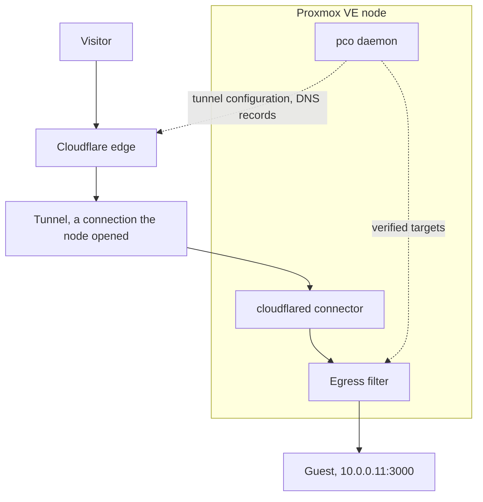

# pco

pco is a Cloudflare Tunnel operator for Proxmox VE. You tag a guest `cf-tunnel` and list
the hostnames it should serve in its Notes, and pco publishes them through a Cloudflare
Tunnel. A daemon on the node reads the guests through the Proxmox API and keeps the
configuration of the tunnel, and a proxied DNS record for each hostname, in line with what
the Notes say. Before it publishes an address it proves that the guest really answers for
it, so that a guest cannot publish the address of the node or of another machine by naming
it. pco is never in the data path: a request goes from Cloudflare's edge through the tunnel
to a `cloudflared` connector on the node, which an egress filter confines to the addresses
pco verified, and on to the guest.

## The path of a request

A visitor reaches Cloudflare's edge, which carries the request through the tunnel to the
connector on the node, and the egress filter lets it on to the guest only at an address pco
verified; the daemon writes the configuration beside that path and is not on it:

## Profiles

pco runs in one of two [profiles](profiles.md):

- **Host**: the daemon and the connectors run on the Proxmox VE node, as systemd units.
- **Appliance**: they run in an unprivileged container, and nothing is installed on the node; it comes in the next release.

## What pco needs

To run pco on a node, which is the host profile, you need:

- Proxmox VE 8.4 or later, which is on Debian 12, or Proxmox VE 9.x, which is on Debian 13,
  on amd64 or arm64. `pco setup` refuses any other version.
- Root on the node, to install the package and run `pco setup`.
- `cloudflared`, which runs the tunnels. `pco setup` installs it from Cloudflare's package
  repository when it is missing, and asks first; the package of pco only recommends it.
- A Cloudflare account with a domain whose zone is active, and an API token that can edit
  tunnels and DNS records in that zone; [Cloudflare token](cloudflare-token.md) says which
  permissions.
- Outbound access from the node: port 7844, TCP and UDP, to Cloudflare's edge for the
  connectors, and port 443 for the API.
- Guests with an IPv4 address that pco can learn, on a bridge where the node has an IPv4
  address too; [Quickstart](quickstart.md) has the whole list.

The packages, their checksums and the signature of the checksum file are on the
[releases page](https://github.com/anaryk/proxmox-cloudflared-operator/releases).

## Where to read on

- **Start**: [Quickstart](quickstart.md) takes a node from nothing to one published
  hostname, [Cloudflare token](cloudflare-token.md) says what the token needs, and the
  [FAQ](faq.md) answers the questions that come up first.
- **Concepts**: [Architecture](architecture.md) says how pco is built,
  [Annotations](annotations.md) is everything you can write in the Notes,
  [Identity](identity.md) how pco proves that a guest owns an address,
  [Security](security.md) what that and the egress filter stop, and [Profiles](profiles.md)
  sets the host and the appliance side by side.
- **Operations**: [Operations](operations.md) covers the daemon, the store and upgrades,
  [Troubleshooting](troubleshooting.md) starts from the output of `pco status`,
  `pco doctor` and `pco diagnose`, and [Uninstall](uninstall.md) takes pco off a node.
- **Reference**: [the commands](cli/index.md), [Settings](settings.md), [Files](files.md),
  [Problems](problems.md), [the annotation grammar](annotations.md#the-grammar) and the
  [Glossary](glossary.md).
- **Project**: the [releases page](https://github.com/anaryk/proxmox-cloudflared-operator/releases),
  the [security policy](https://github.com/anaryk/proxmox-cloudflared-operator/blob/main/SECURITY.md),
  which has the release key and how to verify a release, and the
  [source](https://github.com/anaryk/proxmox-cloudflared-operator).

pco is open source under the MIT licence, and is not affiliated with Proxmox Server
Solutions GmbH or Cloudflare, Inc.
