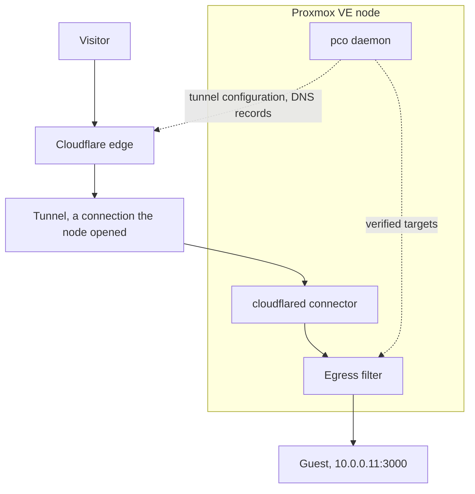

# pco

pco is a Cloudflare Tunnel operator for Proxmox VE. You tag a guest `cf-tunnel` and list
the hostnames it should serve in its Notes, and pco publishes them through a Cloudflare
Tunnel. A daemon on the node reads the guests through the Proxmox API and keeps the
configuration of the tunnel, and a proxied DNS record for each hostname, in line with what
the Notes say. Before it publishes an address it proves that the guest really answers for
it, so that a guest cannot publish the address of the node or of another machine by naming
it. pco is never in the data path: a request goes from Cloudflare's edge through the tunnel
to a `cloudflared` connector on the node, which an egress filter confines to the addresses
pco verified, and on to the guest.

## The path of a request

A visitor reaches Cloudflare's edge, which carries the request through the tunnel to the
connector on the node, and the egress filter lets it on to the guest only at an address pco
verified; the daemon writes the configuration beside that path and is not on it:

## Profiles

pco runs in one of two [profiles](profiles.md):

- **Host**: the daemon and the connectors run on the Proxmox VE node, as systemd units.
- **Appliance**: they run in an unprivileged container, and nothing is installed on the node; it comes in the next release.

## Where to read on

- **Start**: [Quickstart](quickstart.md) takes a node from nothing to one published
  hostname, and [Cloudflare token](cloudflare-token.md) says what the token needs.
- **Concepts**: [Annotations](annotations.md) is everything you can write in the Notes,
  [Identity](identity.md) how pco proves that a guest owns an address, and
  [Security](security.md) what that and the egress filter stop.
- **Operations**: [Operations](operations.md) covers the daemon, the store, the settings and
  upgrades, [Troubleshooting](troubleshooting.md) starts from the output of `pco status`,
  `pco doctor` and `pco diagnose`, and [Uninstall](uninstall.md) takes pco off a node.
- **Reference**: [the annotation grammar](annotations.md#the-grammar).

pco is open source under the MIT licence, and is not affiliated with Proxmox Server
Solutions GmbH or Cloudflare, Inc.
