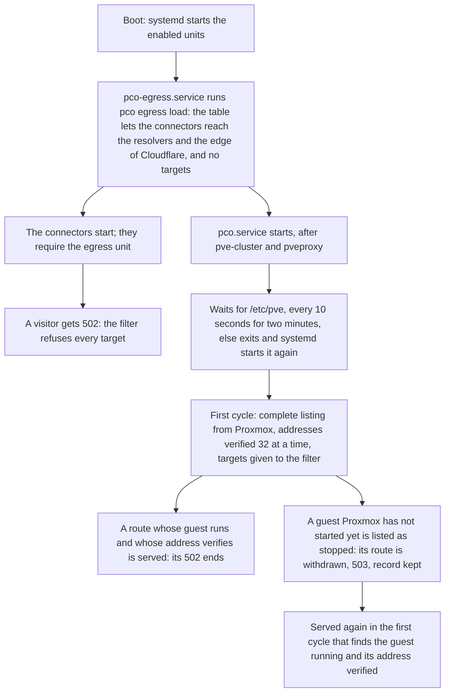
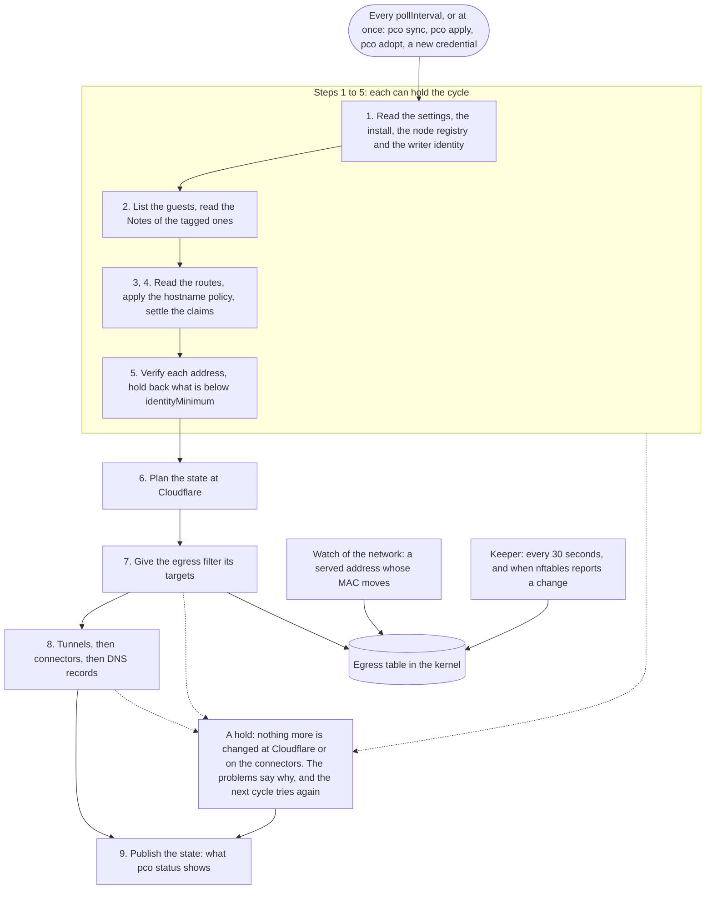

# Operations

This page is the reference for running pco: the daemon and its units, what the daemon does
in each cycle and when it holds back, what a reboot does, how to read its output from a
script, the environment variables, and upgrades. The settings are in [Settings](settings.md),
every path in [Files](files.md), and every problem line in [Problems](problems.md).

## The daemon and its units

The package installs five systemd units, in `/usr/lib/systemd/system`.

| Unit | What it does |
|---|---|
| `pco.service` | The daemon, `pco daemon`. It is of type `notify`, restarts after 5 seconds when it stops, and has 150 seconds to start. It starts after `network-online.target`, `pve-cluster.service` and `pveproxy.service`, and no unit is ordered after it. It does not wait for the guests, and they do not wait for it, those managed by HA included. |
| `pco-egress.service` | Loads the egress filter by running `pco egress load`, a hidden command that puts the table in place with the resolvers of the node and no targets, and exits. It is a one-shot unit that stays active, and it is ordered before `pco.service`. Setup enables and starts it, so the table is loaded at every boot, also before a connector exists, and uninstall disables it. The connector units require it, so starting a connector starts it too. Do not restart it to load the table again: every connector restarts with it. `pco egress load` does that. |
| `pco-cloudflared@<tunnel id>.service` | The connector of one tunnel, `cloudflared` with the files of the tunnel. The daemon starts and stops these, one for each tunnel. They require `pco-egress.service`. |
| `pco-web.service` | The web interface, `pco web`. It runs as the user `pco-web`, starts after `network-online.target`, `pve-cluster.service` and `pco.service`, restarts after 2 seconds when it stops, and reads its address from `/etc/default/pco-web`. `pco setup` enables it, unless it is given `--no-web`. An upgrade of the package restarts it if it ran. |
| `pco-net.service` | For the appliance only; nothing starts it on a host. It runs `pco net load`, a hidden command that puts the dummy device, the route and the table that keep the appliance's service prefix to itself in place, before the network and before `pco.service` and the connectors, which require it in the appliance. Do not restart it to load them again, as `pco.service` and every connector restart with it: `pco net load` does that. |

The connectors keep running when the daemon stops, restarts or is upgraded. pco is never in
the data path: a request goes from Cloudflare's edge to a connector and from there to the
guest, and none of it passes through the daemon. If the daemon is down, published routes
keep working; what stops is everything that needs a decision: new routes, withdrawals, and
the removal of records. The egress table stays in the kernel as the daemon left it, with its
targets, but nothing loads it again if something removes it: `pco egress load` does.

The daemon waits for the cluster filesystem when it starts. Its first step is to read the
Proxmox token from `/etc/pve/priv/pco`, and if `/etc/pve` is not mounted yet it tries again
every 10 seconds for two minutes, and then gives up and exits, which systemd answers by
starting it again. It also takes an exclusive lock on `/var/lib/pco/daemon.lock`, so a
second daemon, whether started by hand or by systemd, refuses with `another pco daemon is
running on this node`.

A connector listens for metrics on `127.0.0.1`, on the lowest port from 20300 that no other
connector uses; the daemon reads its `/ready` endpoint to tell whether it is connected.

After a reboot the connectors start with an egress table that has no targets, so a published
hostname answers 502 until the daemon's first cycle has got a complete listing from Proxmox,
verified the routes and given the filter their targets (see [Security](security.md)). The
daemon starts after `pve-cluster.service` and `pveproxy.service`, and the addresses are verified
up to 32 at a time, so the time to the first serve grows with their number.

The daemon is not ordered before the start of the guests, so Proxmox may still be starting
them when the first cycles run. A guest that does not run yet is listed as stopped, and a
route that was served before the reboot is withdrawn with the reason `guest is not running`:
its hostname answers 503 and its DNS record stays. The route is served again in the first
cycle that finds the guest running and its address verified, which for the guests that start
last is some cycles after the daemon's first. A VM whose address comes from the guest agent
has it only once the agent runs in the guest.

The next diagram shows what a reboot does, from the units that start to the first route that
is served again, and where a visitor sees what.

## Where the state lives

The state is a set of small JSON files, one for each object, in three roots: `/etc/pve/pco`
for what the cluster shares and is not secret, `/etc/pve/priv/pco` for the secrets, and
`/var/lib/pco` for the state of this node. [Files](files.md) lists every file, with what
writes it, its mode and whether to back it up. The daemon never creates the shared roots,
only `pco setup` does, and it checks that the cluster filesystem is mounted before it
touches them. Do not edit the files by hand, except the settings.

## The cycle, in plain words

The daemon runs a cycle every `pollInterval` (10 seconds by default), and at once when you
ask: `pco sync`, `pco apply`, `pco adopt`, or when a credential is added. In each cycle it:

1. Reads the settings, the install, the node registry and the writer identity.
2. Asks Proxmox for every guest and reads the configuration of the tagged ones. Guests that
   are not tagged are read again only every five minutes. The addresses a guest reports are
   cached for a minute.
3. Reads the routes out of the Notes of the tagged guests and applies the hostname policy
   and, in approve mode, the approvals.
4. Settles the claims: which guest holds each hostname.
5. Verifies the address of each route that holds its hostname, up to 32 at a time, with
   15 seconds for each (see [Identity](identity.md)), and holds back what is below
   `identityMinimum`. Routes on the same address of a guest share one check. A proof the
   watch of the network vouches for is not made again until it is `reverifyInterval` old;
   see below.
6. Plans the state at Cloudflare: one tunnel for each account that holds a zone with routes,
   a rule for each route, a 503 rule for each hostname that is claimed and not served, and a
   proxied record for each hostname.
7. Gives the egress filter its targets: those it verified and those a confirmed tunnel
   configuration still uses, less the addresses that lost their proof (see
   [Security](security.md)). This comes before anything is written at Cloudflare.
8. Unless something holds the cycle, brings Cloudflare in line: creates the tunnel if it is
   missing, writes its configuration and reads it back, starts or restarts the connector,
   and creates or retargets DNS records, and removes the ones that are no longer wanted.
9. Publishes what it found, which is what `pco status` shows.

The numbers in the diagram are those of the list. It shows where a cycle can end early, and
what runs beside it.

Two things run beside the cycle. A watch of the network reacts to a served address whose
MAC moves, without waiting for the next cycle. A keeper checks the egress table every 30
seconds and whenever nftables reports a change, and loads it again when it is gone or
changed. [Security](security.md) describes both.

### How often an address is checked on the wire

Checking an address takes the time of an ARP exchange, about 600 ms, which is what a cycle
of many routes waits for. So an address is checked once in a cycle however many routes
point at it, and a proof at `port` stands, in later cycles, for as long as the watch of the
network vouches for it. Each cycle still checks what needs no wire, the denylist, the
addresses of the nodes and the MACs of the other guests, and connects to the port. The
address is checked on the wire again in the next cycle when:

- the watch reported its MAC moved;
- the configuration of its guest changed, or the guest stopped, or moved to another node;
- its address comes due: once in every `reverifyInterval` (a minute by default), at a time
  each address takes from its own, so that the addresses proven in one cycle come due a
  share in each of the cycles that follow;
- the port did not answer, which has the address checked again in the same cycle;
- the proof is at `observed`, or placed the MAC on no bridge: the watch cannot see it move;
- the watch is not running: it could not start, the node is not Linux, or it started
  after the proof was made.

A new address is checked in two cycles in a row: the watch has it only after the first.
With the defaults and 1000 routes, each cycle checks about a sixth of the addresses on the
wire, which takes about 4 seconds; a cycle that checks every address, as one does while the
watch is not running, takes about 20 seconds.

### What Cloudflare's rate limit costs

Cloudflare allows a user 1200 requests in 5 minutes, whatever token they come with, and says
in every answer how many are left and when the count starts again. pco spends at most
`cloudflareBudget` of them for each credential, 1000 by default, which leaves 200 to the
dashboard and other tools: when Cloudflare says that fewer are left, pco keeps to that, and to
a lower limit Cloudflare names. Credentials of one Cloudflare user share the 1200, so give two
such credentials budgets that add up to no more.

A cycle reads each zone once, every record of it in one request up to 5000 records, and
decides from that listing which names to create, which to point at the tunnel again and which
are held by a record of someone else. A record costs one request to create; a change to one,
a removal and an adoption read the name again first.

A cycle does not wait for the budget for long. When the next request would wait longer than
20 seconds, the cycle writes nothing more, ends, and its state says how many changes wait,
in this form:

    11 changes wait for Cloudflare's rate limit

The cycles that follow make them once there are requests to spare. Until then their reads
are refused too, and they say so in one line,

    the tunnel of account <id> and the listing of zone <name> wait for Cloudflare's rate limit

and nothing is removed. The plan is the same in every cycle, so nothing is lost. An adoption
that replaces a record is begun only while there is room for its three requests: the delete,
the create, and the put-back should the create fail.

A first start of 1000 routes thus costs about 1015 requests: a few for the tunnel, a listing
of the zone and a create for each record. The first cycle makes about 990 of the records in a
few seconds, and the rest follow about 5 minutes later, when Cloudflare starts its count again.
An idle cycle costs three requests: the tunnel, its configuration and the listing of the
zone.

The zones and accounts of each credential are listed every five minutes, and each token is
checked again once a day. With the accounts, every five minutes, the daemon also reads the
run token of each tunnel again and lists the connectors Cloudflare shows on it: two calls
for each tunnel, on top of the two listings of each credential. A run token that changed,
as after its secret was rotated, is written to the connector's token file and the connector
is restarted with it. When a connector logs that Cloudflare refuses its token, the token is
read again at once, once for each refusal, and every 30 seconds while a read fails. While the
configuration of a tunnel is not yet seen running, or a connector that pco does not run is
shown on it, its connectors are listed every 30 seconds. The listing of the connectors goes
on in a cycle that holds, every five minutes; see [Security](security.md).

### Observe-only until `pco apply`

A new install, and one after `pco setup --recover`, is in observe-only mode. The daemon runs
every step up to the plan, shows what it would do (`pco plan`, where every action is held
by `observe mode`), and changes nothing at Cloudflare: no tunnel, no configuration, no
record, no connector. `pco apply` leaves the mode. To go back, set `observeOnly` to `true`
in the settings.

### Holding back

The rule of the daemon is that missing information is never taken for an empty answer. When
a step cannot be sure, the cycle holds: it changes nothing at Cloudflare and on the
connectors, `pco status` says why in its problems, and the next cycle tries again. The
daemon holds when:

- the settings, the install, the claims or the other state cannot be read, or the cluster
  filesystem is not mounted;
- the inventory of Proxmox is incomplete: a listing or a configuration could not be read, a
  guest is of an unknown kind, or the cycle was cut short. A partial inventory never leads
  to a removal;
- there is no Cloudflare credential, or a credential has not listed its zones since the
  daemon started (`credential <id>: its zones are not listed yet`): that holds the whole
  cycle, for every account, until its zones are listed or it is removed. It is what a
  token that was revoked or expired before a restart does, even if it is not the one that
  serves your zones (see [Cloudflare token](cloudflare-token.md));
- a zone is in doubt: seen through several credentials with no pin when none of them served
  it alone before, pinned to a credential that does not see it, gone from its credential's
  listing, or refused its DNS by the credential that serves it (see
  [Troubleshooting](troubleshooting.md#a-served-zone-whose-dns-is-refused)). That freezes the
  account of the zone, and not the whole cycle;
- there is no writer identity, or the writer is stale or foreign (see
  [Troubleshooting](troubleshooting.md));
- the guests that hold hostnames drop out of Proxmox's listing in numbers that look like a
  failure and not like their removal. Proxmox lists none of them, or more than five and
  more than 30 per cent are gone: this is what an API token that lost its privileges looks
  like, and the cycle holds until they are listed again or `pco apply --confirm-deletes`
  says they were removed on purpose;
- the egress filter cannot be given its targets, or its table cannot be loaded again after
  it was changed outside pco: the cycle then reads Cloudflare and writes no tunnel
  configuration until it can, because a rule must not send a connector to a target it
  cannot reach.

### Grace periods and the mass delete guard

pco removes a DNS record only after its hostname has been unwanted for the whole grace
period (`grace`, 60 seconds by default), which the daemon watches continuously: a stretch
in which it did not look, longer than two minutes, such as an outage of the daemon,
starts the grace again. Right before it deletes, it asks Proxmox once more whether any guest
still publishes the name. A claim is kept for the same grace when its holder stops asking
for it, so that a restart or a short edit of the Notes loses nothing, and then it goes to the
guest that has waited longest, or is released.

The mass delete guard holds deletes when many are pending at once. If more than 5 records
of this install are being removed, and more than 30 per cent of its records, none of them
is deleted until you confirm: `pco plan` lists what waits, and

    pco apply --confirm-deletes

shows it again and asks. What you confirm is exactly what was listed: the daemon refuses
when it changed in the meantime, and you look again. The same confirmation covers guests
that Proxmox no longer lists, zones that left their listing, and tunnels that no credential
sees. It needs a terminal, or `--yes` in a script.

Requests such as an adoption or a confirmation are one-shot: they wait for a run that can
make them, and expire after five minutes with an event.

## Events and logs

    pco events --since 10m

lists what changed, oldest first: routes that changed state, conflicts, what was applied at
Cloudflare, holds that began or ended, problems that appeared, what happened to the egress
filter, and what admins did. Each event has a time, a level (`info`, `warn`, `error`), a
kind, a subject and a message. The kinds are `route`, `conflict`, `action`, `problem`,
`claim`, `rollout`, `writer`, `admin`, `credential`, `hold`, `egress`, `connector`,
`identity`, `net` and `web`; [Problems](problems.md#event-kinds) says what each one reports.
`--since` takes a duration such as `10m` or a time in RFC 3339 form. The daemon keeps the
last thousand events since it started; the journal has all of them, and the event log file
keeps the recent ones.

The events of the kind `egress` say that the filter was switched off or on, that its table
was changed outside pco and loaded again, and that the MAC of a served address moved, with
what came of the verification that followed.

The daemon logs to the journal as JSON lines:

    journalctl -u pco

Events are logged too, with the field `event`. To change the level, give `pco daemon` the
flag `--log-level` (`trace`, `debug`, `info`, `warn` or `error`) in a drop-in of the unit.
`systemctl edit pco` opens one, and the lines to put in it are

    [Service]
    ExecStart=
    ExecStart=/usr/bin/pco daemon --log-level debug

The empty `ExecStart=` clears the one of the package; without it systemd refuses a second
command. Then run `systemctl restart pco`; the connectors keep running. They log to the
journal under their own units.

## Exit codes and `--json`

Every `pco` command that asks the daemon exits with one of three codes.

| Code | Meaning |
|---|---|
| 0 | All is well. |
| 1 | The command ran and found something to look at: problems in the state, or an egress filter that does not confine the connectors (`pco status`), a failed check (`pco doctor`), a failed step (`pco diagnose`), a filter that is off, not loaded or changed (`pco egress show`), a request the daemon refused, or any other failure. |
| 2 | The command could not ask the daemon: it is not running, its socket refused the connection, no answer came in time, or the answer could not be read. Run as root with the daemon not running, `pco doctor` makes the checks that need no daemon instead and exits by what it finds. |

`pco routes`, `pco plan`, `pco events`, `pco claims list` and `pco guest list` print what
they find and exit 0. `pco doctor` exits 1 for a failure and not for a warning, and
`pco diagnose` for a failed step and not for a skipped one.

With `--json`, the commands that print an answer of the daemon (`status`, `routes`, `plan`,
`events`, `claims list`, `guest list`, `diagnose`, `doctor`, `credential list`, `add` and
`check`) print it as the daemon sent it, re-indented, with control and bidirectional
characters escaped. On a command that has no answer to print, such as `setup` or `apply`,
`--json` is an error.

`pco routes --json` and `pco plan --json` print the whole state, the same document as
`pco status --json`, so that a script finds the fields in one place. The state has these
fields:

| Field | Content |
|---|---|
| `at`, `finishedAt` | When the last cycle began and ended. |
| `mode` | `observe` or `enforce`. |
| `complete` | Whether the inventory of Proxmox was complete. |
| `profile` | `host`. |
| `routes` | One object for each route: `hostname`, `owner`, `state`, `level`, `reason`, `service`, `zone`, `warnings`, `guest`, `candidates`. |
| `issues` | Problems in the Notes and the settings: `guest`, `line`, `col`, `msg`. |
| `tunnels`, `connectors` | The tunnels and the state of their connectors. `unchecked` on a tunnel says the last cycle did not look at Cloudflare, and `leftAsIs` that the tunnel is left as it is for a reason of its own, which `held` gives, as a frozen account. A connector has the `connectorId` its `/ready` gives, and `tokenRefused` or `metricsPortHeld` when its journal says Cloudflare refuses its token or another process holds its metrics port. |
| `rogueConnectors` | The connectors Cloudflare lists on a tunnel of the install that pco does not run: `tunnel`, `tunnelId`, `accountId`, `id`, `originIp`, `version`, `since`. |
| `admission`, `gateTagged` | The admission mode, and how many guests, templates included, carry the gate tag. |
| `credentials` | The credentials and the report of their last check. |
| `actions`, `conflicts`, `lost` | The pending actions, the records of someone else in the way, and the names that lost the marker. |
| `problems` | What the daemon found wrong, as text. |
| `waiting`, `offer` | What waits for a confirmation. |
| `unapproved` | In approve mode, the guests that wait. |
| `hold`, `writerVerdict` | Why the last cycle did not check Cloudflare, and what it found of the writer. |
| `egress` | The egress filter as the daemon last found it: `state` is `on`, `off`, `not loaded` or `changed`, and `since` says when the admin switched it off. Absent until the daemon has looked. |

A script should read the fields and not match the text. The messages in `problems`, `held`,
`reason` and `msg` are for people and can change; the field names, the route states and the
levels are the contract. A field that is added later is added next to the others and does not
change those that are there.

The route states are `active`, `unreachable`, `withdrawn`, `conflict`, `no-zone`, `held`,
`rejected` and `frozen`. `pco routes --state <state>` shows one of them.

## Settings

The settings are one file, `/etc/pve/pco/meta/settings.json`, which `pco settings show` and
`pco settings apply` read and save, as the web interface does. [Settings](settings.md) lists
every one, with its default, its range, when a change takes effect, and what the daemon says
about a file it cannot use.

## Environment variables

The commands read a few variables, and each is read where its row says. The daemon takes
its variables from its unit: `systemctl edit pco` opens a drop-in, and its `Environment=`
lines are what it sees. `pco web` takes its own from `/etc/default/pco-web`, which its unit
reads, and the installer script from the environment it is run in.

| Variable | Read by | Meaning | Default | For production |
|---|---|---|---|---|
| `PCO_PROFILE` | `install.sh` | `host` or `appliance`: where pco is installed. `--appliance` and `--profile` as the first arguments win over it. | `host`; on a terminal and without `--yes` the script asks | yes |
| `PCO_VERSION` | `install.sh` | The release to install, as `1.2.3`. | the latest release | yes |
| `PCO_REPO` | `install.sh` | The GitHub repository the release comes from, as `owner/name`. | `anaryk/proxmox-cloudflared-operator` | a fork only |
| `PCO_SKIP_SETUP` | `install.sh` | `1` stops before the hand-over to `pco setup` (host: after the package is installed) or to `pco appliance install` (appliance: after the checks, with nothing installed) and prints the command. | unset | yes |
| `PCO_DEB`, `PCO_CHECKSUMS`, `PCO_SIGNATURE` | `install.sh` | Local files to install from, so that nothing is downloaded. `PCO_DEB` and `PCO_CHECKSUMS` are set together, and `PCO_SIGNATURE` too unless the signature check is skipped. The signature is checked as always. | unset | yes, for a node without internet |
| `PCO_INSECURE_SKIP_SIGNATURE` | `install.sh` | `1` trusts the checksum alone, without the signature of `checksums.txt`. | unset | no |
| `PCO_TEMPLATE` | `install.sh`, appliance profile | The appliance template as a local file. It is checked against the signed `checksums.txt` and passed to the installer as `--template`; it is for a node that cannot download it. | unset: Proxmox downloads it | yes, for a node without internet |
| `PCO_RESUME` | `install.sh`, appliance profile | The journal of an appliance install that did not finish, as the script names it when the installer fails. The installer finishes the run or takes it back. The package is still downloaded, as the node has no pco to run it with. | unset | yes |
| `PCO_WEB_LISTEN` | `pco web` | The address the web interface listens on, `host:port`. `--listen` wins over it. | `127.0.0.1:8643`; `pco setup` writes the address of the node and port 8643 into `/etc/default/pco-web` | yes |
| `PCO_WEB_HOSTS` | `pco web`, `pco setup` | More host names, or addresses, the web interface is reached by, separated by commas. It answers to its Host header only for the names of the node, the listen address and these, and `pco setup` puts them into the certificate it makes. `--hosts` wins over it. | unset | yes |
| `PCO_WEB_HSTS` | `pco web` | `1` sends `Strict-Transport-Security`, which a browser then holds for every port of the host name; `0` or unset does not. Any other value stops `pco web` with an error. | off | yes, with care: a browser then uses HTTPS only, on every port of the host name |
| `PCO_CLOUDFLARE_API_URL` | `pco daemon`, `pco setup`, the appliance commands | The base URL of the Cloudflare API, such as `http://127.0.0.1:8787/client/v4`. It must be an `http` or `https` URL of a loopback address or `localhost`, without credentials, query or fragment: it points the commands at a fake Cloudflare on the same machine. | unset: the real API | no: tests, and nothing else is meant to use it. A proxy on the same machine would work, and pco treats it as a test setting all the same: the daemon adds `the Cloudflare API is overridden to <url> (PCO_CLOUDFLARE_API_URL); this is for tests only` to the problems of every cycle, and setup warns. |
| `PCO_UPGRADE_BASE` | `pco upgrade`; the daemon only reports it | A release host on this machine that takes every download in place of GitHub: an `http` or `https` URL of a loopback address, without credentials, query or fragment. | unset | no: tests only |
| `PCO_UPGRADE_KEYRING` | `pco upgrade`; the daemon only reports it | The absolute path of a keyring a release is checked with instead of the one the package ships, `/usr/share/pco/release-key.gpg`. | unset | no: tests only |
| `PCO_INSTALL` | The daemon, in the env file of a connector | The install a connector belongs to, so that a daemon of another install, as after the store was lost and set up anew, never takes the connector for one of its own. It is not set by hand: the daemon writes it into `/var/lib/pco/tunnels/<tunnel id>.env`, and the connector unit loads that file. | the install id | not a setting |

While `PCO_UPGRADE_BASE` or `PCO_UPGRADE_KEYRING` is set, `pco upgrade` prints a warning first,
and a daemon that has either in its environment adds `the release host or key is overridden
(PCO_UPGRADE_BASE, PCO_UPGRADE_KEYRING); this is for tests only` to the problems of every state.

The installer script, `scripts/install.sh`, takes nothing else from the environment: not
the binary it hands over to, nor the terminal it asks on, nor the directory of the journals,
so that the environment of root cannot change what it runs. The variables of the end-to-end
tests (`PCO_E2E_*`), of the test suites that need a tool (`PCO_REQUIRE_*`) and of the release
process (`PCO_RELEASE_*`, `PCO_APPLIANCE_DIR`) are not part of the product. The
[end-to-end README](https://github.com/anaryk/proxmox-cloudflared-operator/blob/main/test/e2e/README.md)
and [RELEASING](https://github.com/anaryk/proxmox-cloudflared-operator/blob/main/packaging/RELEASING.md)
describe them.

These variables are not pco's, and it reads them too:

| Variable | Read by | Meaning |
|---|---|---|
| `CREDENTIALS_DIRECTORY` | `pco web` | Where systemd puts the credentials of the unit, `tls.crt`, `tls.key` and `pveproxy.crt`. It is set by systemd and not by hand; `--cert`, `--key` and `--pin` name the files instead. |
| `TZ` | `pco web` | The time zone the page shows the node's times in. Without it, the zone `/etc/localtime` links to. |
| `METRICS_ADDR`, `EDGE_IP_VERSION` | The connector unit | Written by pco into `/var/lib/pco/tunnels/<tunnel id>.env`: the loopback address the connector serves its metrics on, and the IP version it reaches the edge with, `auto`. The unit passes them to `cloudflared`. |

## Upgrades

To upgrade, install the new package, with the installer or with `apt install` of the new
`.deb`; see [Quickstart](quickstart.md). On an upgrade the package reloads systemd and
restarts `pco.service` if it was running. The connectors are not touched, because
restarting them would drop the tunnels they serve; they run on with the binary they started
with, and the files of a connector are rewritten and the connector is restarted only when
the daemon finds them different from what it wants. A change that cloudflared does not read
is no reason to restart it: the env file of a connector from an earlier version, which lacks
the name of the install, is rewritten and the connector runs on.

From this release on, a guest's route for the apex of a zone or for a wildcard is published
only when an `allowHosts` pattern names it (see [Settings](settings.md#hostname-patterns)), and a guest whose
Notes name more than `maxHostnamesPerGuest` hostnames, 32 by default, publishes none. Such
routes stop at the first cycle after the upgrade: they are `rejected`, their hostnames are no
longer in the tunnel's configuration, and the records pco made for them are kept and left
alone, so that they serve again once a pattern names them. Add the patterns before you
upgrade if those names are to go on.

`pco setup` can be run again after an upgrade: it changes nothing that is in order and notes
the new version in the node registry. `pco setup --repair` re-asserts the role, user, token
and tags in Proxmox, as after a restore of the node or an upgrade of Proxmox VE that changes
privileges.

The package does not touch the egress table either. When a release changes the filter, the
table in place is not the one the new daemon loads: `pco egress show` and `pco status` say so
until the daemon's next check loads the new one, and `pco egress load` does it by hand.
Downgrades are not supported: see [the rule for compatibility](settings.md#compatibility).

`cloudflared` comes from Cloudflare's apt repository, and `apt upgrade` updates it. A
running connector keeps the binary it started with until it restarts. To use the new one,
restart the connectors, one at a time. A connector that stops gives its open requests up to
30 seconds to finish (`--grace-period 30s`, and the unit allows 45 seconds to stop), and the
routes of its tunnel are unreachable for a short moment while it reconnects:

    systemctl restart pco-cloudflared@<tunnel id>

`pco doctor` warns when `cloudflared` is more than ten months old.

## One node

pco runs on one node. `pco setup` refuses on a second node of a cluster
(`pco is already set up on node <name>; cluster support arrives in a later release`), and the
daemon holds when the node registry names another node. On a cluster, install it on the node
whose guests you want to publish. The guests of the other nodes are listed by Proxmox and
their routes are read, but they can only be proven at `observed`; see [Identity](identity.md).

## For packagers

The binary is built with the Go build tag `nomsgpack`, which the Makefile, the lint
configuration, the release configuration and the tests all pass. Without it the HTTP library
links a msgpack codec the daemon's API never uses, about 6 MB of binary. A build without it
works.
