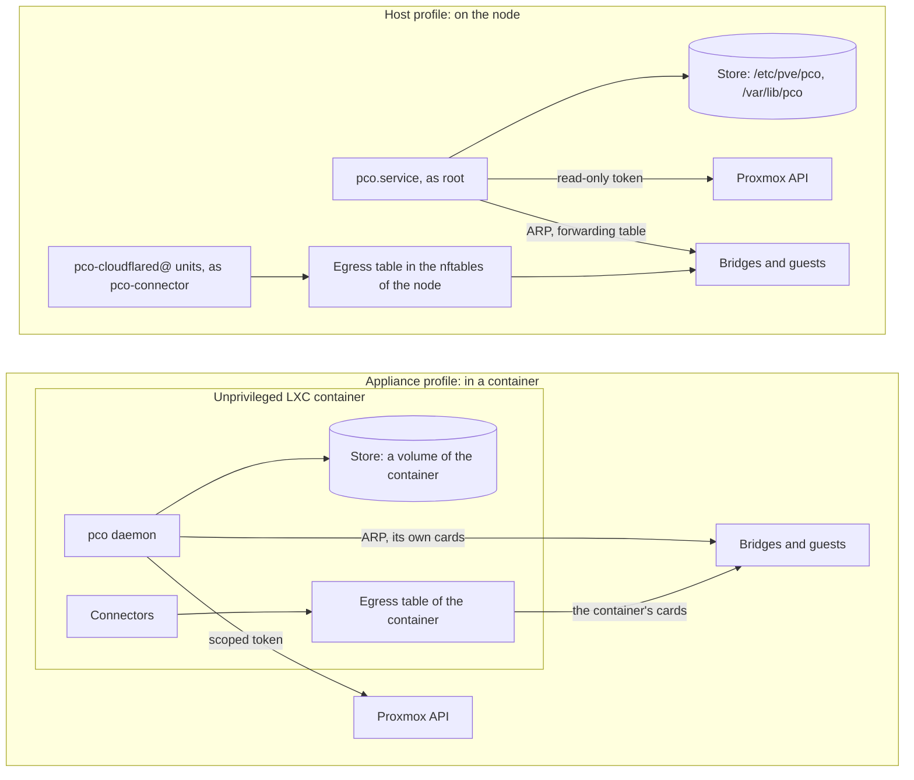

# Profiles

pco is built to run in two ways, called profiles, from one binary: the host profile, where
the daemon and the connectors run on the Proxmox node itself, and the appliance profile,
where they run in a container and nothing is installed on the node. This release has the
host profile only. The appliance arrives in a later release.

The profile of an install is recorded when it is made, and `pco status` shows it:
`Profile: host`.

## Side by side

Where the parts of pco run in each profile, and how each reaches Proxmox and the guests:

| | Host (this release) | Appliance (a later release) |
|---|---|---|
| Where pco and cloudflared run | systemd units on the node | an unprivileged LXC container with nesting enabled |
| What is on the node | the package, the units, the `pco-connector` user, an nftables table | the container |
| Proxmox access | an API token (read-only) and local root for `pco setup` | the API only, with a scoped token |
| How guests are reached | as the node itself, through the node's own address on the guest's bridge | through the container's network cards |
| Identity level | `port` for guests on the node, `observed` for others | `filtered` on the managed network, `observed` elsewhere |
| Managed network isolation | planned: SDN isolated ports, at layer 2 | planned: the Proxmox firewall on the cards pco attaches, at layer 3 |
| Store | `/etc/pve/pco`, on the cluster filesystem | a volume of the container |
| Control-plane failover | planned for clusters: a lease on the cluster filesystem, automatic | planned: a Proxmox HA resource, or restore and promote |
| Data-path availability | one connector on the one node; a connector for each node is planned for clusters | the same |
| Sign-in to a web interface | the ticket of the Proxmox web interface, or a Proxmox API token | planned: its own sign-in |

The rows that say planned are direction, not behaviour: nothing in this release does them.
In this release pco runs on one node, has a command line and a web interface, and does not
attach network cards to guests or manage a network of its own. [Architecture](architecture.md)
describes the parts of the host profile.

## What they share

Both profiles use the same annotation grammar, planner, inventory, Cloudflare client,
reconcilers, connector units, engine, API and command line. What differs is the prober (the
host profile can read the forwarding table of the bridge, the appliance cannot), the network
backend, the installer and the way an upgrade is done, boot ordering, the sign-in to a web
interface and, once clusters are supported, the store.

## Why there are two

A clean hypervisor, with nothing installed on it that is not Proxmox, is a reasonable thing
to want, and it is what the appliance is for. The appliance keeps pco and cloudflared in an
unprivileged container with an API token of limited scope. A compromise of the container is
not a compromise of the node.

The host profile exists because it can prove more. A daemon on the node reads the bridge
forwarding table, which says on which port of the bridge a MAC address lives, and so it can
show that an address belongs to the guest that asked for it and that the node's frames for it
go to that guest's own port. That is the `port` identity level. A container cannot read the
table, and its best level on an ordinary network is `observed`. [Identity](identity.md)
explains the levels, and [Security](security.md) what each stops.

It was also the faster one to finish and to test against a real Cloudflare account, so it
comes first. The cost of the host profile is that a root daemon and a systemd unit live on
the hypervisor; [Security](security.md) says what they can do and what confines the
connector.

If you need to run pco without installing anything on a node, wait for the appliance. If you
can accept a root daemon on the node, the host profile is what exists.
