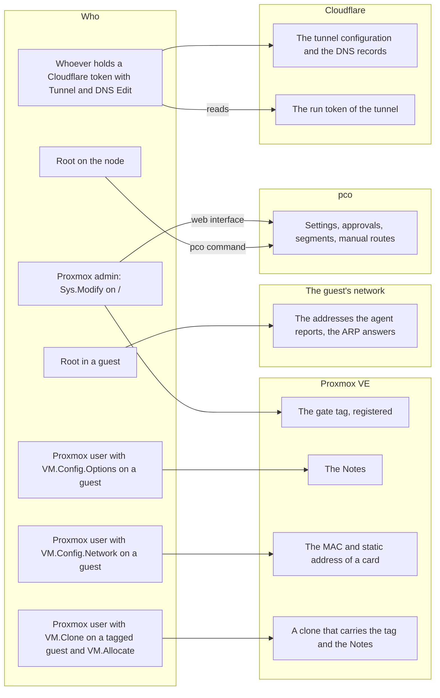
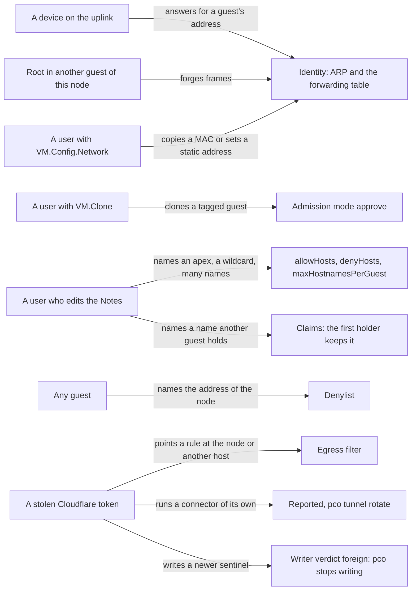
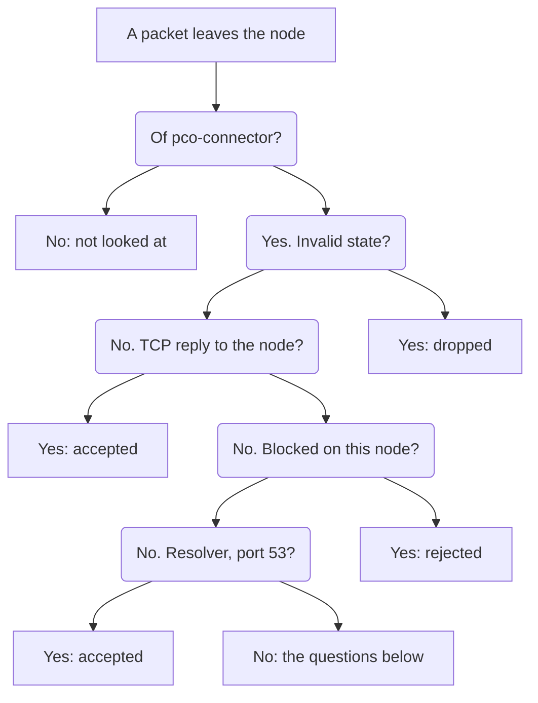
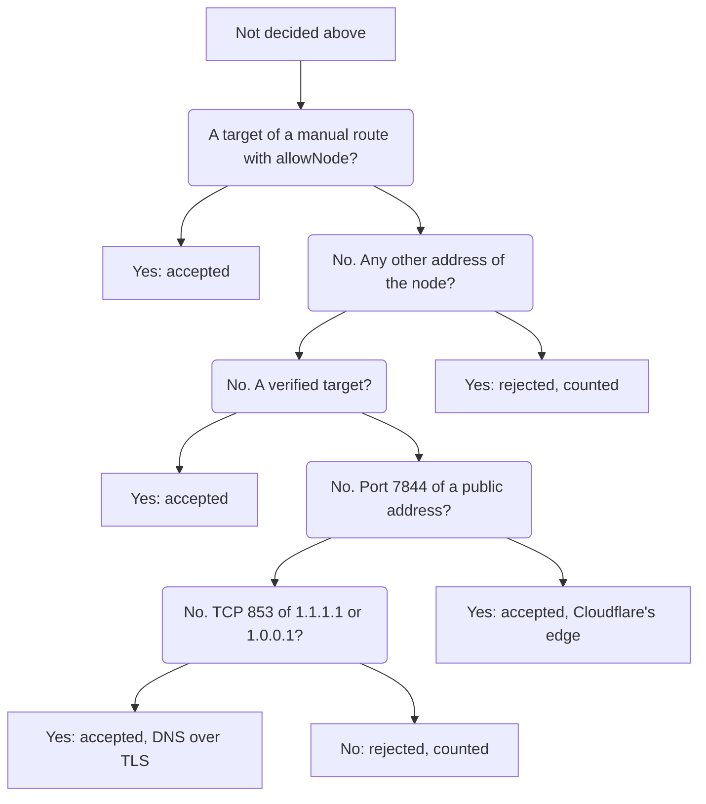

# Security

This page says what pco trusts, what it does not, which parts hold which privileges,
and what each protection stops. It is written for the person who decides whether to run
pco on a node, and who would like to know where the limits are before an incident shows
them.

## Trust boundaries

pco reads what several kinds of people and programs can write, and treats none of it as proof.
Who can write what pco acts on:

The tag says that a guest may publish, the Notes say what it asks for, and an address is
served only once [Identity](identity.md) has shown on the network of the node that it is the
guest's. Against each attacker stands one of the defences this page describes:

How far each holds, and at which identity level, is the rest of this page; the
[table of the five attackers](#identity-levels-against-five-attackers) is the short form.

## What runs with which rights

| Part | Runs as | Can |
|---|---|---|
| The daemon, `pco.service` | root | Read Proxmox through its API token, open a raw socket to ask ARP, read the bridge forwarding table through netlink and watch it and the neighbour table for changes, load the egress table with `nft`, run `systemctl` for the connectors and write their files, call the Cloudflare API with the stored tokens. It listens on a unix socket and nowhere else. |
| The connectors, `pco-cloudflared@<tunnel id>.service` | the system user `pco-connector`, with no capabilities | Open outbound connections, which the egress filter confines (below). |
| The `pco` command | whoever runs it | `setup`, `uninstall` and `pco egress` work on the node directly and need root. The others ask the daemon through its socket, which also lets only root in. |

The daemon is a root-equivalent part of the node. It runs as root, has the Cloudflare
tokens, manages systemd units, and answers a socket. Anyone who can make it do things has
the node. Its unit applies a few protections (`ProtectHome`, `PrivateTmp`,
`ProtectKernelModules`, `ProtectControlGroups`, `LockPersonality`, `ProtectProc=invisible`)
and writes no core dump (`LimitCORE=0`), since its memory holds the tokens, but no more,
because it needs systemd, nftables, raw sockets and files under `/var/lib` and `/etc/pve`.

The connector is where the confinement is. Its unit runs as `pco-connector` with
`NoNewPrivileges`, `ProtectSystem=strict`, `ProtectHome`, `PrivateTmp`,
`PrivateDevices`, the kernel-protection options, an empty capability set,
`RestrictAddressFamilies` limited to IPv4, IPv6, unix sockets and netlink,
`RestrictNamespaces`, `RestrictRealtime`, `MemoryDenyWriteExecute`, the system call filter
`@system-service` (a call outside it fails with `EPERM`), and `ProtectProc=invisible` with
`ProcSubset=pid`: in `/proc` it sees no process of another user, so neither the daemon, which
runs as root, nor the Proxmox services, and nothing of the kernel but the processes. The
connectors of the other tunnels run as the same user and stay visible to it; a user of its
own for each tunnel is a later hardening. It cannot see `/etc/cloudflared`, `/usr/local/etc/cloudflared` or
`/root/.cloudflared`, and it is started with a configuration file of pco's own, so that
cloudflared reads no configuration of the host. Its token is handed to it as a systemd
credential and read from a file, so it never appears on a command line or in the
environment.

A connector listens on 127.0.0.1 for its metrics, on a port from 20300 up. A local user who
listens on that port first keeps it from starting: it exits and systemd starts it again,
over and over. The daemon reads that from the connector's journal, says
`metrics port 20300 is held by another process` as a problem, and moves the connector to a
port of its own in the next cycle that keeps it running, which is the next one in enforce
mode; the problem says when. The port that was taken is not given out again for an hour.

The Proxmox side is read-only. Setup makes the role `PCO`, the user `pco@pve` and the
token `pco@pve!pco`, and the role holds `VM.Audit`, `Sys.Audit`, `SDN.Audit`,
`VM.GuestAgent.Audit` (`VM.Monitor` on Proxmox VE 8.4) and `Pool.Audit`, granted on `/`.
pco reads the pool of each guest from `/cluster/resources`, which shows it only to a
token with `Pool.Audit`. The daemon never changes a guest, a tag or a Notes field. Only
`pco setup` and `pco uninstall` change Proxmox, as root, and what they change is listed
in the manifest.

The Cloudflare side is not read-only: the token can edit DNS records and tunnels in the
zones and accounts you chose. Scope it narrowly; see
[Cloudflare token](cloudflare-token.md).

## The gate tag, and what it proves

A guest is published only if it carries the gate tag, `cf-tunnel` unless the setting
`gateTag` says otherwise, and its Notes hold routes. What does the tag prove?

When the tag is a registered tag, which setup arranges unless you decline, only a user
with `Sys.Modify` on `/` can set or remove it. The tag then proves that such a user tagged
that guest at some point. It does not prove more:

- It is not an approval of the hostnames. Whoever may edit the Notes of the guest
  (`VM.Config.Options`) chooses what the guest publishes, within the hostname policy
  (`allowHosts` and `denyHosts` in [Operations](operations.md)). Two kinds of name are kept
  out unless `allowHosts` names them: the apex of a zone, and a wildcard, which would answer
  every name of the zone that has no record of its own, with a valid certificate. And one
  guest names at most `maxHostnamesPerGuest` hostnames, 32 by default; one that names more
  publishes none. Set `allowHosts` to the names you mean to publish when the people who edit
  the Notes are not the people who run the node.
- It is not tied to what the guest is. A clone and a restore keep the tags and the Notes.
- If you decline to register the tag (`--no-registered-tags`), it proves nothing about
  who set it: whoever can edit the guest can tag it. Setup then warns, naming the gate
  tag, unless it is registered already, and `pco setup --repair` registers it later.

Setup registers `cf-tunnel` and `cf-tunnel-managed`, and the gate tag of the settings
when that is another one. If you change `gateTag` afterwards, run `pco setup` again, or
`pco setup --repair`, to register the new tag as well. Until you do, the new gate tag is
one that anyone who may edit the options of a guest can set. Nothing reads
`cf-tunnel-managed` in this release.

### Clones and restores

A clone of a published guest carries the tag and the Notes, and so asks for the same
hostnames. It does not get them. The first guest to claim a hostname keeps it for as long
as it keeps asking, so the clone's route is in the state `conflict` and serves nothing.
Identity alone never moves a claim, and neither does a new guest that is created under the
VMID of an old one: the claim belongs to the guest `qemu/101`, and the new one inherits it.

Naming a hostname early wins nothing. A guest takes no claim on a name in a zone this install
never served, nor on an apex or a wildcard that `allowHosts` does not name. Once the zone is
served and the name allowed, the guests that name it then get it as any free hostname: the
first in owner order. A holder whose name comes to be rejected loses its claim at once, also
when a broken entry in its Notes still names it. The claims in a zone the install served are
kept as they are while the zone is in doubt, left out or gone from its listing.

A guest restored to a different VMID is a different owner and is in conflict while the
original exists. A guest that is restored or created again under the VMID of a published
guest publishes the same hostnames, without anyone approving it again, as long as it
carries the tag and the Notes. Admission mode `approve` closes that for a guest that comes
back with a new identity, and not for one that keeps its identity (see below).

A clone is also how a user who may not set the tag gets a tagged guest. Whoever holds
`VM.Clone` on a tagged guest, or on a tagged template, and `VM.Allocate` where the clone goes
makes a guest that carries the tag, and once its Notes are theirs to edit, it publishes the
hostnames they write there that nobody holds yet. A registered tag does not stop that:
Proxmox copies the tags of the source. In admission mode `tag` it is published at the next
cycle; in mode `approve` it waits, because a clone has an identity of its own. `pco doctor`
warns in its `admission` check while the mode is `tag` and any guest carries the gate tag:
pco does not read the ACLs yet, so it cannot tell whether anyone but the admins may clone
them. Use `approve` when anyone but the admins holds `VM.Clone` on a tagged guest.

### Approval mode

With the setting `admission` set to `approve`, a tagged guest is published only after an
admin has approved it:

    pco guest list
    pco guest approve qemu/101
    pco guest revoke qemu/101

An approval is of the identity the guest has when it is approved: for a virtual machine its
SMBIOS UUID, or else its creation time, or else a hash of the MAC of its first card; for a
container a hash of the MAC of its first card. A clone has another identity, and so has a
guest that is created again with a new UUID, or, for a container, a new MAC: each needs an
approval of its own. The daemon refuses an approval when the guest has changed since it was
shown.

A guest that keeps its identity keeps its approval. A guest restored from a backup of
itself keeps its UUID and its MACs unless the restore is asked to make new unique
addresses (`--unique` of `qmrestore` and `pct restore`), and a container that is created
again with the same MAC has the same identity. Approval mode does not close those.

A guest that waits for approval is not published. A hostname it already holds stays
claimed and answers 503, so nobody else gets it. `pco status` shows how many guests wait
(the `Approval:` line), `pco guest list` which, and `pco doctor` has a warning for each.
Changing the mode to `approve` takes the routes of every guest that is not approved off the
air at the next cycle: their hostnames answer 503.

Approval mode is recommended when the people who can edit the guests are not the people who
administer the node. It is off by default. The default is `tag`.

## Identity levels against five attackers

[Identity](identity.md) describes the checks. This table says what each level stops. Every
row but the first assumes a guest that carries the tag: a user cannot tag their own guest
when the tag is registered, unless they may clone one that has it (the last row).

`port` is what a guest on this node gets. `observed` is what a guest on another node of the
cluster gets, and what an address behind a router gets when you trust it, and only if
`identityMinimum` is lowered to `observed`. `filtered` is reserved for another profile and
no host guest has it.

| Attacker | `observed` | `port` |
|---|---|---|
| A device on the uplink, outside Proxmox | Stops a device that answers for a guest's address with its own MAC. Once the route is served, a stranger's MAC that the kernel learns for the address is noticed as well (see below). Does not stop a device that copies the guest's MAC too: ARP cannot tell the copy from the guest, and for a guest on another node this node cannot see where the table sends its frames. | Stops both. The bridge must have learned the guest's MAC on the guest's own port and on no other, and a MAC the table has on the uplink fails. A device that starts using the guest's MAC after the check makes the bridge learn it on the uplink: the daemon is told at once, takes the address out of the egress filter within tens of milliseconds, verifies the route again at once, and withdraws it at Cloudflare if that fails. Limit: the tens of milliseconds between the table changing and the filter following. |
| Root in another guest of this node | Stops a guest that answers with its own MAC, and a card configured with a MAC that a running guest has. Frames forged with the MAC of a guest of another node put that MAC on the port of the attacker's guest, which `observed` notices when it checks. | Stops forged frames as well. They move the entry to the attacker's port, so the address leaves the filter within tens of milliseconds, the verification fails, and the victim's route is withdrawn (503). It is not taken over: that is a denial of service for the victim, not a hijack. Limit: the same. |
| A Proxmox user with `VM.Config.Network` on another guest | Does not stop it. The user can give their guest the MAC of any device on the segment that is not a running guest and, since the Notes are theirs, aim a route at that device. Only a MAC that a running guest has is refused. | Mostly stops it. To pass, the table has to have the device's MAC on the user's own port, which it has only after the user's guest sent a frame with that MAC and before the device sent its next one. That next frame moves the entry back to the uplink, which the daemon sees at once, and the address leaves the filter within tens of milliseconds. A user who keeps transmitting can get the check to pass again, and what the device can then be asked for is limited to the moment after each of its frames. It is not a complete defence. |
| A Proxmox user with `VM.Config.Network` on the published guest | Does not stop it. The user can give a card of the published guest the MAC of a device on the segment and set the card's static address to the device's address. The static addresses of a guest are tried before those its agent reports, so the route then points at the device, and nobody has to edit the Notes. | Mostly stops it, with the same race and the same watch as in the row above. |
| A Proxmox user with `VM.Clone` on a tagged guest and `VM.Allocate` | Does not stop it. The clone carries the tag, and its address is the clone's own, so it passes. Its Notes publish what the user writes there, within the hostname policy, and nothing that another guest holds. | Does not stop it either, for the same reason. Admission mode `approve` does: the clone has an identity of its own and waits for an admin. |

What this table shows is that `port` is meant to stand on its own and `observed` is not.
At `observed`, whoever can set the MAC of a guest's card and write its Notes can reach any
device on the segment. If you lower `identityMinimum`, give `VM.Config.Network` and Notes
access on tagged guests only to people you would trust with the whole segment, keep the tag
registered, and consider `admission: approve`.

### Trusted static addresses

`trustStatic` and `trustedCIDRs` let an address behind a router through (see
[Identity](identity.md)). Such an address is proven by the guest's Proxmox configuration
alone: pco asks neither ARP nor the forwarding table. It checks that the address is one of
the static addresses of the guest's card, that it lies in a trusted prefix, and that the
kernel routes it through a gateway.

Whoever may change the network configuration of a tagged guest can therefore point its
routes at any host inside `trustedCIDRs`, by giving the card that host's address as its
static address. There is no race to win, as in the last row of the table, because nothing
on the wire is looked at. The level is `observed`, so such a route is served only while
`identityMinimum` is `observed`. Keep `trustedCIDRs` as narrow as you can: the prefixes
of the hosts you mean to publish, and nothing wider.

### Manual routes

The daemon also reads route files from `/etc/pve/pco/routes/`. `pco route manual add` and
`pco route manual remove` write them (root only), and so does the web UI (admins only). Both
accept an address only inside `manualCIDRs` of the settings, which is empty until you fill it,
so that nobody can aim a route at an address you did not name. A file that root writes by hand
is not checked against it. A manual route names an address and no guest, so nothing proves it:
its level is `manual`, and only the denylist, the addresses of the nodes and a connection
to the port apply. A manual route with `allowNode` may even point at an address of a node:
that lifts the rules that keep the addresses of nodes out, and no other, and the prefix of the
node has to be in `manualCIDRs` as well. Keep `manualCIDRs` to the networks of the services you
mean to publish, and treat the directory as part of root's configuration of the node.

### Between two cycles

The checks in [Identity](identity.md) are made when pco looks: in each cycle, 10 seconds by
default, while the watch below is not running, and while it runs, once in every
`reverifyInterval` (a minute by default) for an address proven at `port`, and at once when
the watch reports a move. Between two cycles the daemon watches two tables of the kernel
through netlink and acts on a change at once:

- The forwarding table of the bridge, for every route proven at `port`: the MAC of the
  guest, or any other MAC of the same guest, learned on a port that is not the guest's own.
- The neighbour table of the node, for every served address: the kernel learns a MAC for
  the address that is neither the one the proof found nor another MAC of the same guest.

When one of them changes, the address leaves the egress filter on every port, within tens
of milliseconds. The routes on it are verified again as soon as the cycle lock allows, at most
once every five seconds for an address. If they all pass, the address comes back. If one
fails, the address stays out and a cycle is asked for, which withdraws the route at
Cloudflare (503). `pco events` shows both outcomes under the kind `egress`.

What this leaves:

- The tens of milliseconds between the kernel changing its table and the daemon taking the
  address out of the filter. The watch sees the change in under a millisecond; the rest is
  the run of `nft` that removes the address.
- A MAC of the guest's own that shows up only in the neighbour table is not a move: a guest
  with two cards on one bridge may answer for its address with either.
- A route whose proof placed no MAC in the forwarding table, which is every route at
  `observed` (a guest on another node, a trusted static address), is watched in the
  neighbour table only.
- The watch can fail. When the daemon cannot subscribe, it logs that watching the network
  for bound addresses that move failed, tries again after a minute, and until then sees a
  move only at the next cycle. A subscription that overflowed under a burst of
  notifications is made again after a second and compares both tables as they are, so a
  move in the gap is not missed.

## The connector egress filter

A tunnel is configured at Cloudflare. Whoever can write that configuration, with a stolen
API token or in the dashboard, can make a connector open connections to anything the node
can reach, including the Proxmox web interface on port 8006. Checking addresses in pco does
not help against someone who writes the configuration behind its back. The egress filter
does: it confines the connector processes on the node, whatever the configuration says.

The filter is not all a stolen token with the permissions of pco's can do, and the rest is
not confined on the node:

- It can run a connector of its own for the tunnel, which receives a share of the requests
  to every hostname of the tunnel. pco reports it; see
  [A connector that is not pco's](#a-connector-that-is-not-pcos).
- It can point a hostname elsewhere. What pco puts back in its next cycle, ten seconds
  later by default, and not before: the tunnel's configuration, a record of pco's that was
  deleted, and a record of pco's whose target was changed but that still carries its
  marker. What it does not: a record changed to another type, or stripped of its marker,
  is no longer pco's. `pco status` shows it as a conflict, or as a name that lost its
  marker, and the hostname is not published there until `pco adopt <name>` takes it back.
  Until then the requests go where the token sent them.
- It can write a sentinel rule of a newer generation of this install into the
  configuration. pco then takes the writer for one it does not know, says
  `writer verdict is foreign`, fails the `writer` check of `pco doctor` and stops writing, so
  that whatever the token wrote stays. The connectors are still watched while it holds. When
  no other node runs pco with this install, the verdict is a forgery, and this order puts it
  right:
  1. Replace the token: add a new one with `pco credential add`, revoke the old one at
     Cloudflare, then `pco credential remove` it.
  2. `pco tunnel rotate`, which works while the cycle holds: the connector that the token
     made loses its session for good.
  3. `pco setup --recover` on this node: it takes a writer generation above every one in
     the tunnels, and leaves pco in observe-only mode.
  4. `pco apply`. The next cycle writes the configuration again, with its own sentinel.

### What a connector can reach

The filter is the nftables table `inet pco_egress`. Its chain sits on the output hook at
priority -10, after connection tracking and the destination NAT, before the filter chains
of the Proxmox firewall, and it applies only to packets of sockets that belong to the user
`pco-connector`. The uid is looked up by name, because it differs from node to node. Every
other process is untouched.

The decision the filter makes for a packet that leaves the node, from the first question to
the last; each box begins with the answer that leads to it. First what is decided before the
targets:

Then the rest, for a packet none of these decided:

For a connector's packet the chain does the following, in this order, and the first rule
that matches decides:

1. A packet in an invalid connection state is dropped.
2. Replies of TCP connections to an address of the node itself are accepted. That is how
   the daemon reads the `/ready` endpoint of a connector on 127.0.0.1.
3. An address on the block list of this node is rejected on every port.
4. Two rules count a new TCP connection to a target and decide nothing: a connection in the
   new state to an address and port in the `flows4` or `flows6` set is counted in the element
   of that set, and the packet goes on to the next rule.
5. The resolvers of the node are accepted: the `nameserver` lines of `/etc/resolv.conf`, TCP
   and UDP port 53.
6. The targets of manual routes with `allowNode` are accepted: a TCP connection to an
   address and port in the `allownode4` or `allownode6` set. Root wrote those routes to
   publish a service of the node itself.
7. Anything else addressed to the node itself is rejected and counted. That includes a
   verified target that has become an address of the node since it was verified, as a
   virtual address that fails over to the node does: it is refused at once, and not only
   once the next cycle has taken it out of the set.
8. The targets are accepted: a TCP connection to an address and port in the targets set,
   which holds the origins the daemon verified.
9. TCP and UDP port 7844 to a public unicast address is accepted. That is Cloudflare's
   edge. The rule excludes the ranges that are not the public internet (private, shared,
   link-local, loopback, benchmark, documentation, translation prefixes, 6to4, Teredo,
   multicast and reserved ones, for IPv4 and IPv6) rather than list Cloudflare's addresses,
   so there is no list to keep up to date.
10. TCP port 853 to 1.1.1.1 and 1.0.0.1 is accepted: the DNS over TLS fallback of cloudflared.
11. Everything else is rejected and counted. TCP is answered with a reset and the rest with
    ICMP administratively prohibited, not dropped, so that a connection to a withdrawn target
    fails at once instead of waiting for a timeout.

A connector can therefore reach Cloudflare's edge, the resolvers, and the verified targets,
and cannot reach the management ports of the node or any other host. A rule written at
Cloudflare for `http://10.0.0.1:8006` gets a refused connection.

The filter decides where a connector connects, not what it sends. Two of the ways out are
wide on purpose: port 7844 to any public address, since the edge's addresses are not
listed, and port 53 to the resolvers, which pass a name on to anyone's name server. A
connector process that is itself taken over, as through a flaw of cloudflared, can send
what it has to a host of its choosing on port 7844, or in the names it asks the resolvers
for. A rule at Cloudflare cannot make cloudflared do that; only code running as
`pco-connector` can. Keep cloudflared up to date (`pco doctor` warns about one older than
ten months).

The daemon's own checks, among them the request that `pco diagnose` makes, come from the
daemon and not from a connector, so the filter does not confine them.

### How the daemon keeps the targets

The daemon gives the filter the whole set of targets in every cycle. The set holds the
address and port of every route that holds its hostname and whose address the cycle has
just verified, and every target that a tunnel configuration last confirmed at Cloudflare
still sends a connector to. From it the daemon takes the addresses that lost their proof in
this cycle, and those whose MAC moved and have not been verified again. The order of
changes follows from that:

- A target enters the set before the tunnel configuration with its rule is written, so a
  rule never sends a connector to a target it cannot reach.
- A target leaves the set one cycle after a tunnel run has confirmed a configuration
  without it. The rule goes first, then the target.
- A target whose proof is lost leaves at once, in the cycle that finds it and before
  anything is written at Cloudflare: its identity fails, its guest stops, or the guest is
  gone. A target whose MAC moves leaves at once, between cycles (see above).
- A cycle that holds because the store cannot be read leaves the set as it is. When the
  filter cannot be given the set, the cycle writes no tunnel configuration and says so in
  the problems, with the text `setting the egress filter: ...; no tunnel configuration is
  written until it is set`.
- The set, and the configurations that Cloudflare last confirmed, are kept in
  `engine-memory.json` (see [Operations](operations.md)), so that a restart of the daemon
  does not cut the routes that were being served.

The filter looks at every packet of a connector and not only at the first of a
connection, so a connection that is open to a target that leaves the set is reset at its
next packet.

### The table at boot

`pco-egress.service` loads the table with the resolvers of the node and no targets. Every
connector unit requires it and starts after it, so starting a connector, at boot or at any
other time, starts the unit first, and a table that fails to load keeps the connector from
starting. Setup enables and starts the unit, so the table is loaded at every boot, also
while there is no connector yet, and the daemon loads it too whenever it finds it gone.
Uninstall disables it and removes the table.

After a reboot a connector reaches Cloudflare's edge and the resolvers, and nothing else,
until the daemon's first cycle gets through. That cycle needs a complete listing from
Proxmox, verifies the routes, and then gives the filter the targets: the ones it verified,
and those of the tunnel configurations it last confirmed at Cloudflare, which it remembers.
Visitors get a 502 for a published hostname until then. How long that takes grows with the
number of addresses, which are verified up to 32 at a time.

The table is loaded in one nft transaction, so it is whole or not there. The commands that
read it check not only the targets but the whole table, its chains, rules and counters, and
say when it is not what pco loads.

### Keeping the table in place

The daemon checks the table every 30 seconds, and whenever the kernel reports a change of
the nftables ruleset, after waiting 200 milliseconds for a burst of changes to pass. The
check compares the whole table, its flags, chains, rules, sets and counters, with what pco
loaded. A table that is gone, dormant, or not the one pco loaded is loaded again with the
targets the filter was last given, at most once every five seconds. The daemon then writes
the event

    the egress table was changed or removed outside pco and was loaded again

and `pco status` carries it as a problem, with what differed in brackets. If the daemon
cannot load the table, the `Egress:` line of `pco status` reads `not loaded: the connectors
are not confined` or `not the one pco loads: the connectors may not be confined`, the
command exits 1, and the cycle writes no tunnel configuration until a check finds the table
in place.

`nft flush ruleset`, and an enabled `nftables.service` whose configuration begins with
`flush ruleset` (which the Debian default does) when it is started or reloaded, remove the
table. The connectors are not confined from then until the daemon loads it again. That is
normally a fraction of a second, since the daemon is told by the kernel; if the
notification does not arrive, it is the 30 seconds of the timer at most. `pco doctor` warns
while `nftables.service` is enabled, in its `nftables` check.

### The `pco egress` commands

They work on the node directly, without the daemon, and need root.

| Command | What it does |
|---|---|
| `pco egress show` | Says whether the filter is on, off, not loaded, or loaded but not as pco loads it (it then names what differs). Lists the targets, those of `allowNode` marked so, the resolvers, the addresses blocked on this node, and what the table rejected since it was last loaded in full, in packets: to addresses of this node, and to anything else. Exits 1 when the filter is off, gone or changed. |
| `pco egress block <address>` | Puts the address on the block list of this node and takes its entries out of the table at once. The list is kept in `/var/lib/pco/egress-blocked.json` and is subtracted from every set the daemon loads, until `unblock`. It needs no daemon and no Cloudflare. |
| `pco egress unblock <address>` | Takes the address off the list. If it is still a verified target, the daemon puts it back at its next cycle. |
| `pco egress off` | Removes the table and writes `/var/lib/pco/egress-off.json`. While that file exists, neither the boot unit nor the daemon loads the table. The connectors are not confined. |
| `pco egress on` | Removes the switch and loads the table, with the resolvers and no targets unless the table is there as it should be. The daemon gives the targets back as soon as it notices, within a second or so, or at its next check, which is 30 seconds at the longest. |
| `pco egress load` | Loads the table when it is gone or not as it should be, and leaves an intact one with its sets as they are. It is what the boot unit runs. The text of `pco egress --help` names it; the list of commands there does not. |

An example of `pco egress show` on a node with three targets and one blocked address:

    The egress filter is on.

    Targets:
      10.0.0.5:80
      10.0.0.5:8080
      10.0.0.6:443
    Resolvers:
      192.168.1.1

    Rejected since the table was last loaded in full:
      to addresses of this node  3 packets
      to anything else           12 packets

    Blocked on this node:
      10.0.0.9

### The off switch

`pco egress off` exists for the case that the filter is itself the fault, and for nothing
else, because with it the connectors can reach everything the node can. It is local root
only: no request of the daemon's API can switch the filter off, and the switch is a file
that only root can write. While it is off, `pco egress show` says that the filter is off,
since when, and exits 1. `pco status` starts with a warning, shows `Egress: off: the
connectors are not confined` and exits 1, `pco doctor` fails its `egress` check, and
the daemon records the switch off and the switch on as events.

### If the table disappears

The daemon loads it again by itself, as described above. When it cannot, or is not
running, run

    pco egress load

(`pco egress on`, which `pco egress show` suggests, loads it too, unless the filter was
switched off.) Do not restart `pco-egress.service` for that. The connector units require it,
and a restart of a unit that others require restarts them as well, so every connector would
drop its connections to Cloudflare. For the same reason, do not stop it. `pco egress load`
is the way to reload: it loads the table when it is gone or changed, and does nothing to one
that is intact.

## A connector that is not pco's

Anyone who holds the run token of a tunnel can run a connector for it anywhere, and
Cloudflare then spreads the requests to every hostname of the tunnel over all its
connectors. A stolen Cloudflare token with `Cloudflare Tunnel: Edit`, which pco's own token
needs, reads the run token with one request. Whoever runs that second connector receives
part of the traffic of every published hostname, in the clear, and answers it as they like.

The daemon looks for that. Every five minutes, and every 30 seconds while a rollout or a
finding is pending, it lists the connectors Cloudflare shows on each tunnel and holds their
ids against the id that the `/ready` endpoint of its own connector reports. It does so in
every cycle, also one that holds, as a cycle whose writer is not in order does: a hold must
not hide that connector. A connector it does not know is an error event the first time it
is seen, and a problem line in every cycle while it is listed:

    tunnel pco-abc123 in account 0123abcd is served by connector 6f2d... from 198.51.100.7
    (cloudflared 2026.8.0), which pco does not run on this node: it takes a share of the
    requests to every hostname of the tunnel; unless you run it, rotate the tunnel secret
    with pco tunnel rotate --account 0123abcd

`pco status` exits 1, and `pco doctor` fails its `rogue connectors` check. The address and
version are what Cloudflare reports. While the daemon's own connector is not ready it cannot
tell its own id, so it compares nothing until it is; and an id its connector had within the
last ten minutes counts as its own too, because Cloudflare lists a connector that restarted,
or died without saying goodbye, under its old id for a while.

The comparison is by id. A connector that someone changed to give itself the id of pco's
would pass for pco's. The listing could tell it apart, by more connections under that id than
pco's own holds and an origin address of its own, but connections come and go with
reconnects and may come from both an IPv4 and an IPv6 address, so pco does not compare them in
this release.

pco does not cut the other connector off by itself in this release. A second connector of
the same tunnel is how a replica on another node of the cluster will run, which a later
release brings, and a lockdown that guessed wrong would take the hostnames off the air. What
to do is up to you:

1. If you run that connector, nothing. pco keeps reporting it.
2. If you do not, run `pco tunnel rotate` (with `--account` when the install has tunnels in
   several accounts). It gives the tunnel a new secret at Cloudflare, ends the connections
   of all its connectors, and restarts pco's connector with the new token at once. The other
   connector loses its session and cannot connect again with the token it has. Every
   published hostname of the tunnel is unreachable for the few seconds the connector on the
   node takes to reconnect. Only root may run it. It works while the cycle holds, for a
   tunnel the last cycle did not check, as long as its id and credential are known; a tunnel
   left as it is for a reason of its own, as in a frozen account, is refused, held or not.
   It is also refused while pco is in observe-only mode, as it changes things at Cloudflare;
   run `pco apply` first.
3. Replace the Cloudflare token that leaked: add a new one with `pco credential add` and
   remove the old one, then revoke it at Cloudflare.

The daemon also follows a secret that was rotated elsewhere, in the dashboard or with the
API: it reads each run token again every five minutes, and at once when its connector logs
that Cloudflare refuses the token, and restarts the connector with the new one. A read that
fails while the refusal lasts is tried again every 30 seconds, and the problem line says
when.

## Secrets and where they live

| What | Where | Notes |
|---|---|---|
| The secret of the Proxmox API token `pco@pve!pco` | `/etc/pve/priv/pco/meta/pve-token.json` | Read by the daemon when it starts. |
| Cloudflare API tokens | `/etc/pve/priv/pco/credentials/<id>.json` | One file for each credential. |
| Tunnel run tokens of the connectors | `/var/lib/pco/tunnels/<tunnel id>.token` | Mode 0600 in a directory of mode 0700. Passed to cloudflared as a systemd credential. |

`/var/lib/pco` is mode 0700. `/etc/pve` is the cluster filesystem, and Proxmox keeps
`/etc/pve/priv` readable by root alone. On a cluster it is replicated to every node, so
every node holds these files. Anything that backs up `/etc/pve` or `/var/lib/pco` copies
the secrets with it: protect those backups as you protect the tokens.

pco never takes a token from an argument or the environment, and prints or encodes it as
`[redacted]` when it must show a value. The daemon's API does not return tokens, error
messages from Cloudflare have the token blanked out, and a token file that others can read
makes the command that reads it warn.

The daemon talks to the Proxmox API on `https://127.0.0.1:8006`. Port 8006 is not a
privileged port, so while `pveproxy` is down any local user could listen on it and be handed
the token. To prevent that, pco does not trust the name on the certificate: it requires the
loopback API to present, byte for byte, the certificate that this node serves, which it reads
from `/etc/pve/local/pveproxy-ssl.pem` or else `pve-ssl.pem`. A certificate that no longer
matches the one pco read is read again before it is refused, in case you replaced it.

The rest of the state (the install id, the writer identity, the settings, the claims) is not
secret; [Operations](operations.md) lists it.

## The socket API and who may call it

The daemon answers on the unix socket `/run/pco/pco.sock`. It has no network listener. The
directory `/run/pco` has mode 0750 and the socket 0660, both owned by root; the group is
`pco-web` when that group exists, and root's group otherwise. The daemon also reads the
user id of the process on the other end of every connection from the kernel and answers only
root, and the user `pco-web` if there is one. The user and the group `pco-web` count only
while the web UI is installed, that is while `/usr/lib/systemd/system/pco-web.service` is
there: anyone who may add a user could otherwise make a `pco-web` that the daemon answers.
Without the unit the daemon ignores both, and says so in a warning at its start when either
exists. The daemon decides this when it starts: after the web package is installed or
removed, restart it (`systemctl restart pco`). Anyone else gets a refusal that says nothing
about which requests exist. `pco` run as another user reports that it must run as root and
exits 2.

The daemon refuses to make its socket directory unless it is named `pco`, lives in a
directory that only the daemon's user can write, and is not a link. The check is there so
that a socket path cannot be pointed at a directory such as `/tmp` whose mode and owner the
daemon would then change.

Everything a request can do is what the CLI shows: read the state, ask for a cycle, apply,
adopt, add and check and remove credentials, resolve claims, approve guests, rotate the
secret of a tunnel, diagnose, run the doctor. Rotating a secret restarts every connector of
the tunnel, so the daemon answers that request for root only, and not for `pco-web`. A
request cannot read a token or switch the egress filter off. It changes the targets of the
filter only as a cycle does, by changing what is published: whoever may use the socket may
publish what the guests ask for, add a credential of another account, and confirm deletes,
so treat `pco-web` as an admin of pco.

## What Cloudflare sees

- The hostnames you publish, and the addresses and ports of the guests behind them. They are
  in the ingress rules of the tunnel, such as `http://10.0.0.11:3000`.
- The install id, in the names of the tunnel and the marker of the DNS records, and the
  writer's generation and nonce in the sentinel rule.
- API requests from the node's address, with the user agent `pco/<version>`.
- The connector's outbound connections from the node's address.
- The traffic of every proxied hostname, as for any proxied hostname at Cloudflare: it ends
  at Cloudflare's edge in the clear, and from the connector to the guest it is plain HTTP
  unless the route says `https`.

It does not see the Proxmox token, the other guests, the Notes beyond the hostnames and
route options, or anything that is not published.

A hostname you publish is public, as is the tunnel it points at (the CNAME holds the
tunnel's id). pco puts nothing in front of it: no Cloudflare Access policy, no login. What
protects an application is the application, or whatever you configure at Cloudflare for the
hostname yourself.
