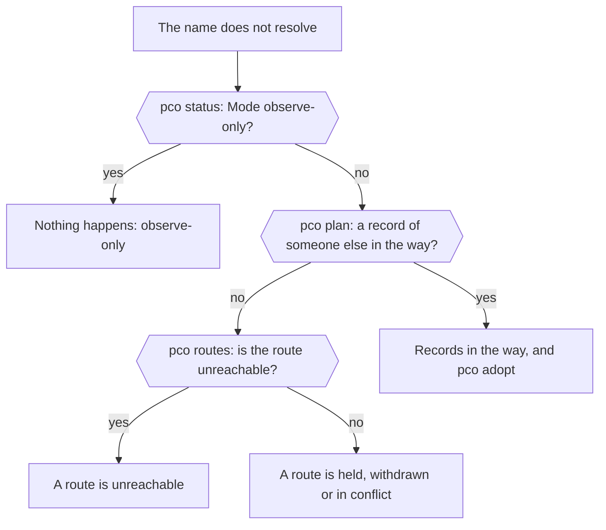
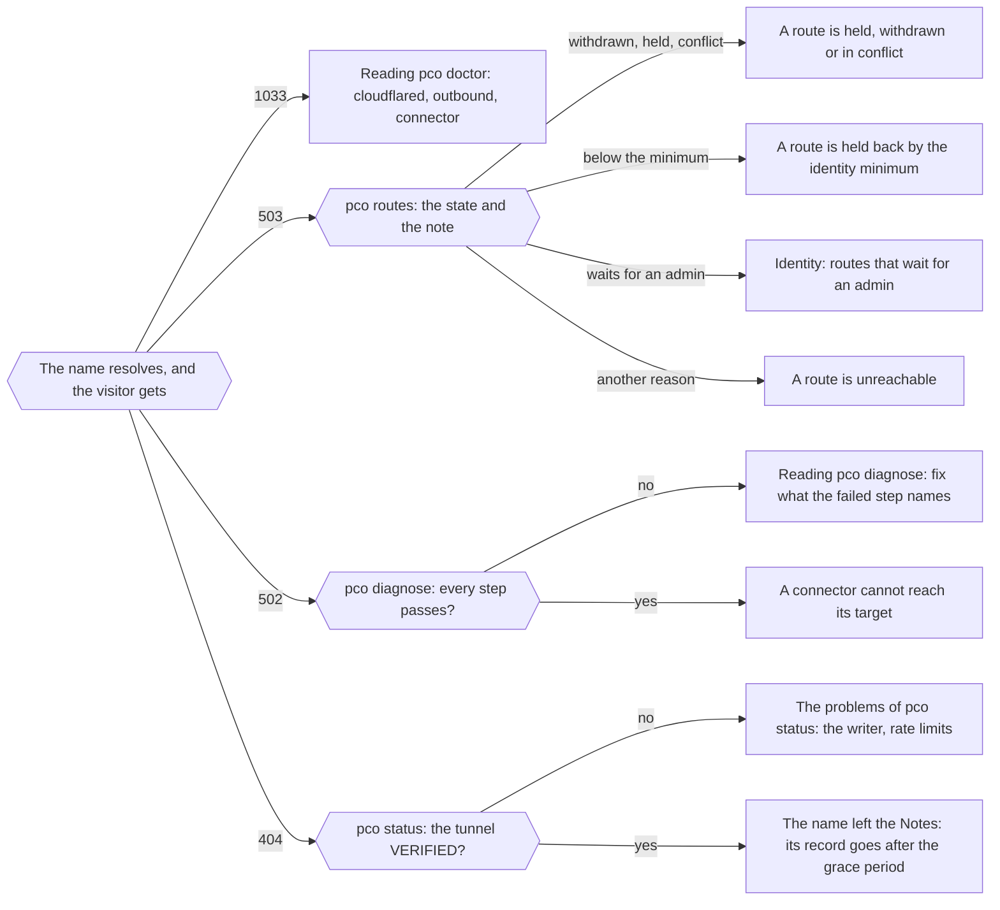

# Troubleshooting

Start with the three commands that say what pco thinks: `pco status`, `pco doctor` and
`pco diagnose <hostname>`. This page says how to read them, and then goes through the
problems that come up, from what a visitor sees to what the daemon reports. [Problems](problems.md)
lists every problem line, event kind and doctor check, with its cause and what to do.

Commands run as root on the node. `pco` exits with 2 when it cannot ask the daemon:

    pco: cannot reach the pco daemon at /run/pco/pco.sock: is it running?

Start with `systemctl status pco` and `journalctl -u pco`. A refusal that says
`permission denied on /run/pco/pco.sock: run as root` is the socket telling you who may
use it.

`pco doctor` is the one command that still has something to say when the daemon is not
running, if you run it as root. It makes the checks that need no daemon, on the node itself:
whether `pco.service` and `pco-egress.service` run and start at boot, the store, `cloudflared`
and the egress table. A `daemon` line says that the rest was not made, and the exit status is
by what it found: 1 when `pco.service` does not run or another of these checks fails, 0 when
there are warnings only, as for a daemon that is still starting. Run it again once the
daemon answers.

## A hostname does not answer

Where to look when a published hostname does not answer, from what the visitor gets to the
section of this page that deals with it. When the name does not resolve:

When it resolves, by what the visitor gets, an empty 503 or 404 being the tunnel's own answer:

The sections the two point at:

- [Nothing happens: observe-only](#nothing-happens-observe-only)
- [Records in the way, and `pco adopt`](#records-in-the-way-and-pco-adopt)
- [A route is `unreachable`](#a-route-is-unreachable)
- [A route is held, withdrawn or in conflict](#a-route-is-held-withdrawn-or-in-conflict)
- [Reading `pco doctor`](#reading-pco-doctor)
- [A route is held back by the identity minimum](#a-route-is-held-back-by-the-identity-minimum)
- [Routes that wait for an admin](identity.md#routes-that-wait-for-an-admin), in Identity
- [Reading `pco diagnose`](#reading-pco-diagnose)
- [A connector cannot reach its target](#a-connector-cannot-reach-its-target)
- [The writer is stale, foreign or unknown](#the-writer-is-stale-foreign-or-unknown) and
  [Rate limits](#rate-limits)
- [What a visitor sees](#what-a-visitor-sees), the same in a table

## Reading `pco status`

    Mode:        enforce
    Profile:     host
    Inventory:   complete
    Writer:      ok
    Egress:      on
    Routes:      active 3, unreachable 1
    Last cycle:  2026-10-01T14:00:00+02:00
    Tunnels:
      NAME        ID        VERIFIED  CONNECTOR
      pco-abc123  0a1b2c3d  yes       active, ready, 4 connections
    Credentials:
      LABEL  STATE   NOTE
      main   usable  token expires 2026-10-13T14:00:00+02:00 (in 12 days)
    Issues:      none
    Problems:    none

- **Mode** is `observe-only` until `pco apply`, then `enforce`. `unknown` means no cycle has
  run yet.
- **Inventory** is `incomplete` when Proxmox could not be read in full. The cycle holds, and
  the problems say what was not readable.
- **Writer** is `ok`, or `stale`, `foreign` or `unknown`; see
  [the writer](#the-writer-is-stale-foreign-or-unknown).
- **Egress** is the filter that confines the connectors, as the daemon last found it:
  - `on` is as it should be.
  - `off: the connectors are not confined` means an admin switched it off with
    `pco egress off`. The output then starts with a warning that says since when.
  - `not loaded: the connectors are not confined` and
    `not the one pco loads: the connectors may not be confined` mean the table is gone or
    changed. The daemon loads it again by itself, so a state that stays means it could not;
    see [the filter](#a-connector-cannot-reach-its-target).
  - `not checked yet` is what it says in the first seconds after the daemon started, half a
    minute at most.
- **Routes** counts the routes by state: `active`, `unreachable`, `withdrawn`, `conflict`,
  `no-zone`, `held`, `rejected`, `frozen`. It says `none` when there are no routes.
- **Approval** appears only when guests wait for approval in approve mode, as
  `2 guests wait (pco guest list)`.
- **Tunnels** lists the tunnels of the install, with the first eight characters of the id.
  `VERIFIED` is `yes` when the configuration at Cloudflare was read back and equals the plan,
  `no` when a write was held or failed, `held` when the tunnel is left as it is on purpose
  (the account is frozen, no credential sees it), `unknown`, or `unchecked` when the last
  cycle held and did not look at Cloudflare at all: the line is then what an earlier cycle
  found. `CONNECTOR` is `inactive`, `active, not ready`, `active, ready, N connections`, or
  `none` when the state has no connector for the tunnel: it has no id yet, or none was found.
- **Credentials** shows `usable`, `problem` or `unknown` for each, with the first failed
  check or the expiry in the note.
- **Issues** are the mistakes in the Notes and the settings, with a position (see
  [Annotations](annotations.md)); the first ten are listed.
- **Problems** are what the daemon found wrong in the last cycle. Most of them say what to do.

The exit status is 1 when there are problems, or the inventory is incomplete, or the writer is
not in order, or the egress filter does not confine the connectors, and 0 otherwise.

## Reading `pco doctor`

`pco doctor` checks the installation as a whole and prints a line for each check, with what to
do about it when it is not fine:

    ✗ cloudflared       cloudflared does not run: exec: no such file
                        fix: install cloudflared from the package repository of Cloudflare
    ! credential cred1  not checked yet
                        fix: pco credential check cred1
    ✓ mode              enforce: changes are applied
    ✓ store             the store is mounted and set up

    1 failure, 1 warning.

`✓` is fine, `!` is a warning and `✗` a failure. Only a failure makes the exit status 1. The
checks are:

| Check | Fails or warns when |
|---|---|
| `cycle` | The last cycle is more than three poll intervals old (warning) or six (failure): the daemon is stuck. `journalctl -u pco` says why. |
| `cloudflared` | It does not run, did not answer in time, or is more than ten months old; the age counts from the first day of the month in its version number. |
| `outbound` | TCP to `region1.v2.argotunnel.com:7844` cannot be made. A warning when every connector is connected anyway, because they may be on UDP. Allow outbound TCP and UDP to port 7844. |
| `proxmox` | The Proxmox API does not answer with the token of pco, or the version is older than 8.4. |
| `egress` | The egress filter is switched off, or its table is not loaded or not the one pco loads: a failure, because the connectors are then not confined. A warning while the daemon has not checked it yet. |
| `nftables` | `nftables.service` is enabled. When it starts or restarts, the rules it loads flush the egress table with the rest, and the connectors are not confined until the daemon loads it again, within 30 seconds. `systemctl disable nftables.service`, or keep its rules from flushing the whole ruleset. |
| `store`, `node lock` | The cluster filesystem is not mounted or pco is not set up; this daemon does not hold the lock of the node. |
| `unit pco.service`, `unit pco-egress.service`, `daemon` | Only while the daemon is not running, as root. The unit does not run (failure), or runs and does not start at boot (warning); `daemon` is a warning that says the checks that need the daemon were not made. |
| `mode` | A warning in observe-only mode. |
| `inventory`, `writer`, `problems` | The inventory is incomplete, the writer is not in order, or the last cycle reported problems. |
| `conflicts`, `lost markers` | Records of someone else stand in the way, or records of this install lost their marker; `pco adopt <name>`. |
| `waiting` | Something waits for `pco apply --confirm-deletes`. |
| `credential <id>` | A token is not checked, unusable, expired, or expires in less than 30 days. A warning, `the token could not be checked`, when Cloudflare did not answer the check; it says nothing about the token. |
| `approval <owner>` | A guest waits for approval. |
| `tunnel <name>`, `connector <name>` | A tunnel is not verified or does not exist yet; a connector is not running, not connected, or was not found. |

## Reading `pco diagnose`

    pco diagnose app.example.com

walks the chain from the route to the origin and stops at the first step that fails; the steps
after it say `skipped`.

| Step | What it asks |
|---|---|
| `route` | Which guest holds the hostname and in what state. A conflict or a held name fails here. |
| `zone` | Whether a zone of a credential serves the hostname. |
| `dns` | Whether a record at the hostname points at the tunnel, and whether one is waiting to be made. A record of someone else, or one that lost its marker, fails here and names `pco adopt`. |
| `ingress` | Whether the tunnel's configuration has a rule for it and was verified. A rule that answers 503 fails here unless the target is the cause, in which case the next steps say more. |
| `connector` | Whether a connector runs for the tunnel and is connected to Cloudflare. |
| `identity` | Which address was verified for the route, at which level, and from which source. When there is none, every candidate that was tried and why it failed. |
| `tcp` | Whether the port answers. |
| `http` | The answer of a request that the daemon makes to the origin with the Host header and TLS settings of the route. |

The `http` step comes from the daemon, as root, and not from the connector. It tells you what the
origin answers, and does not tell you what the connector can reach. That is the difference
the egress filter can make (see [the filter](#a-connector-cannot-reach-its-target)).

If the last cycle held and did not look at Cloudflare, the `dns`, `ingress`, `connector`,
`tcp` and `http` steps say so and show a warning instead of an answer.

## What a visitor sees

| Visitor sees | Meaning | Look at |
|---|---|---|
| Cloudflare error 1033 | The tunnel has no connected connector. | `pco status` connector column, `systemctl status pco-cloudflared@<tunnel id>`, `journalctl -u pco-cloudflared@<tunnel id>`, `pco doctor` for `cloudflared` and `outbound`. |
| 502 Bad Gateway | The tunnel is connected, and the connector could not get an answer from the origin. | `pco diagnose` for `tcp` and `http`. The service is down, listens on 127.0.0.1 only, speaks TLS where the route says `http`, has a certificate that does not verify (`sni=` or `no-tls-verify`), or the egress filter refuses the target: for every target after a reboot, until the daemon's first cycle has loaded them, and for a target whose MAC just moved. |
| An empty 503 | The tunnel's own block rule: pco withdrew the route, or holds the hostname, or the guest waits for approval, or its identity is below `identityMinimum`. | `pco routes`: the state and the note. |
| An empty 404 | The name resolves to the tunnel, and the tunnel has no rule for it. | The tunnel's configuration is not verified (`pco status`), or the hostname is no longer in the Notes of a tagged guest and its record waits out the grace period. |
| The hostname does not resolve | There is no record for it. | In observe-only mode pco makes no record and no rule, so the name does not resolve at all and there is no 404: `pco plan` shows what `pco apply` would create. A record of someone else may be in the way. |

For a 502, `pco diagnose` can say what to change in the route. When the origin speaks TLS and the
route says `http`, the `http` step says `origin speaks TLS: use https:// in the route`. When the
certificate does not verify it says
`TLS verification failed (name mismatch): set sni=<name> in the route when the certificate is of
another name, or no-tls-verify`.

## A route is `unreachable`

`pco routes` shows the reason in the note. For a route that has never been served, the tunnel gets
a 503 rule for the hostname and no DNS record is made. For a route that was served and whose port
stops answering, the rule and the record stay, and visitors get a 502.

The reasons come from the checks in [Identity](identity.md). `pco diagnose` lists them for each
candidate.

| Reason | What it means and what to do |
|---|---|
| `no candidate address` | pco found no IPv4 address for the guest. For a virtual machine, enable the guest agent in its options and run it in the guest, or give the address in the route, or set it in the cloud-init `ipconfig`. For a container, start it. |
| `guest is not running`, `guest not found in inventory`, `guest state unknown` | The guest is stopped, is gone, or Proxmox has not said. The route is withdrawn. |
| `node has no address on vmbr0 in the guest's network` | The node has no address of its own in the guest's network, on that bridge or VLAN interface (`vmbr0.20` for a tagged card). Give the bridge an address in that network, or for a network behind a router see `trustStatic`. Read the warning below before you give the node an address. |
| `route to <address> leaves through <interface>, not <interface>`, `... leaves through a gateway`, `node has no route to <address>`, `route to <address> changes with the source address` | The kernel does not reach the address directly through the guest's bridge. A more specific route on another bridge, a gateway, or a policy rule on the source address does it. Fix the routes of the node. |
| `no ARP answer on vmbr0` | Nothing answered ARP for the address within the window. The address is not configured in the guest, is on another VLAN, or the guest is quiet or not up yet. |
| `<address> answered by <MAC>, which is not this guest` | Another machine claims the address: a duplicate address, or a device on the network. Find it and fix the address. |
| `too many stations claim <address> on vmbr0` | 64 or more MACs claim it. Something is flooding the network. |
| `MAC <MAC> not seen on bridge vmbr0` | The bridge has not learned the guest's MAC. The guest has not sent anything yet. `bridge fdb show br vmbr0 \| grep <MAC>` shows the table. |
| `MAC <MAC> is on several ports: ...`, `MAC <MAC> is on port <port>, not on the guest's own port` | The bridge puts the MAC somewhere else, or in two places: a copy of the MAC, a guest that was moved, or a device that forges frames. For a route that was being served, the daemon sees the move as it happens and takes the address out of the egress filter at once; `pco events` says so. |
| `MAC <MAC> is on local port <port> but the guest runs on <node>` | A guest of this node sends frames with the MAC of a guest of another node. |
| `MAC <MAC> is also configured on qemu/<id>` | Two running guests have one MAC, as after a clone or a restore. Change the MAC of one of them in its network device. |
| `port 3000: ...` | Identity holds but the connection failed: `connection refused` when nothing listens on that address and port, a timeout when a firewall drops it. |
| `identity not confirmed for 5m0s`, `identity proof is dated in the future` | The proof of a bound address is too old and could not be renewed. The route is withdrawn. |
| `ARP on vmbr0: ...`, `forwarding table of vmbr0: ...`, `route to <address>: ...`, `listing host interfaces: ...` | The host could not be asked, which proves nothing either way. The error that follows says why; the daemon needs to run as root. |
| `address of this node`, `address of a cluster node`, `loopback address`, `link-local address`, ... | The address is never published. The target is the node, or something that cannot be a guest. |
| `identity level observed is below the required port` | The route is held back by `identityMinimum`; see [Identity](identity.md). |
| `guest has no net1`, `address <address> is not a usable IPv4 address`, `guest has no network interface` | The route's `via=` or address names something the guest does not have. |

Before you give the node an address in a guest's network, think about who is in it. The
web interface and API of the node (`pveproxy`, port 8006), `spiceproxy` and `sshd` listen on
every address of the node by default, so an address on a bridge or VLAN puts the node's
management in reach of every guest there. Restrict that first: with the Proxmox firewall
(datacenter or node rules that allow ports 8006 and 22 only from your management network),
or with `LISTEN_IP` and `ALLOW_FROM` in `/etc/default/pveproxy`. The egress filter does not
help here: it confines the connectors, and these are the guests.

## A route is held back by the identity minimum

A route whose note says `identity level observed is below the required port` has passed its
identity check, and the check proves less than the settings ask for. The hostname answers 503 and
has no DNS record, and `pco status` carries a problem line that names how many routes this is. It
happens for guests on other nodes of the cluster and for trusted static addresses, which can only
reach `observed`.

There are three ways out:

1. Move the guest to the node that runs pco, where it can reach `port`.
2. Lower `identityMinimum` to `observed` in the settings, knowing what that gives up for every
   guest of the install: [Identity](identity.md) says what it is, and the table in
   [Security](security.md) what it no longer stops.
3. Leave the route held back, if you did not mean to publish it.

## A route is held, withdrawn or in conflict

- **`held`**: the hostname is claimed and nobody serves it. The note says why: the holder still
  names it in its Notes without a route (a broken entry, or the hostname left in a comment), or
  no longer asks for it and the grace period is running. It answers 503 meanwhile.
- **`withdrawn`**: the route was served and lost its identity, or the guest stopped. It answers
  503 and its DNS record stays, and it is served again when the check passes.
- **`conflict`**: another guest holds the hostname. `pco claims list` shows the holder and who
  waits. To hand the hostname over on purpose, `pco claims resolve <hostname> <owner>`; the
  owner is a guest, as `qemu/102`, and has to claim the hostname itself. The holder then waits for
  it, in the place its claim gives it in the line.
- **`rejected`**: the hostname is the apex of a zone or a wildcard, which a guest publishes only
  when an `allowHosts` pattern names it. The note names the pattern to add, as
  `add "*.example.com" to allowHosts`. Add it to the settings if the name is meant to be
  published, or take the name out of the Notes. A rejected route holds no claim, a claim its
  guest had goes at once, and a record pco made for it is left alone. A guest whose Notes
  name more than `maxHostnamesPerGuest` hostnames has no route at all, and an issue says so.
- **`no-zone`**: no credential serves the zone of the hostname (`no Cloudflare zone for this
  hostname in any credential`: the token does not see it, or the zone is not active), or two
  credentials see it (`pin it to one`, see [Cloudflare token](cloudflare-token.md)), or the
  hostname is reserved. In a zone this install never served, the route takes no claim: when
  the zone is served, the guests that name the hostname then get it as any free one.
- **`frozen`**: the account of the zone is left as it is, because a zone is in doubt. The note
  says which; for a zone whose DNS its token cannot read, see
  [the next section](#a-served-zone-whose-dns-is-refused).

## A served zone whose DNS is refused

The check of a token reads the DNS of every active zone. When a zone pco serves is refused,
its account is frozen: its routes have the state `frozen`, nothing is changed at Cloudflare
for it, and what was published keeps serving. `pco status` has the problem line, and the note
of each route in the account gives its reason. The line says which of two steps this is.

**The first refusal**, which can be Cloudflare's own mistake:

    the token of credential a1b2c3d4 could not read the DNS of zone example.org, which it
    serves; account acc1 is left as it is, checking again at 14:15

The time is the local time of the node, at most 15 minutes ahead, and `pco events` has a
warning for it. If the next check reads the DNS, the account is served again and nothing was
changed. `and the check waits for the store` stands in place of the time while the store
cannot be read or written, because no token is checked then: look for the problem that says
why the store is held, and at `pco doctor`.

**The second one in a row**, which is taken as a permission that is gone:

    credential a1b2c3d4 can no longer read the DNS of zone example.org, which it serves: grant
    it Zone > DNS > Edit there; account acc1 is left as it is until a check finds it readable
    again or pco apply --confirm-deletes lets the zone go

Three things end it:

- Grant Zone > DNS > Edit on the zone to the token, and `pco credential check <id>`. The
  account is served again in the next cycle.
- `pco apply --confirm-deletes` lets the zone go. `pco plan` lists it among what waits, with
  what the confirmation does: its hostnames are taken off the tunnel, and its records stay
  as they are, as pco cannot read them. Its routes then say `no-zone`.
- When another credential can read the zone, the line says `a pin gives the zone to credential
  <id>, which can read it`. Pin the zone to it in `zonePins` (see
  [Cloudflare token](cloudflare-token.md)). The zone, and its hostnames on the tunnel, then
  pass to that credential, as they do on a confirmation.

A zone that appears in a listing after the last check of its token has no verdict yet, and
the account is frozen for it in the same way until a check has looked at it:

    zone example.org is listed by credential a1b2c3d4, whose last check did not look at it;
    account acc1 is left as it is, checking again at 14:15

The check is made as soon as the cycle that listed the zone ends, and the next cycle serves the
zone or says why not. When Cloudflare does not answer that check, the line stays until the time
it names.

## Records in the way, and `pco adopt`

When a DNS record that pco did not make already holds the hostname, pco does not touch it. The
route waits, and `pco plan` lists the record:

    Records of someone else that stand in the way (pco adopt replaces one):
    NAME              ZONE         TYPE  CONTENT
    shop.example.com  example.com  A     192.0.2.10

To let pco take the name over:

    pco adopt shop.example.com

It shows the conflict first and asks. The replacement is made by the next run in which the
tunnel is verified and its connector is ready, and it first keeps a copy of the record it
replaces in `/etc/pve/pco/adopted.jsonl`. The request is dropped after five minutes if no run
could make it.

`pco adopt` takes back a record of this install that lost its marker as well. `pco plan` lists
those as `Names that point at the tunnel but lost the marker of this install`. A record that
has the marker and an unexpected type, or that is not a CNAME, is not replaced: it is reported as
a conflict.

## Nothing happens: observe-only

A new install does not change anything at Cloudflare. `pco status` says `Mode: observe-only` and
its last line says `Run pco apply to start publishing.` `pco plan` lists what the daemon would do,
each action held by `observe mode`. Run `pco apply` when it is what you expect.

## Rate limits

pco keeps to `cloudflareBudget` requests in 5 minutes for each credential, 1000 by default,
and to what Cloudflare says is left of the 1200 it allows a user. When that is spent, a cycle
stops writing, and `pco status` says what waits in one line: `11 changes wait for
Cloudflare's rate limit`, or, while not even a read is left, `the tunnel of account <id> and
the listing of zone <name> wait for Cloudflare's rate limit`. The cycles after Cloudflare
starts its count again go on. A first start of many routes does this once; see
[Operations](operations.md).

If Cloudflare answers 429 anyway, pco stops calling for as long as Cloudflare asked, and the
calls that fail say `not sent: holding back after an earlier 429`. Nothing is lost: the cycle
tries again. If it recurs, raise `pollInterval` in the settings, lower `cloudflareBudget`
when other tools use the same Cloudflare user, or check that no other program uses the same
token.

## A connector cannot reach its target

If `pco routes` shows a route `active` and `pco diagnose` passes every step, but visitors get a
502, the filter on the connector may be refusing its target, because `diagnose` asks from the
daemon and the filter confines the connector only. Start with `pco status`: its `Egress:` line
and its problems say what the daemon knows. Then, on the node:

    pco egress show

- **`its table is not loaded`**, or **`not as pco loads it`**: the connectors are not
  confined, or confined by something else. The daemon checks the table every 30 seconds and
  whenever nftables reports a change, and loads it again by itself; if `pco status` still
  says so, its problems and `journalctl -u pco` say why it could not. `pco egress load`
  loads the table by hand. Do not restart `pco-egress.service`: every connector restarts with
  it.
- The target is not under `Targets`. Then it is not in the table, and the counter
  `to anything else` rises when the connector tries it. The daemon puts a target in the table
  in the cycle that verifies its address, so look at why it is not: `pco routes` and the
  `identity` step of `pco diagnose`. Right after a reboot or a restart of the daemon, the
  targets come with its first cycle. A cycle that cannot give the filter its targets says
  `setting the egress filter: ...; no tunnel configuration is written until it is set` in the
  problems of `pco status`.
- The target was there and is gone: `pco events` has the kind `egress`. `the MAC of
  10.0.0.11 moved; the connectors do not reach it until it is verified again` is the daemon
  taking an address out at once because its MAC moved. If the verification that follows
  passes, the event `10.0.0.11 was verified again after its MAC moved; the connectors reach
  it again` follows. If it fails, the address stays out and its routes are withdrawn
  (`10.0.0.11 did not pass its verification after its MAC moved`, with the reason); the route
  shows that reason in `pco routes`. Look for a second guest or device with the same MAC, a
  card whose MAC was changed, or a guest that was migrated.
- The target address is under `Blocked on this node`: `pco egress unblock <address>`. The
  daemon puts it back at its next cycle, if it is still a verified target.
- The filter is `off`: switch it on with `pco egress on`. The daemon gives the targets back
  within a second or so, or at its next check.

To prove that the filter is the cause, switch it off, try again, and switch it on at once:

    pco egress off
    pco egress on

While it is off, the connectors are not confined. If the route works with the filter off and not
with it on, the filter is refusing something it should allow: keep the output of `pco egress
show` and the journal.

## A connector of another install

After a lost store, connectors from an earlier install can still run on the node. `pco status`
reports each one as a problem, and the daemon never stops or removes a connector that belongs
to another install, or that names none:

    connector for tunnel <tunnel id> belongs to install <old id>; pco setup --recover adopts
    that install, pco uninstall on this node removes it

A connector from before pco wrote the install into its env file gets this instead:

    connector for tunnel <tunnel id> names no install; pco setup --recover adopts the
    install it was made for, pco uninstall on this node removes it

`pco setup --recover` adopts the earlier install, and `pco uninstall` removes every connector
on the node; see [Uninstall](uninstall.md), which also says what a plain `pco setup` does
beside such connectors. It refuses, and tells you to use one of those two.

A unit that is loaded and has neither an env file nor a token file cannot serve anything, and
the daemon stops it and clears its failed state when it prunes connectors, which it does
outside observe-only mode; a connector that has either file is left alone.

## The writer is stale, foreign or unknown

The writer is the identity that is written into the configuration of every tunnel. A daemon
writes only while the configuration carries its own mark or an older one.

- **stale**: `a newer generation of this install writes the tunnel configuration`. Another
  process of this install wrote with a higher generation, which a recovery on another copy of
  the store does. `pco setup --recover` on the node that should write takes a generation above
  it.
- **foreign**: `a writer of this install that leader.json does not know wrote the tunnel
  configuration`. Another install uses the same install id, or someone wrote a sentinel of a
  newer generation with a stolen Cloudflare token. If no other node runs pco with this
  install, follow the order in [Security](security.md): replace the token, `pco tunnel
  rotate`, `pco setup --recover` on this node, then `pco apply`. Otherwise stop the other
  one.
- **unknown**: `leader.json could not be used`. The file is missing or invalid; `pco setup`
  writes one for a store that has none, and `pco setup --recover` takes a generation above the
  one in use.

While the writer is not in order, the daemon changes nothing at Cloudflare.

## Cloudflare did not answer

A check of a token that gets no answer from Cloudflare, because of a network error, a server
error or a rate limit, is no verdict on the token. `pco credential check` marks such a line
with `?` and `Cloudflare did not answer`, and the result reads:

    Usable:    not known, Cloudflare did not answer

The daemon's own daily check keeps the report it had, adds a warning to the events, and checks
again after 15 minutes; `pco doctor` shows a warning for the credential and no failure. A
token that failed for another reason, `grant ...` for instance, is a failure as before.

## Credential expiry

`pco status` and `pco doctor` warn when a token expires in less than 30 days: `token expires
2026-10-13T14:00:00+02:00 (in 12 days)`. Rotate it before then, as
[Cloudflare token](cloudflare-token.md) describes. When it has expired, pco can change nothing at
Cloudflare through it, but the connectors keep serving what was published.

## Other problems you may see

| Problem | What to do |
|---|---|
| `pco is not set up on this node; run pco setup` | The store is empty or missing. Run `pco setup`, or `pco setup --recover` after a lost store. |
| `cluster filesystem is not mounted` | `/etc/pve` is not mounted. `systemctl status pve-cluster`. The daemon does nothing meanwhile. |
| `node <name> is not registered; run pco setup` | The node registry does not name this node. Run `pco setup`. |
| `Proxmox lists no guest at all, but N guests hold a hostname` | The Proxmox API token of pco lost its privileges, or the listing failed. Run `pco setup --repair`, and look at `pco doctor`. If the guests were removed on purpose, `pco apply --confirm-deletes`. |
| `no Cloudflare credential; add one with pco credential add` | Add a token; see [Cloudflare token](cloudflare-token.md). |
| `credential <id>: its zones are not listed yet (...)` | The token cannot list its zones, because it lacks `Zone > Zone > Read`, was revoked or has expired, or Cloudflare did not answer. Until it can, nothing is changed at Cloudflare for any account, not only for its own. `pco credential check <id>` says what to grant. If the token is dead, remove the credential: `pco credential remove <id>` (see [Cloudflare token](cloudflare-token.md)). |
| `settings gateTag changed since pco started ...` | `systemctl restart pco`, and `pco setup` to register the new gate tag. |
| `reading the settings: ...` | The settings file is wrong. Settings has the forms of the message and what each means: [Settings](settings.md#a-settings-file-the-daemon-cannot-use). |
| `settings: pollInterval is ... below the minimum of 5s; ...` | A setting below its minimum; the minimum is used. Raise it with `pco settings apply`. See [Settings](settings.md#a-settings-file-the-daemon-cannot-use). |
| `the Cloudflare API is overridden to <url> (PCO_CLOUDFLARE_API_URL); this is for tests only` | The daemon was started with `PCO_CLOUDFLARE_API_URL`, which the end-to-end tests set to point it at a fake Cloudflare on this node; nothing it does then reaches Cloudflare. A production node never has it: find where it is set with `systemctl cat pco` (usually a drop-in), remove it and `systemctl restart pco`. |
| `the egress table was changed or removed outside pco and was loaded again (...)` | Something changed the nftables ruleset, and the daemon put the table back. Find what: `nft flush ruleset`, or `nftables.service` starting or restarting (see `pco doctor`). |
